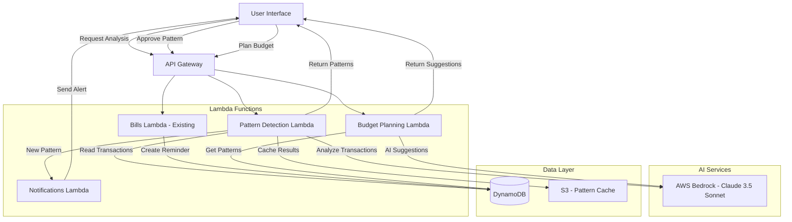

# Design Document: AI-Powered Bill Reminders and Future Budget Planning

## Overview

This feature adds intelligent automation to BudgetBuddy by leveraging AWS Bedrock (Claude 3.5 Sonnet) to analyze transaction history, detect recurring payment patterns, and assist with future budget planning. The system maintains user control through a review-and-approve workflow while reducing manual data entry and improving budget accuracy.

### Key Components

1. **AI Pattern Detection Service**: Analyzes transaction history to identify recurring bills
2. **Bill Reminder Integration**: Converts approved patterns into automated reminders
3. **Future Budget Planner**: Suggests budget allocations based on recurring expenses
4. **User Review Interface**: Allows users to approve, reject, or modify AI suggestions
5. **Smart Notification System**: Proactively alerts users about pattern changes

### Design Principles

- **User Control First**: All AI suggestions require explicit user approval
- **Transparency**: Clear explanations for why patterns were detected
- **Privacy**: Transaction data processed securely, not retained in AI logs
- **Integration**: Seamless integration with existing bills and budget systems
- **Performance**: Fast analysis (< 10 seconds) with cost-effective AI usage

## Architecture

### High-Level Architecture



### Data Flow

1. **Pattern Detection Flow**:
   - User triggers analysis (manual or automatic)
   - Lambda retrieves 3-6 months of transactions from DynamoDB
   - Transactions sent to AWS Bedrock with structured prompt
   - AI returns detected patterns with confidence scores
   - Results cached in S3 and stored in DynamoDB
   - User presented with review interface

2. **Bill Reminder Creation Flow**:
   - User reviews detected patterns
   - User approves/rejects/edits patterns
   - Approved patterns sent to existing bills Lambda
   - Bill reminders created with AI metadata tag
   - Scheduler picks up reminders for notifications

3. **Budget Planning Flow**:
   - User initiates new month budget creation
   - Lambda retrieves active bill reminders and transaction history
   - AI generates category-wise suggestions
   - User reviews and applies suggestions to budget

## Components and Interfaces

### 1. Pattern Detection Lambda

**Purpose**: Analyze transaction history to identify recurring payment patterns

**Handler**: `backend/functions/pattern-detection/index.js`

**API Endpoints**:

- `POST /api/patterns/detect` - Trigger pattern detection analysis
- `GET /api/patterns` - Retrieve detected patterns for user
- `PUT /api/patterns/{patternId}` - Update pattern (approve/reject/edit)
- `DELETE /api/patterns/{patternId}` - Delete a detected pattern

**Input Schema** (POST /api/patterns/detect):

```javascript
{
  userId: string,
  familyId: string,
  analysisMonths: number (default: 6, min: 3, max: 12),
  minConfidence: number (default: 50, range: 0-100)
}
```

**Output Schema**:

```javascript
{
  patterns: [
    {
      patternId: string,
      merchantName: string,
      suggestedBillName: string,
      averageAmount: number,
      amountStdDev: number,
      frequency: 'weekly' | 'bi-weekly' | 'monthly' | 'quarterly' | 'annual',
      confidenceScore: number,
      nextExpectedDate: string (ISO 8601),
      lastOccurrences: [
        { date: string, amount: number, transactionId: string }
      ],
      categoryId: string,
      explanation: string
    }
  ],
  analysisDate: string,
  transactionsAnalyzed: number
}
```

**Service Layer** (`pattern-detection-service.js`):

```javascript
class PatternDetectionService {
  async analyzeTransactions(userId, familyId, options) {
    // 1. Retrieve transactions from repository
    // 2. Prepare AI prompt with transaction data
    // 3. Call AWS Bedrock for pattern analysis
    // 4. Parse and validate AI response
    // 5. Calculate confidence scores
    // 6. Store patterns in DynamoDB
    // 7. Return detected patterns
  }

  async getPatterns(userId, familyId, filters) {
    // Retrieve stored patterns with optional filtering
  }

  async updatePattern(patternId, userId, updates) {
    // Update pattern details (user edits)
  }

  async approvePattern(patternId, userId) {
    // Mark pattern as approved, trigger bill creation
  }

  async rejectPattern(patternId, userId) {
    // Mark pattern as rejected, exclude from future suggestions
  }
}
```

**Repository Layer** (`pattern-detection-repository.js`):

```javascript
class PatternDetectionRepository {
  async getTransactionHistory(familyId, startDate, endDate) {
    // Query DynamoDB for transactions in date range
    // GSI: familyId-date-index
  }

  async savePattern(pattern) {
    // Store detected pattern in DynamoDB
    // PK: FAMILY#{familyId}, SK: PATTERN#{patternId}
  }

  async getPatternsByFamily(familyId, status) {
    // Retrieve patterns (pending/approved/rejected)
  }

  async updatePatternStatus(patternId, status, metadata) {
    // Update pattern approval status
  }
}
```

### 2. AI Prompt Engineering

**Pattern Detection Prompt Template**:

```
You are a financial analysis assistant. Analyze the following transaction history to identify recurring payment patterns.

Transaction History (last {months} months):
{transactions_json}

Instructions:
1. Identify transactions that occur at regular intervals (weekly, bi-weekly, monthly, quarterly, annual)
2. Group similar transactions by merchant name (use fuzzy matching for variations)
3. Calculate average amount and frequency for each pattern
4. Assign confidence score (0-100) based on:
   - Consistency of timing (higher score for regular intervals)
   - Consistency of amount (higher score for similar amounts)
   - Number of occurrences (higher score for more data points)
   - Merchant name clarity (higher score for recognizable merchants)
5. Only include patterns with at least 3 occurrences
6. Provide explanation for each detected pattern

Return JSON array with this exact structure:
[
  {
    "merchantName": "string",
    "suggestedBillName": "string",
    "averageAmount": number,
    "amountStdDev": number,
    "frequency": "weekly|bi-weekly|monthly|quarterly|annual",
    "confidenceScore": number,
    "occurrences": [
      {"date": "YYYY-MM-DD", "amount": number, "transactionId": "string"}
    ],
    "explanation": "string"
  }
]

Focus on common recurring bills: rent, mortgage, insurance, utilities, subscriptions, loan payments.
```

**Budget Planning Prompt Template**:

```
You are a budget planning assistant. Based on the user's transaction history and recurring bills, suggest budget allocations for {target_month}.

Historical Data:
- Recurring Bills: {bills_json}
- Past 3 Months Spending by Category: {spending_json}
- Target Month: {month_name} {year}

Instructions:
1. For each budget category, suggest an amount based on:
   - Recurring bills in that category
   - Historical average spending
   - Seasonal adjustments (if applicable)
2. Account for payment frequency:
   - Bi-weekly: Calculate if 2 or 3 occurrences in target month
   - Monthly: 1 occurrence
   - Quarterly/Annual: Prorate if due in target month
3. Assign confidence score based on data consistency
4. Provide brief explanation for each suggestion

Return JSON with this structure:
{
  "suggestions": [
    {
      "categoryId": "string",
      "categoryName": "string",
      "suggestedAmount": number,
      "confidenceScore": number,
      "breakdown": [
        {"item": "string", "amount": number, "type": "recurring|average"}
      ],
      "explanation": "string"
    }
  ],
  "totalSuggested": number
}
```

### 3. Budget Planning Lambda

**Purpose**: Generate AI-powered budget suggestions for future months

**Handler**: `backend/functions/budget-planning/index.js`

**API Endpoints**:

- `POST /api/budget/suggestions` - Generate budget suggestions for a month
- `POST /api/budget/apply-suggestions` - Apply approved suggestions to budget

**Input Schema** (POST /api/budget/suggestions):

```javascript
{
  userId: string,
  familyId: string,
  targetMonth: string (YYYY-MM),
  includeRecurringBills: boolean (default: true),
  includeHistoricalAverage: boolean (default: true)
}
```

**Output Schema**:

```javascript
{
  targetMonth: string,
  suggestions: [
    {
      categoryId: string,
      categoryName: string,
      suggestedAmount: number,
      confidenceScore: number,
      breakdown: [
        { item: string, amount: number, type: 'recurring' | 'average' }
      ],
      explanation: string
    }
  ],
  totalSuggested: number,
  generatedAt: string
}
```

### 4. Integration with Existing Bills Lambda

**Modifications to** `backend/functions/bills/index.js`:

**New Field in Bill Model**:

```javascript
{
  // Existing fields...
  aiGenerated: boolean,
  sourcePatternId: string (optional),
  aiConfidenceScore: number (optional),
  aiDetectedDate: string (optional)
}
```

**New Service Method**:

```javascript
async createBillFromPattern(pattern, userId, familyId) {
  // Convert approved pattern to bill reminder
  // Set aiGenerated: true
  // Link to sourcePatternId
  // Create reminder schedule (7 days, 3 days, due date)
}
```

### 5. Notification System Integration

**New Notification Types**:

- `PATTERN_DETECTED`: New recurring pattern found
- `PATTERN_AMOUNT_CHANGED`: Recurring bill amount changed significantly
- `PATTERN_MISSING`: Expected recurring transaction didn't occur
- `BUDGET_SUGGESTION_AVAILABLE`: AI budget suggestions ready for review

**Notification Payload**:

```javascript
{
  type: 'PATTERN_DETECTED',
  patternId: string,
  merchantName: string,
  averageAmount: number,
  frequency: string,
  confidenceScore: number,
  actionUrl: '/bills/review-patterns',
  createdAt: string
}
```

## Data Models

### DetectedPattern Table Schema

**DynamoDB Table**: `budgetbuddy-{env}-patterns`

**Primary Key**:

- PK: `FAMILY#{familyId}`
- SK: `PATTERN#{patternId}`

**Attributes**:

```javascript
{
  PK: string,
  SK: string,
  patternId: string (UUID),
  familyId: string,
  userId: string (who triggered detection),
  merchantName: string,
  suggestedBillName: string,
  averageAmount: number,
  amountStdDev: number,
  frequency: string ('weekly' | 'bi-weekly' | 'monthly' | 'quarterly' | 'annual'),
  confidenceScore: number (0-100),
  status: string ('pending' | 'approved' | 'rejected' | 'ignored'),
  categoryId: string,
  nextExpectedDate: string (ISO 8601),
  occurrences: [
    {
      date: string,
      amount: number,
      transactionId: string
    }
  ],
  explanation: string,
  createdAt: string,
  updatedAt: string,
  approvedAt: string (optional),
  approvedBy: string (optional),
  billId: string (optional, if converted to bill),
  aiModelVersion: string ('claude-3.5-sonnet'),
  analysisMonths: number
}
```

**GSI**: `status-createdAt-index`

- PK: `familyId#status`
- SK: `createdAt`
- Purpose: Query patterns by status for a family

### BudgetSuggestion Table Schema

**DynamoDB Table**: `budgetbuddy-{env}-budget-suggestions`

**Primary Key**:

- PK: `FAMILY#{familyId}`
- SK: `SUGGESTION#{targetMonth}#{timestamp}`

**Attributes**:

```javascript
{
  PK: string,
  SK: string,
  suggestionId: string (UUID),
  familyId: string,
  userId: string,
  targetMonth: string (YYYY-MM),
  suggestions: [
    {
      categoryId: string,
      categoryName: string,
      suggestedAmount: number,
      confidenceScore: number,
      breakdown: [
        { item: string, amount: number, type: string }
      ],
      explanation: string
    }
  ],
  totalSuggested: number,
  status: string ('pending' | 'applied' | 'rejected'),
  appliedAt: string (optional),
  createdAt: string,
  aiModelVersion: string
}
```

### Updates to Existing Bill Model

**Add to** `budgetbuddy-{env}-bills`:

```javascript
{
  // Existing fields remain...
  aiGenerated: boolean (default: false),
  sourcePatternId: string (optional),
  aiConfidenceScore: number (optional),
  aiDetectedDate: string (optional),
  userModified: boolean (default: false)
}
```

### Pattern Analysis Cache (S3)

**Bucket**: `budgetbuddy-{env}-pattern-cache`

**Object Key**: `{familyId}/{analysisDate}.json`

**Purpose**: Cache raw AI analysis results to avoid re-processing

**Lifecycle**: Delete after 30 days

**Content**:

```javascript
{
  familyId: string,
  analysisDate: string,
  transactionsAnalyzed: number,
  rawAIResponse: object,
  detectedPatterns: array,
  processingTimeMs: number
}
```

## Pattern Detection Algorithm

### Core Algorithm Steps

1. **Data Retrieval**:
   - Query transactions for past N months (default 6)
   - Filter out transfers, income, and one-time purchases
   - Group by merchant name (fuzzy matching)

2. **Frequency Detection**:
   - For each merchant group, calculate intervals between transactions
   - Identify dominant interval pattern (weekly: 7±2 days, bi-weekly: 14±3 days, monthly: 30±3 days)
   - Require minimum 3 occurrences to establish pattern

3. **Amount Analysis**:
   - Calculate mean and standard deviation of amounts
   - Flag as variable if stdDev > 30% of mean
   - Use median for variable amounts (more robust to outliers)

4. **Confidence Scoring**:

   ```javascript
   confidenceScore = (
     timingConsistency * 0.4 +
     amountConsistency * 0.3 +
     occurrenceCount * 0.2 +
     merchantClarity * 0.1
   ) * 100

   where:
   - timingConsistency = 1 - (avgDeviation / expectedInterval)
   - amountConsistency = 1 - (stdDev / mean)
   - occurrenceCount = min(occurrences / 6, 1)
   - merchantClarity = hasKnownMerchant ? 1 : 0.7
   ```

5. **AI Enhancement**:
   - Send grouped transactions to AWS Bedrock
   - AI validates patterns and suggests bill names
   - AI provides human-readable explanations
   - AI identifies seasonal patterns

### Fuzzy Merchant Matching

**Algorithm**: Levenshtein distance with threshold

```javascript
function fuzzyMatch(merchant1, merchant2) {
  // Normalize: lowercase, remove special chars
  const norm1 = normalize(merchant1);
  const norm2 = normalize(merchant2);

  // Calculate Levenshtein distance
  const distance = levenshteinDistance(norm1, norm2);
  const maxLength = Math.max(norm1.length, norm2.length);
  const similarity = 1 - distance / maxLength;

  // Match if similarity > 80%
  return similarity > 0.8;
}
```

### Handling Edge Cases

1. **Variable Amounts** (utilities):
   - Use median instead of mean
   - Increase confidence if pattern is consistent
   - Suggest amount range in bill reminder

2. **Irregular Timing**:
   - Allow ±3 day variance for monthly bills
   - Handle months with different day counts
   - Account for weekends (bills often shift to Friday)

3. **Seasonal Expenses**:
   - Flag patterns that only occur in certain months
   - Adjust confidence based on seasonality
   - Include in budget suggestions for relevant months only

4. **One-Time vs Recurring**:
   - Require minimum 3 occurrences
   - Check if pattern continues in recent months
   - Flag as "potentially ended" if 2+ expected occurrences missed

## Correctness Properties

_A property is a characteristic or behavior that should hold true across all valid executions of a system—essentially, a formal statement about what the system should do. Properties serve as the bridge between human-readable specifications and machine-verifiable correctness guarantees._

### Property 1: Pattern Detection Output Completeness

_For any_ successful pattern detection analysis, all detected patterns in the response must contain the required fields: patternId, merchantName, suggestedBillName, averageAmount, frequency, confidenceScore (0-100), nextExpectedDate, occurrences array, categoryId, and explanation.

**Validates: Requirements 1.3, 1.4, 1.7, 2.2**

### Property 2: Frequency Detection with Tolerance

_For any_ set of transactions with a recurring pattern, the AI_Pattern_Detector must correctly identify the frequency (weekly, bi-weekly, monthly, quarterly, annual) even when transaction dates vary by ±3 days from the expected interval.

**Validates: Requirements 1.2, 6.3**

### Property 3: Amount Variance Handling

_For any_ group of transactions being analyzed for patterns, if the standard deviation of amounts exceeds 30% of the mean, the pattern must either be flagged as variable-amount or excluded from detection, and if included, must use median instead of mean for the suggested amount.

**Validates: Requirements 1.5, 6.4**

### Property 4: Minimum Occurrence Threshold

_For any_ merchant or transaction group, a recurring pattern must not be detected unless there are at least 3 occurrences in the analyzed time period.

**Validates: Requirements 6.1**

### Property 5: Fuzzy Merchant Matching

_For any_ two merchant names with Levenshtein similarity > 80% (after normalization), they must be grouped together as the same merchant for pattern detection purposes.

**Validates: Requirements 6.2**

### Property 6: High-Confidence Pattern Flagging

_For any_ detected pattern, if the confidenceScore is above 70, it must be flagged as high-confidence, and if below 50, it must be filtered out from user-facing suggestions.

**Validates: Requirements 1.6, 10.6**

### Property 7: Bill Reminder Creation from Pattern

_For any_ approved pattern, when converted to a Bill_Reminder, the resulting bill must: (1) contain all pattern details (merchant, amount, frequency, due date), (2) have aiGenerated set to true, (3) have sourcePatternId linking to the pattern, (4) have reminder notifications scheduled for 7 days before, 3 days before, and on the due date.

**Validates: Requirements 2.3, 2.4, 2.7**

### Property 8: Pattern Status Persistence

_For any_ pattern that is rejected or dismissed by a user, subsequent pattern detection analyses must exclude that pattern from suggestions and mark it with status 'rejected' or 'ignored' in the database.

**Validates: Requirements 2.5, 5.6**

### Property 9: User Edit Preservation

_For any_ pattern that a user edits before approval, the created Bill_Reminder must reflect the user-modified values (not the original AI-suggested values), and the userModified flag must be set to true.

**Validates: Requirements 2.6**

### Property 10: AI Metadata Preservation

_For any_ AI-created bill reminder, when a user edits the bill details, the AI metadata fields (aiGenerated, sourcePatternId, aiConfidenceScore, aiDetectedDate) must remain unchanged and preserved in the database.

**Validates: Requirements 5.7, 7.4**

### Property 11: Budget Suggestion Completeness

_For any_ budget planning request, the Future_Budget_Planner must: (1) analyze both transaction history and active bill reminders, (2) generate suggestions for all categories with recurring expenses or historical spending, (3) include confidence scores for each suggestion, (4) adjust bi-weekly expenses based on the number of occurrences in the target month, (5) apply seasonal adjustments when historical data shows seasonal patterns.

**Validates: Requirements 3.1, 3.2, 3.3, 3.5, 3.6**

### Property 12: Notification Triggering Rules

_For any_ pattern detection or monitoring event, notifications must be triggered when: (1) a new pattern with confidenceScore > 70 is detected, (2) a recurring bill amount changes by more than 20% from historical average, (3) a pattern misses 2 consecutive expected occurrences, and all notifications must include actionable options (review, create reminder, adjust budget).

**Validates: Requirements 4.1, 4.2, 4.5, 4.6**

### Property 13: Budget Suggestion Intelligence

_For any_ budget creation with unaccounted recurring bills or categories consistently over budget (3+ months), the system must include suggestions to account for those bills or recommend budget adjustments.

**Validates: Requirements 4.3, 4.4**

### Property 14: Manual Pattern Creation

_For any_ transaction manually marked as recurring by a user, the system must prompt for frequency and create a Bill_Reminder with the specified frequency and transaction details.

**Validates: Requirements 5.2**

### Property 15: Pattern Edit Propagation

_For any_ pattern that has an associated Bill_Reminder, when the pattern is edited, the Bill_Reminder must be updated to reflect the changes.

**Validates: Requirements 5.4**

### Property 16: Explanation Presence

_For any_ AI-detected pattern or budget suggestion, the response must include a non-empty explanation field describing why the pattern was detected or why the suggestion was made.

**Validates: Requirements 5.5**

### Property 17: Integration with Existing Bills System

_For any_ AI-created Bill_Reminder, it must use the same data model and be processed identically by the bills-scheduler as manually-created reminders, with the only difference being the AI metadata fields.

**Validates: Requirements 7.1, 7.2**

### Property 18: Payment Recording for Learning

_For any_ bill payment recorded in the system, the payment data must be stored and associated with the bill for future pattern detection improvements.

**Validates: Requirements 7.5**

### Property 19: Duplicate Bill Detection

_For any_ AI-suggested pattern, before creating a Bill_Reminder, the system must check for existing bills with the same merchant name and frequency, and if a duplicate exists, must not create a redundant reminder.

**Validates: Requirements 7.6**

### Property 20: Authorization Scoping

_For any_ pattern detection or budget planning request, the system must only access and analyze transactions belonging to the authenticated user's familyId, never returning data from other families.

**Validates: Requirements 8.3**

### Property 21: Account Deletion Cleanup

_For any_ user account deletion, all associated AI-detected patterns and budget suggestions must be deleted from the database.

**Validates: Requirements 8.5**

### Property 22: Sensitive Data Logging Protection

_For any_ log entry created during AI operations, the log must not contain sensitive financial details such as specific transaction amounts, merchant names, or account numbers.

**Validates: Requirements 8.6**

### Property 23: Error Handling with Retry Logic

_For any_ AWS Bedrock API call that fails with a transient error (5xx, timeout), the system must retry with exponential backoff (starting at 1s, max 3 retries), and if all retries fail, must return a user-friendly error message without exposing internal error details.

**Validates: Requirements 9.3, 9.4**

### Property 24: Cost Monitoring

_For any_ pattern detection analysis, if the estimated AWS Bedrock cost exceeds $0.10, the system must log a warning with the cost details for monitoring purposes.

**Validates: Requirements 9.5**

### Property 25: Prompt Structure Completeness

_For any_ AI prompt sent to AWS Bedrock, the prompt must: (1) include all required transaction fields (date, merchant, amount, category), (2) specify the expected JSON output structure, (3) include example outputs, (4) provide historical context for budget planning, and the response must be validated against the expected JSON schema before being returned to the user.

**Validates: Requirements 10.1, 10.2, 10.3, 10.4, 10.5**

## Error Handling

### Error Categories

1. **Insufficient Data Errors**:
   - **Scenario**: User has less than 3 months of transaction history
   - **Response**: HTTP 400 with message "Insufficient transaction history. At least 3 months of data required for pattern detection."
   - **User Action**: Continue using app, retry after more transactions

2. **AI Service Errors**:
   - **Scenario**: AWS Bedrock API failure, timeout, or rate limiting
   - **Response**: HTTP 503 with message "AI service temporarily unavailable. Please try again in a few minutes."
   - **Retry Logic**: Exponential backoff (1s, 2s, 4s), max 3 attempts
   - **Fallback**: Cache previous analysis results if available

3. **Invalid AI Response**:
   - **Scenario**: AI returns malformed JSON or missing required fields
   - **Response**: Log error, retry with clarified prompt (max 2 attempts)
   - **Fallback**: Return empty patterns array with warning message

4. **Authorization Errors**:
   - **Scenario**: User attempts to access patterns for different family
   - **Response**: HTTP 403 with message "Access denied"
   - **Logging**: Log security event for monitoring

5. **Duplicate Bill Errors**:
   - **Scenario**: AI suggests pattern that matches existing bill
   - **Response**: HTTP 409 with message "A similar bill already exists: {billName}"
   - **User Action**: Option to view existing bill or modify suggestion

6. **Cost Limit Errors**:
   - **Scenario**: AI analysis would exceed cost threshold
   - **Response**: HTTP 429 with message "Analysis limit reached. Please try again tomorrow."
   - **Logging**: Log cost warning for admin review

### Error Response Format

```javascript
{
  error: {
    code: string,
    message: string,
    details: object (optional),
    retryAfter: number (optional, seconds)
  }
}
```

### Graceful Degradation

1. **Pattern Detection Unavailable**:
   - Users can still manually create bill reminders
   - Show message: "AI suggestions temporarily unavailable"

2. **Budget Planning Unavailable**:
   - Users can still manually create budgets
   - Show historical averages without AI enhancement

3. **Partial Results**:
   - If some patterns detected but AI fails mid-analysis
   - Return partial results with warning flag

## Testing Strategy

### Unit Testing

**Focus Areas**:

- Pattern detection algorithm logic (frequency calculation, confidence scoring)
- Fuzzy merchant matching algorithm
- Amount variance calculations (mean, median, standard deviation)
- Date tolerance logic (±3 days)
- Prompt construction and validation
- Error handling and retry logic
- Authorization checks

**Test Framework**: Jest

**Coverage Target**: > 80% for service and repository layers

**Example Unit Tests**:

```javascript
describe("PatternDetectionService", () => {
  test("calculates confidence score correctly for consistent patterns", () => {
    // Test confidence scoring algorithm
  });

  test("groups similar merchant names using fuzzy matching", () => {
    // Test Levenshtein distance matching
  });

  test("filters out patterns with less than 3 occurrences", () => {
    // Test minimum occurrence threshold
  });

  test("handles amount variance by using median for variable bills", () => {
    // Test median calculation for high variance
  });
});
```

### Property-Based Testing

**Focus Areas**:

- Pattern detection across various transaction patterns
- Confidence score invariants (always 0-100)
- Frequency detection with date variations
- Amount calculations with different variance levels
- Authorization scoping (never returns wrong family data)
- Error handling consistency

**Test Framework**: fast-check

**Configuration**: Minimum 100 iterations per property test

**Example Property Tests**:

```javascript
describe("Pattern Detection Properties", () => {
  test("Property 1: All detected patterns have required fields", () => {
    fc.assert(
      fc.asyncProperty(
        fc.array(transactionGenerator(), { minLength: 10, maxLength: 100 }),
        async (transactions) => {
          const result = await patternDetectionService.analyzeTransactions(
            "user123",
            "family456",
            { transactions },
          );

          result.patterns.forEach((pattern) => {
            expect(pattern).toHaveProperty("patternId");
            expect(pattern).toHaveProperty("merchantName");
            expect(pattern).toHaveProperty("confidenceScore");
            expect(pattern.confidenceScore).toBeGreaterThanOrEqual(0);
            expect(pattern.confidenceScore).toBeLessThanOrEqual(100);
          });
        },
      ),
      { numRuns: 100 },
    );
  });

  test("Property 6: High confidence patterns flagged correctly", () => {
    fc.assert(
      fc.asyncProperty(
        fc.array(recurringTransactionGenerator(), { minLength: 3 }),
        async (transactions) => {
          const result = await patternDetectionService.analyzeTransactions(
            "user123",
            "family456",
            { transactions },
          );

          result.patterns.forEach((pattern) => {
            if (pattern.confidenceScore > 70) {
              expect(pattern.highConfidence).toBe(true);
            }
            if (pattern.confidenceScore < 50) {
              // Should be filtered out
              expect(result.patterns).not.toContain(pattern);
            }
          });
        },
      ),
      { numRuns: 100 },
    );
  });

  test("Property 20: Authorization scoping enforced", () => {
    fc.assert(
      fc.asyncProperty(
        fc.string(),
        fc.string(),
        async (familyId1, familyId2) => {
          fc.pre(familyId1 !== familyId2);

          const result = await patternDetectionService.analyzeTransactions(
            "user123",
            familyId1,
            {},
          );

          // Verify no data from familyId2 is returned
          result.patterns.forEach((pattern) => {
            expect(pattern.familyId).toBe(familyId1);
            expect(pattern.familyId).not.toBe(familyId2);
          });
        },
      ),
      { numRuns: 100 },
    );
  });
});
```

### Integration Testing

**Focus Areas**:

- End-to-end pattern detection flow
- Bill reminder creation from approved patterns
- Budget suggestion generation
- Notification triggering
- DynamoDB queries and updates
- AWS Bedrock API integration (with mocking)

**Test Environment**: dev environment with test data

**Example Integration Tests**:

```javascript
describe("Pattern Detection Integration", () => {
  test("detects patterns, user approves, bill reminder created", async () => {
    // 1. Create test transactions in DynamoDB
    // 2. Trigger pattern detection
    // 3. Verify patterns detected
    // 4. Approve a pattern
    // 5. Verify bill reminder created
    // 6. Verify reminder schedule set correctly
  });

  test("rejected patterns excluded from future suggestions", async () => {
    // 1. Detect patterns
    // 2. Reject a pattern
    // 3. Run detection again
    // 4. Verify rejected pattern not suggested
  });
});
```

### AI Prompt Testing

**Focus Areas**:

- Prompt structure validation
- AI response parsing
- Handling malformed responses
- Cost estimation

**Approach**:

- Mock AWS Bedrock responses for unit tests
- Use real API calls in integration tests (with cost limits)
- Validate JSON schema of responses
- Test with various transaction patterns

### Performance Testing

**Metrics**:

- Pattern detection: < 10 seconds for 1000 transactions
- Budget planning: < 5 seconds
- API response time: p95 < 500ms

**Tools**: Artillery or k6 for load testing

**Scenarios**:

- Single user analysis
- 10 concurrent users
- Large transaction history (1000+ transactions)

## Security Considerations

### Data Privacy

1. **Transaction Data Handling**:
   - Encrypt in transit (TLS 1.2+)
   - Encrypt at rest (DynamoDB encryption)
   - Minimize data sent to AI (only necessary fields)
   - No retention in AI service logs

2. **AI Prompt Sanitization**:
   - Remove PII before sending to Bedrock
   - Use transaction IDs instead of account numbers
   - Anonymize merchant names if possible

3. **Access Control**:
   - JWT authentication required
   - Family-level authorization enforced
   - IAM roles with least privilege
   - No cross-family data access

### Audit Logging

**Log Events**:

- Pattern detection requests (userId, familyId, timestamp)
- Pattern approvals/rejections (patternId, action, userId)
- Bill reminder creations from AI (billId, sourcePatternId)
- AI API calls (cost, duration, success/failure)
- Authorization failures (userId, attempted familyId)

**Log Format**:

```javascript
{
  timestamp: string,
  level: 'INFO' | 'WARN' | 'ERROR',
  event: string,
  userId: string,
  familyId: string,
  details: object,
  requestId: string
}
```

### Cost Controls

1. **Rate Limiting**:
   - Max 5 pattern detection requests per user per day
   - Max 10 budget planning requests per user per month

2. **Cost Monitoring**:
   - Log all AI API costs
   - Alert if daily cost > $10
   - Alert if single request > $0.10

3. **Caching**:
   - Cache pattern detection results for 24 hours
   - Reuse cached results if transactions unchanged

## Deployment Strategy

### Infrastructure Changes

**New Resources**:

- Lambda: `pattern-detection`, `budget-planning`
- DynamoDB Table: `budgetbuddy-{env}-patterns`, `budgetbuddy-{env}-budget-suggestions`
- S3 Bucket: `budgetbuddy-{env}-pattern-cache`
- IAM Roles: Bedrock access for Lambda functions
- CloudWatch Alarms: Error rate, latency, cost

**CDK Stack**: `api-features-stack.ts` (extend existing)

### Rollout Plan

1. **Phase 1: Backend Deployment**:
   - Deploy Lambda functions
   - Create DynamoDB tables
   - Configure IAM permissions
   - Test with Postman/curl

2. **Phase 2: Frontend Integration**:
   - Add pattern review UI
   - Add budget suggestion UI
   - Add notification handling
   - Test end-to-end flows

3. **Phase 3: Gradual Rollout**:
   - Enable for 10% of users (feature flag)
   - Monitor metrics and costs
   - Increase to 50%, then 100%

4. **Phase 4: Optimization**:
   - Tune confidence thresholds based on user feedback
   - Optimize AI prompts for accuracy
   - Implement caching improvements

### Monitoring

**Key Metrics**:

- Pattern detection success rate
- Pattern approval rate (target: 70%+)
- AI accuracy (user feedback)
- API latency (p95 < 500ms)
- Error rate (< 0.1%)
- Cost per analysis (target: < $0.05)

**Dashboards**:

- CloudWatch dashboard with all metrics
- Cost Explorer for AI spending
- User engagement metrics (pattern reviews, approvals)

### Rollback Plan

**Triggers**:

- Error rate > 5%
- Cost > $50/day
- User complaints > 10/day

**Rollback Steps**:

1. Disable feature flag (stop new analyses)
2. Revert Lambda deployments
3. Preserve data (don't delete tables)
4. Investigate and fix issues
5. Re-deploy with fixes

## Future Enhancements

1. **Machine Learning Improvements**:
   - Train custom model on user feedback
   - Improve confidence scoring algorithm
   - Better seasonal pattern detection

2. **Advanced Features**:
   - Predict future expenses based on trends
   - Anomaly detection (unusual spending)
   - Smart category suggestions
   - Bill negotiation recommendations

3. **User Experience**:
   - One-click approval of all high-confidence patterns
   - Bulk edit patterns
   - Pattern templates (common bills)
   - Mobile push notifications

4. **Integration**:
   - Bank sync integration (auto-detect from linked accounts)
   - Calendar integration (add bills to calendar)
   - Email parsing (detect bills from emails)

## Appendix

### Glossary of Terms

- **Pattern**: A detected recurring transaction sequence
- **Confidence Score**: 0-100 value indicating detection certainty
- **Fuzzy Matching**: Algorithm for matching similar strings
- **Levenshtein Distance**: Edit distance between two strings
- **Frequency**: Interval of recurring transactions (weekly, monthly, etc.)
- **Variance**: Statistical measure of amount fluctuation

### References

- AWS Bedrock Documentation: https://docs.aws.amazon.com/bedrock/
- Claude 3.5 Sonnet Model Card: https://www.anthropic.com/claude
- Levenshtein Distance Algorithm: https://en.wikipedia.org/wiki/Levenshtein_distance
- Property-Based Testing with fast-check: https://github.com/dubzzz/fast-check
