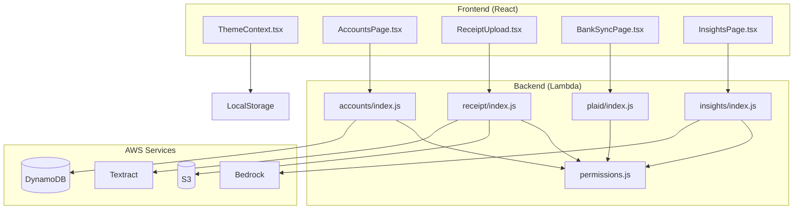

# Design Document: Critical Bug Fixes

## Overview

This design document outlines the technical approach to fix six critical bugs in the BudgetBuddy web application. The bugs affect theme persistence, account permissions, receipt scanning, bank account connections, and AI insights. Each fix is designed to be minimal and targeted to avoid introducing regressions.

## Architecture

The fixes span multiple layers of the application:



## Components and Interfaces

### Bug 1: Theme Context Fix

**Problem**: The theme is applied asynchronously after React hydration, causing a flash of light theme.

**Solution**: Apply theme synchronously during initial state initialization and add an inline script to apply theme before React loads.

**Component**: `packages/web-app/src/contexts/ThemeContext.tsx`

```typescript
// Current problematic code:
const [mode, setModeState] = useState<ThemeMode>(() => {
  const savedMode = localStorage.getItem("budgetbuddy-theme-mode") as ThemeMode;
  // Theme is read but not applied until useEffect runs
  return savedMode || "system";
});

// Fixed code:
const [mode, setModeState] = useState<ThemeMode>(() => {
  const savedMode = localStorage.getItem("budgetbuddy-theme-mode") as ThemeMode;
  if (savedMode && ["light", "dark", "system"].includes(savedMode)) {
    // Apply theme immediately during initialization
    const resolved = savedMode === "system" ? getSystemTheme() : savedMode;
    if (resolved === "dark") {
      document.documentElement.classList.add("dark");
    } else {
      document.documentElement.classList.remove("dark");
    }
    return savedMode;
  }
  return "system";
});
```

**Additional Fix**: Add inline script to `index.html` to apply theme before React loads:

```html
<script>
  (function () {
    const mode = localStorage.getItem("budgetbuddy-theme-mode");
    if (
      mode === "dark" ||
      (mode === "system" &&
        window.matchMedia("(prefers-color-scheme: dark)").matches)
    ) {
      document.documentElement.classList.add("dark");
    }
  })();
</script>
```

### Bug 2: Permission Matrix Fix

**Problem**: The permission matrix in `permissions.js` doesn't include `account:*` permissions.

**Solution**: Add account permissions to the PERMISSION_MATRIX constant.

**Component**: `backend/layers/shared/nodejs/shared/permissions.js`

```javascript
// Add to PERMISSION_MATRIX:
const PERMISSION_MATRIX = {
  primary: {
    // ... existing permissions ...
    "account:view": true,
    "account:create": true,
    "account:edit": true,
    "account:delete": true,
  },
  spouse: {
    // ... existing permissions ...
    "account:view": true,
    "account:create": true,
    "account:edit": true,
    "account:delete": true,
  },
  viewer: {
    // ... existing permissions ...
    "account:view": true,
    "account:create": false,
    "account:edit": false,
    "account:delete": false,
  },
};
```

### Bug 3: Receipt Scanning Error Handling

**Problem**: "Failed to fetch" errors are not handled gracefully, showing generic error messages.

**Solution**: Add specific error handling for network errors and improve error messages.

**Component**: `packages/web-app/src/components/ReceiptUpload.tsx`

```typescript
// Enhanced error handling:
try {
  const uploadResponse = await fetch(`${API_BASE}/receipt/upload`, { ... });
  // ...
} catch (error) {
  if (error instanceof TypeError && error.message === 'Failed to fetch') {
    setError('Network error: Unable to connect to the server. Please check your internet connection and try again.');
  } else {
    setError(error instanceof Error ? error.message : 'Failed to upload receipt');
  }
}
```

### Bug 4: Bank Sync Error Handling

**Problem**: "Failed to fetch" errors on the Bank Sync page are not handled gracefully.

**Solution**: Add specific error handling in the ConnectedAccounts component.

**Component**: `packages/web-app/src/components/ConnectedAccounts.tsx`

```typescript
// Enhanced error handling:
try {
  const accounts = await getLinkedAccounts();
  // ...
} catch (error) {
  if (error instanceof TypeError && error.message === "Failed to fetch") {
    setError(
      "Network error: Unable to connect to the server. Please check your internet connection.",
    );
  } else {
    setError(
      error instanceof Error
        ? error.message
        : "Failed to load connected accounts",
    );
  }
}
```

### Bug 5: AI Insights Error Handling

**Problem**: AI insights show generic error message when Bedrock fails.

**Solution**: The current implementation already has fallback logic, but the error message needs improvement.

**Component**: `packages/web-app/src/pages/InsightsPage.tsx`

The current error handling already catches errors and shows suggestions. The issue may be:

1. Network connectivity issues (same as bugs 3 and 4)
2. Backend Bedrock configuration issues

```typescript
// Current code already handles this:
} catch (error) {
  console.error('Error asking question:', error);
  setAskLoading(false);
  setAskResponse({
    question: askQuestion,
    answer: "Sorry, I couldn't process your question. Please try again later.",
    suggestions: [
      'How much did I spend on groceries?',
      'What\'s my biggest expense category?',
      'Am I spending more than last month?',
    ],
  });
}
```

**Enhancement**: Add network error detection:

```typescript
} catch (error) {
  console.error('Error asking question:', error);
  setAskLoading(false);

  let errorMessage = "Sorry, I couldn't process your question. Please try again later.";
  if (error instanceof TypeError && error.message === 'Failed to fetch') {
    errorMessage = "Network error: Unable to connect to the server. Please check your internet connection.";
  }

  setAskResponse({
    question: askQuestion,
    answer: errorMessage,
    suggestions: [...],
  });
}
```

### Bug 6: Keyboard Shortcuts Documentation

**Problem**: User mentioned "remove keyboard shortcuts" - needs clarification.

**Solution**: The keyboard shortcuts are an intentional feature. The Settings page already documents them. No code changes needed unless user confirms they want to remove the feature.

## Data Models

No data model changes are required for these bug fixes. The fixes are primarily:

1. Frontend state management (theme)
2. Backend permission configuration (accounts)
3. Error handling improvements (receipt, bank sync, insights)

## Error Handling

### Network Error Detection Pattern

All API calls should use this pattern for consistent error handling:

```typescript
async function apiCall<T>(url: string, options?: RequestInit): Promise<T> {
  try {
    const response = await fetch(url, options);
    if (!response.ok) {
      const errorData = await response.json().catch(() => ({}));
      throw new ApiError(
        errorData.message || `HTTP ${response.status}`,
        response.status,
      );
    }
    return response.json();
  } catch (error) {
    if (error instanceof TypeError && error.message === "Failed to fetch") {
      throw new NetworkError(
        "Unable to connect to the server. Please check your internet connection.",
      );
    }
    throw error;
  }
}
```

### Error Types

```typescript
class ApiError extends Error {
  constructor(
    message: string,
    public statusCode: number,
  ) {
    super(message);
    this.name = "ApiError";
  }
}

class NetworkError extends Error {
  constructor(message: string) {
    super(message);
    this.name = "NetworkError";
  }
}
```

## Correctness Properties

_A property is a characteristic or behavior that should hold true across all valid executions of a system—essentially, a formal statement about what the system should do. Properties serve as the bridge between human-readable specifications and machine-verifiable correctness guarantees._

### Property 1: Theme Persistence Round Trip

_For any_ valid theme mode (light, dark, system), setting the theme and then reading from localStorage should return the same theme mode.

**Validates: Requirements 1.2**

### Property 2: Theme Application Consistency

_For any_ theme mode, after setting the mode, the document.documentElement.classList should contain 'dark' if and only if the resolved theme is 'dark'.

**Validates: Requirements 1.1, 1.4**

### Property 3: Invalid Theme Fallback

_For any_ string that is not a valid theme mode ('light', 'dark', 'system'), the Theme_Context should fall back to 'system' mode.

**Validates: Requirements 1.5**

### Property 4: Permission Matrix Completeness for Account Actions

_For any_ account action (view, create, edit, delete) and any role (primary, spouse, viewer), the Permission_Matrix should have a defined boolean value, and the value should match the expected permissions:

- primary: all account actions allowed
- spouse: all account actions allowed
- viewer: only view allowed

**Validates: Requirements 2.1-2.12**

### Property 5: Error Response Contains User-Friendly Message

_For any_ API error response (non-2xx status), the error handling should produce a user-friendly message that does not expose internal error details.

**Validates: Requirements 3.4, 3.5, 4.2, 5.3**

### Property 6: Error Response Includes Suggestions

_For any_ error in the AI Insights feature, the error response should include at least one alternative question suggestion.

**Validates: Requirements 5.6**

## Testing Strategy

### Unit Tests

Unit tests will cover:

- ThemeContext initialization with various localStorage states
- Permission matrix configuration validation
- Error message formatting functions
- Network error detection logic

### Property-Based Tests

Property-based tests using fast-check will validate:

- Theme persistence round-trip (Property 1)
- Theme application consistency (Property 2)
- Invalid theme fallback (Property 3)
- Permission matrix completeness (Property 4)
- Error message user-friendliness (Property 5)
- Error suggestions presence (Property 6)

**Configuration**: Each property test will run minimum 100 iterations.

**Tag Format**: `Feature: critical-bug-fixes, Property {number}: {property_text}`

### Integration Tests

Integration tests will cover:

- Account API calls with different user roles
- Receipt upload flow with mocked S3
- Bank sync page loading with mocked Plaid API
- AI insights with mocked Bedrock responses

### Test Files

| Component         | Test File                                                    |
| ----------------- | ------------------------------------------------------------ |
| ThemeContext      | `packages/web-app/src/contexts/ThemeContext.test.tsx`        |
| Permissions       | `backend/layers/shared/nodejs/shared/permissions.test.js`    |
| ReceiptUpload     | `packages/web-app/src/components/ReceiptUpload.test.tsx`     |
| ConnectedAccounts | `packages/web-app/src/components/ConnectedAccounts.test.tsx` |
| InsightsPage      | `packages/web-app/src/pages/InsightsPage.test.tsx`           |
