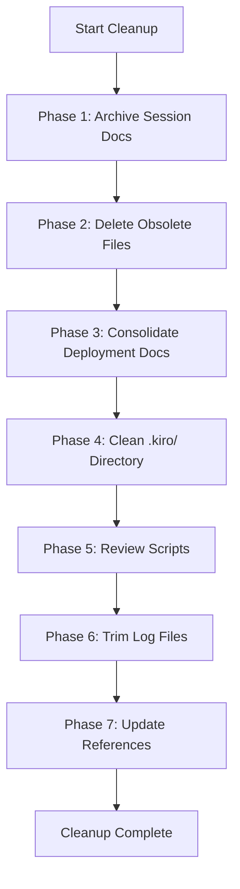

# Design Document: Documentation Cleanup

## Overview

This design document outlines the approach for auditing and cleaning up the BudgetBuddy codebase documentation. The cleanup involves archiving session-specific documents, deleting obsolete files, consolidating redundant deployment documentation, cleaning up the .kiro/ directory, reviewing scripts, and trimming large log files.

The cleanup is primarily a file management operation with some content consolidation. All operations will be performed using file system operations (move, delete, create) and content editing.

## Architecture

### High-Level Approach



### Directory Structure After Cleanup

```
docs/
├── archive/
│   ├── sessions/           # Session-specific docs from root
│   │   ├── API_GATEWAY_DEPLOYMENT_FIX.md
│   │   ├── ARCHITECTURE_REVIEW.md
│   │   ├── AUTONOMOUS_DEVELOPMENT_DESIGN.md
│   │   ├── BACKUP_RESTORE_IMPLEMENTATION.md
│   │   ├── COMPREHENSIVE_HOOK_ANALYSIS.md
│   │   ├── DOCUMENTATION_ENFORCEMENT_ANALYSIS.md
│   │   ├── FIXES_APPLIED.md
│   │   ├── HOOK_ANALYSIS.md
│   │   └── SESSION_SUMMARY.md
│   ├── kiro/               # Session-specific docs from .kiro/
│   │   ├── STEERING_OPTIMIZATION_COMPLETE.md
│   │   ├── DEPLOYMENT_FAILURE_SUMMARY.md
│   │   ├── SESSION_41_SUMMARY.md
│   │   └── SESSION_CONTINUITY_UPDATE.md
│   ├── blockers/           # Resolved blocker documentation
│   │   └── FAMILY_LAMBDA_502_BLOCKER.md
│   ├── changelog-archive.md    # Old CHANGELOG entries
│   └── development-log-archive.md  # Old DEVELOPMENT_LOG entries
├── deployment-guide.md     # Consolidated deployment documentation
├── api-endpoints.md
├── api-troubleshooting.md
├── aws-resource-standards.md
├── aws-stack-architecture.md
├── cicd-automation-guide.md
├── configuration-guide.md
├── DEVELOPMENT_BEST_PRACTICES.md
├── development-status.md
├── multi-currency-guide.md
├── push-notifications-guide.md
├── README.md
├── stack-management-guide.md
├── USER_JOURNEYS.md
├── user-guide-family.md
└── user-guide-notifications.md
```

## Components and Interfaces

### Component 1: Archive Manager

**Purpose**: Move files to appropriate archive directories while preserving content.

**Operations**:

- `moveToArchive(sourcePath, archiveSubdir)`: Move file to archive subdirectory
- `createArchiveDirectory(path)`: Create archive subdirectory if not exists
- `verifyArchive(originalPath, archivePath)`: Verify file was archived correctly

**Archive Directory Mapping**:
| Source Location | Archive Destination |
|-----------------|---------------------|
| Root session docs | `docs/archive/sessions/` |
| .kiro/ session docs | `docs/archive/kiro/` |
| Resolved blockers | `docs/archive/blockers/` |

### Component 2: Documentation Consolidator

**Purpose**: Merge multiple documentation files into a single comprehensive document.

**Operations**:

- `extractSections(filePath)`: Parse markdown file into sections
- `mergeSections(sections[])`: Combine sections from multiple files
- `deduplicateContent(content)`: Remove duplicate information
- `writeConsolidatedDoc(path, content)`: Write merged document

**Consolidation Strategy for Deployment Docs**:

1. **DEPLOYMENT.md** - General deployment guide (prerequisites, environments, quick start)
2. **DEPLOYMENT_INSTRUCTIONS.md** - Specific auth-onboarding deployment (historical context)
3. **DEPLOYMENT_INSTRUCTIONS_CICD.md** - CI/CD deployment process (primary method)

**Merged Structure**:

```markdown
# BudgetBuddy Deployment Guide

## Prerequisites

## Quick Start (CI/CD - Recommended)

## Manual Deployment

## Environment Configuration

## Post-Deployment Verification

## Troubleshooting

## Rollback Procedures

## Historical Context (Auth-Onboarding)
```

### Component 3: Script Analyzer

**Purpose**: Identify and clean up redundant or obsolete scripts.

**Current Script Analysis**:

| Script                            | Status    | Action                                       |
| --------------------------------- | --------- | -------------------------------------------- |
| security-check.ps1                | Redundant | DELETE (duplicate of security-check-win.ps1) |
| security-check-win.ps1            | Active    | KEEP                                         |
| security-check-simple.ps1         | Redundant | DELETE (simplified version not needed)       |
| security-check.sh                 | Active    | KEEP                                         |
| migrate-budgets-currency.js       | Review    | KEEP if multi-currency active                |
| migrate-transactions-currency.js  | Review    | KEEP if multi-currency active                |
| migrate-user-profiles-currency.js | Review    | KEEP if multi-currency active                |

### Component 4: Log Trimmer

**Purpose**: Archive old entries from large log files while maintaining recent history.

**Trimming Strategy**:

- CHANGELOG.md: Keep last 6 months, archive older entries
- DEVELOPMENT_LOG.md: Keep last 3 months, archive older entries

**Archive Format**:

```markdown
# Archived [CHANGELOG/DEVELOPMENT_LOG] Entries

> This file contains archived entries from [original file].
> For recent entries, see [link to main file].

## Archived Entries

[Content from original file, oldest first]
```

## Data Models

### File Operation Record

```typescript
interface FileOperation {
  type: "move" | "delete" | "create" | "update";
  sourcePath: string;
  destinationPath?: string; // For move operations
  reason: string;
  timestamp: Date;
  verified: boolean;
}
```

### Cleanup Report

```typescript
interface CleanupReport {
  filesArchived: FileOperation[];
  filesDeleted: FileOperation[];
  filesCreated: FileOperation[];
  filesUpdated: FileOperation[];
  scriptsRemoved: string[];
  referencesUpdated: number;
  errors: string[];
}
```

## Correctness Properties

_A property is a characteristic or behavior that should hold true across all valid executions of a system—essentially, a formal statement about what the system should do. Properties serve as the bridge between human-readable specifications and machine-verifiable correctness guarantees._

### Property 1: Archive Operation Integrity

_For any_ file that is archived, the file SHALL exist in the destination archive directory with the same filename, and the original file SHALL NOT exist in the source location after the archive operation completes.

**Validates: Requirements 1.1, 1.2, 1.5**

### Property 2: Consolidation Content Preservation

_For any_ consolidation of multiple documentation files, the resulting consolidated document SHALL contain all unique sections and information from each source file, and no references to the original files SHALL remain broken in other documentation.

**Validates: Requirements 3.1, 3.2, 3.5**

### Property 3: CHANGELOG Date-Based Archiving

_For any_ entry in CHANGELOG.md, if the entry date is older than 6 months from the current date, the entry SHALL appear in the archive file and SHALL NOT appear in the main CHANGELOG.md. Conversely, entries within the last 6 months SHALL remain in the main file.

**Validates: Requirements 6.1, 6.5**

### Property 4: DEVELOPMENT_LOG Date-Based Archiving

_For any_ entry in DEVELOPMENT_LOG.md, if the entry date is older than 3 months from the current date, the entry SHALL appear in the archive file and SHALL NOT appear in the main DEVELOPMENT_LOG.md. Conversely, entries within the last 3 months SHALL remain in the main file.

**Validates: Requirements 6.2, 6.6**

### Property 5: Archive Format Preservation

_For any_ archived log entries, the markdown structure (headers, lists, code blocks) SHALL be preserved exactly as in the original file.

**Validates: Requirements 6.3**

### Property 6: Link Integrity After Cleanup

_For any_ markdown file in the repository after cleanup, all internal links (relative paths to other files) SHALL resolve to existing files. No broken links SHALL remain.

**Validates: Requirements 7.1, 7.2, 7.3**

### Property 7: Resolved Blocker Header Addition

_For any_ blocker file that is archived as resolved, the archived file SHALL contain a header noting the resolution status and date.

**Validates: Requirements 4.4**

## Error Handling

### File Operation Errors

| Error Scenario                      | Handling Strategy                                                   |
| ----------------------------------- | ------------------------------------------------------------------- |
| Source file not found               | Log warning, skip operation, continue with other files              |
| Destination directory doesn't exist | Create directory before move operation                              |
| Permission denied                   | Log error, report in cleanup summary, manual intervention required  |
| File already exists in destination  | Compare content, skip if identical, rename with suffix if different |

### Content Parsing Errors

| Error Scenario               | Handling Strategy                           |
| ---------------------------- | ------------------------------------------- |
| Invalid markdown structure   | Preserve original content, log warning      |
| Date parsing failure in logs | Use file modification date as fallback      |
| Missing expected sections    | Log warning, proceed with available content |

### Reference Update Errors

| Error Scenario                 | Handling Strategy                                  |
| ------------------------------ | -------------------------------------------------- |
| Circular reference detected    | Log warning, break cycle by removing one reference |
| External link (not internal)   | Skip, only process internal references             |
| Reference in non-markdown file | Log for manual review                              |

## Testing Strategy

### Unit Tests

Unit tests will verify individual operations:

1. **File Operations**
   - Test file move preserves content
   - Test directory creation
   - Test file deletion verification

2. **Content Parsing**
   - Test markdown section extraction
   - Test date parsing from log entries
   - Test link extraction from markdown

3. **Reference Updates**
   - Test link replacement in markdown
   - Test broken link detection

### Property-Based Tests

Property-based tests will use fast-check to verify correctness properties:

1. **Archive Integrity Test**
   - Generate random file paths and content
   - Verify archive operation maintains integrity
   - **Feature: documentation-cleanup, Property 1: Archive Operation Integrity**

2. **Link Integrity Test**
   - Generate markdown files with various link patterns
   - Verify all links resolve after operations
   - **Feature: documentation-cleanup, Property 6: Link Integrity After Cleanup**

### Integration Tests

Integration tests will verify end-to-end cleanup:

1. **Full Cleanup Simulation**
   - Create test directory structure
   - Run cleanup operations
   - Verify final state matches expected structure

2. **Rollback Verification**
   - Verify cleanup can be reversed if needed
   - Test git-based rollback

### Manual Verification Checklist

After automated cleanup, manually verify:

- [ ] All archived files are accessible in archive directories
- [ ] Consolidated deployment guide is comprehensive and accurate
- [ ] No broken links in documentation
- [ ] scripts/README.md accurately reflects current scripts
- [ ] .kiro/README.md accurately reflects current .kiro/ structure
- [ ] CHANGELOG.md and DEVELOPMENT_LOG.md are readable and navigable
