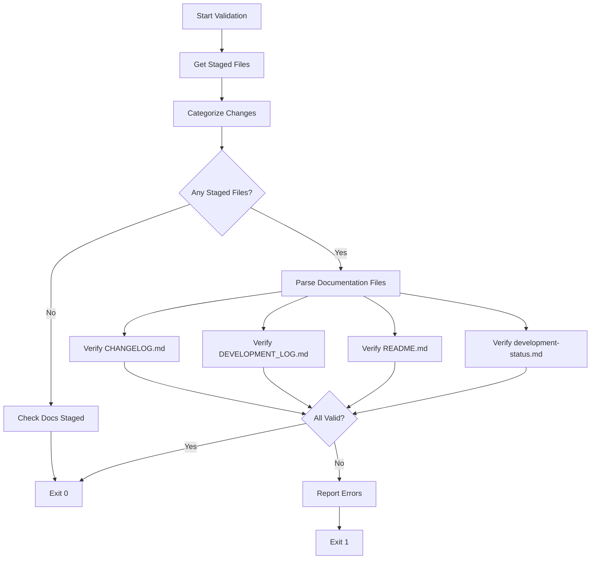

# Design Document: Documentation Validation Fix

## Overview

This design addresses the critical flaw in `scripts/validate-documentation.js` where validation passes based on file modification timestamps rather than verifying that documentation content actually reflects the current commit's work.

The solution implements content-based validation that:

- Parses documentation files to verify they contain entries for current work
- Analyzes staged files to determine what documentation is required
- Provides specific, actionable error messages when validation fails
- Maintains backward compatibility with existing workflows

## Architecture

### High-Level Flow



### Module Structure

```
scripts/
  validate-documentation.js (main entry point)
  validators/
    changelog-validator.js
    dev-log-validator.js
    readme-validator.js
    status-validator.js
  utils/
    git-utils.js (staged files, categorization)
    date-utils.js (date parsing, comparison)
    content-parser.js (file parsing utilities)
```

## Components and Interfaces

### 1. Main Validator (validate-documentation.js)

**Responsibilities:**

- Orchestrate validation workflow
- Call git utilities to get staged files
- Invoke individual validators
- Aggregate and report errors
- Exit with appropriate status code

**Interface:**

```javascript
async function validateDocumentation() {
  // Returns: { success: boolean, errors: string[] }
}
```

### 2. Git Utilities (utils/git-utils.js)

**Responsibilities:**

- Execute git commands to get staged files
- Categorize changes by type (backend, frontend, infrastructure, tests, docs)
- Determine if documentation files are staged

**Interface:**

```javascript
async function getStagedFiles() {
  // Returns: string[] - Array of file paths
}

function categorizeChanges(stagedFiles) {
  // Returns: {
  //   backend: string[],
  //   frontend: string[],
  //   infrastructure: string[],
  //   tests: string[],
  //   docs: string[]
  // }
}

function isDocumentationStaged(stagedFiles) {
  // Returns: boolean
}
```

**Categorization Rules:**

- Backend: `backend/**/*.js`, `backend/**/*.json`
- Frontend: `packages/**/*.tsx`, `packages/**/*.ts`, `packages/**/*.jsx`, `packages/**/*.js`
- Infrastructure: `infrastructure/**/*.ts`, `.github/workflows/**/*.yml`
- Tests: `tests/**/*.js`, `**/*.test.js`, `**/*.spec.js`
- Docs: `docs/**/*.md`, `*.md`

### 3. Date Utilities (utils/date-utils.js)

**Responsibilities:**

- Parse dates from documentation files
- Compare dates to determine if entry is from today
- Format dates consistently

**Interface:**

```javascript
function getTodayString() {
  // Returns: string - "YYYY-MM-DD" format
}

function isToday(dateString) {
  // Returns: boolean
}

function isWithinDays(dateString, days) {
  // Returns: boolean
}

function parseDate(dateString) {
  // Returns: Date | null
}
```

### 4. Content Parser (utils/content-parser.js)

**Responsibilities:**

- Read file content
- Extract sections by heading
- Find date patterns in content
- Search for keywords/patterns

**Interface:**

```javascript
async function readFile(filePath) {
  // Returns: string - File content
}

function extractSection(content, headingPattern) {
  // Returns: string - Section content
}

function findDatesInContent(content) {
  // Returns: string[] - Array of date strings
}

function containsKeywords(content, keywords) {
  // Returns: boolean
}
```

### 5. CHANGELOG Validator (validators/changelog-validator.js)

**Responsibilities:**

- Verify version entry exists for today
- Check semantic version format
- Verify entry mentions relevant changes based on staged files

**Interface:**

```javascript
async function validateChangelog(stagedFiles, categories) {
  // Returns: { valid: boolean, errors: string[] }
}
```

**Validation Logic:**

1. Read CHANGELOG.md content
2. Search for version entry with today's date (pattern: `## [X.Y.Z] - YYYY-MM-DD`)
3. Extract entry content (text between this version and next version/EOF)
4. Check if entry mentions:
   - "backend" or specific backend files if categories.backend.length > 0
   - "frontend" or "web" or "mobile" if categories.frontend.length > 0
   - "infrastructure" or "CDK" or "stack" if categories.infrastructure.length > 0
5. Return errors if validation fails

### 6. Development Log Validator (validators/dev-log-validator.js)

**Responsibilities:**

- Verify session entry exists for today
- Check entry contains work description
- Verify entry mentions relevant work based on staged files

**Interface:**

```javascript
async function validateDevLog(stagedFiles, categories) {
  // Returns: { valid: boolean, errors: string[] }
}
```

**Validation Logic:**

1. Read DEVELOPMENT_LOG.md content
2. Search for session entry with today's date (pattern: `### YYYY-MM-DD`)
3. Extract entry content (text between this date and next date/EOF)
4. Check if entry has substantial content (> 50 characters)
5. Check if entry mentions relevant components or work areas
6. Return errors if validation fails

### 7. README Validator (validators/readme-validator.js)

**Responsibilities:**

- Verify "Recent Achievements" section exists
- Check for recent updates (within 7 days)
- Verify major features are mentioned

**Interface:**

```javascript
async function validateReadme(stagedFiles, categories) {
  // Returns: { valid: boolean, errors: string[] }
}
```

**Validation Logic:**

1. Read README.md content
2. Extract "Recent Achievements" section
3. Find all dates in section
4. Check if any date is within last 7 days
5. For major changes (infrastructure, new features), verify section mentions them
6. Return errors if validation fails

### 8. Status Validator (validators/status-validator.js)

**Responsibilities:**

- Verify "Last Updated" field is today's date
- Check "Current Status" section has content

**Interface:**

```javascript
async function validateStatus(stagedFiles, categories) {
  // Returns: { valid: boolean, errors: string[] }
}
```

**Validation Logic:**

1. Read docs/development-status.md content
2. Search for "Last Updated" field (pattern: `**Last Updated:** YYYY-MM-DD`)
3. Verify date is today
4. Extract "Current Status" section
5. Verify section has substantial content (> 100 characters)
6. Return errors if validation fails

## Data Models

### StagedFilesAnalysis

```javascript
{
  files: string[],           // All staged files
  categories: {
    backend: string[],
    frontend: string[],
    infrastructure: string[],
    tests: string[],
    docs: string[]
  },
  hasDocChanges: boolean,    // True if any doc file is staged
  requiresValidation: boolean // True if non-doc files are staged
}
```

### ValidationResult

```javascript
{
  valid: boolean,
  errors: string[],          // Array of error messages
  file: string               // Which file failed validation
}
```

### AggregatedResult

```javascript
{
  success: boolean,
  results: {
    changelog: ValidationResult,
    devLog: ValidationResult,
    readme: ValidationResult,
    status: ValidationResult
  }
}
```

## Correctness Properties

_A property is a characteristic or behavior that should hold true across all valid executions of a system—essentially, a formal statement about what the system should do. Properties serve as the bridge between human-readable specifications and machine-verifiable correctness guarantees._

### Property 1: Content-Based Validation Over Timestamps

_For any_ validation run with staged files, the script should parse and verify documentation file content rather than relying solely on file modification timestamps.
**Validates: Requirements 1.1, 1.2, 1.5**

### Property 2: Staged Files Extraction and Categorization

_For any_ validation run, when files are staged, the script should correctly extract the list of staged files from git and categorize them by type (backend, frontend, infrastructure, tests, docs), then use these categories to determine required documentation content.
**Validates: Requirements 1.3, 6.1, 6.2, 6.4**

### Property 3: Date-Based Entry Validation

_For any_ documentation file that requires dated entries (CHANGELOG.md, DEVELOPMENT_LOG.md, development-status.md), the script should verify that an entry exists with today's date.
**Validates: Requirements 2.1, 3.1, 5.2**

### Property 4: Semantic Version Format Validation

_For any_ CHANGELOG.md validation, the script should verify that version entries follow semantic versioning format (X.Y.Z).
**Validates: Requirements 2.2**

### Property 5: Category-Specific Content Validation

_For any_ staged files in a specific category (backend, frontend, infrastructure), the script should verify that CHANGELOG.md and DEVELOPMENT_LOG.md contain mentions of that category or related work.
**Validates: Requirements 2.3, 2.4, 2.5, 3.3**

### Property 6: Substantial Content Requirement

_For any_ documentation entry being validated, the script should verify that the entry contains substantial content (minimum character thresholds: DEVELOPMENT_LOG.md > 50 chars, development-status.md > 100 chars).
**Validates: Requirements 3.2, 5.3**

### Property 7: Recent Achievements Time Window

_For any_ README.md validation, the script should verify that at least one achievement in the "Recent Achievements" section was added or updated within the last 7 days.
**Validates: Requirements 4.2**

### Property 8: Major Feature Documentation

_For any_ staged files that represent major features (infrastructure changes, new feature directories), the script should verify that README.md mentions the feature.
**Validates: Requirements 4.3**

### Property 9: Required Section Existence

_For any_ documentation file validation, the script should verify that required sections exist (README.md "Recent Achievements", development-status.md "Last Updated" and "Current Status").
**Validates: Requirements 4.1, 5.1**

### Property 10: Comprehensive Error Reporting

_For any_ validation failure, the script should output which documentation file failed, what content is missing or incorrect, which staged files triggered the requirement, and actionable guidance on how to fix the issue.
**Validates: Requirements 1.4, 7.1, 7.2, 7.3, 7.4**

### Property 11: Exit Code Consistency

_For any_ validation run, the script should exit with status code 0 when validation passes and non-zero when validation fails.
**Validates: Requirements 7.5, 8.4**

### Property 12: Empty Staging Area Handling

_For any_ validation run where no files are staged, the script should skip content verification and only check if documentation files themselves are staged.
**Validates: Requirements 6.3**

### Property 13: Backward Compatibility

_For any_ invocation of the validation script, it should maintain the same command-line interface and output format as the current version, ensuring compatibility with existing tools (safe-commit-push.js, git hooks).
**Validates: Requirements 8.1, 8.5**

## Error Handling

### Error Categories

**1. Git Command Failures**

- Scenario: `git diff --cached` command fails
- Handling: Catch error, log descriptive message, exit with code 1
- Message: "Failed to get staged files from git. Ensure you're in a git repository."

**2. File Read Failures**

- Scenario: Documentation file doesn't exist or can't be read
- Handling: Catch error, report which file is missing, exit with code 1
- Message: "Failed to read {filename}. Ensure the file exists and is readable."

**3. Content Validation Failures**

- Scenario: Documentation content doesn't match requirements
- Handling: Collect all validation errors, report with context, exit with code 1
- Message: Specific to each validator (see validator interfaces)

**4. Date Parsing Failures**

- Scenario: Date format in documentation is invalid
- Handling: Log warning, treat as missing date, continue validation
- Message: "Warning: Could not parse date '{dateString}' in {filename}"

### Error Message Format

All error messages should follow this structure:

```
❌ {DocumentationFile} validation failed:
   - {Specific issue}
   - Staged files: {list of relevant staged files}
   - Fix: {Actionable guidance}
```

Example:

```
❌ CHANGELOG.md validation failed:
   - No version entry found for today (2024-01-15)
   - Staged files: backend/auth/index.js, infrastructure/auth-stack.ts
   - Fix: Add a version entry with today's date and mention backend/infrastructure changes
```

### Graceful Degradation

**Partial Validation:**

- If one validator fails, continue with remaining validators
- Report all failures at the end
- Exit with code 1 if any validator failed

**Missing Optional Content:**

- Some content checks are warnings, not errors
- Example: README.md major feature mention is a warning for small changes
- Warnings don't cause validation to fail

## Testing Strategy

### Unit Tests

**Git Utilities:**

- Test `getStagedFiles()` with mocked git commands
- Test `categorizeChanges()` with various file paths
- Test edge cases: empty staging area, non-existent paths

**Date Utilities:**

- Test `isToday()` with various date formats
- Test `isWithinDays()` with boundary conditions
- Test `parseDate()` with invalid formats

**Content Parser:**

- Test `extractSection()` with various markdown structures
- Test `findDatesInContent()` with different date formats
- Test `containsKeywords()` with case sensitivity

**Individual Validators:**

- Test each validator with valid and invalid documentation
- Test error message generation
- Test edge cases: missing sections, empty content, wrong dates

### Property-Based Tests

**Property 1: Content-Based Validation Over Timestamps**

- Generate random staged files and documentation content
- Verify validation checks content, not just timestamps
- Minimum 100 iterations

**Property 2: Staged Files Extraction and Categorization**

- Generate random file paths across all categories
- Verify correct categorization for all paths
- Minimum 100 iterations

**Property 3: Date-Based Entry Validation**

- Generate random dates (today, past, future)
- Verify correct detection of today's date
- Minimum 100 iterations

**Property 5: Category-Specific Content Validation**

- Generate random staged files and documentation content
- Verify category mentions are correctly detected
- Minimum 100 iterations

**Property 10: Comprehensive Error Reporting**

- Generate random validation failures
- Verify all error components are present
- Minimum 100 iterations

**Property 11: Exit Code Consistency**

- Generate random validation scenarios (pass/fail)
- Verify exit codes are always correct
- Minimum 100 iterations

### Integration Tests

**End-to-End Validation:**

- Create temporary git repository
- Stage various file combinations
- Create documentation with various states (valid/invalid)
- Run validation and verify results

**Backward Compatibility:**

- Test integration with `safe-commit-push.js`
- Test integration with git pre-commit hooks
- Verify output format matches expectations

**Real-World Scenarios:**

- Test with actual BudgetBuddy commit patterns
- Test with various documentation states from project history
- Verify validation catches real issues

### Test Configuration

- **Framework**: Jest
- **Coverage Target**: > 90% (critical validation logic)
- **Property Test Iterations**: 100 minimum per property
- **Mocking**: Mock git commands, file system operations
- **Test Data**: Use fixtures for documentation samples

## Performance Considerations

### Optimization Strategies

**1. Lazy File Reading:**

- Only read documentation files if validation is required
- Skip content parsing if no files are staged

**2. Efficient Pattern Matching:**

- Use compiled regex patterns for date/version matching
- Cache regex compilation results

**3. Early Exit:**

- If no files are staged, exit immediately
- If documentation files are staged, skip content validation

**4. Minimal Git Operations:**

- Single `git diff --cached` call to get all staged files
- No additional git operations needed

### Performance Targets

- **Validation Time**: < 500ms for typical commit
- **Memory Usage**: < 50MB
- **Git Operations**: 1 command per validation run

## Security Considerations

### Input Validation

**Git Command Output:**

- Sanitize file paths from git output
- Prevent path traversal attacks
- Validate file paths are within repository

**File Content:**

- Limit file size for documentation files (< 10MB)
- Handle malformed content gracefully
- Prevent regex DoS with timeout limits

### Safe Execution

**No Code Execution:**

- Never execute code from documentation files
- Only parse and analyze text content

**Error Information:**

- Don't expose sensitive information in error messages
- Sanitize file paths in error output

## Deployment Strategy

### Rollout Plan

**Phase 1: Development and Testing**

- Implement new validation logic
- Write comprehensive tests
- Test with historical commits

**Phase 2: Parallel Validation**

- Run both old and new validation in parallel
- Compare results and fix discrepancies
- Ensure no false positives

**Phase 3: Gradual Rollout**

- Deploy to development environment
- Monitor for issues
- Deploy to production after 1 week

**Phase 4: Cleanup**

- Remove old validation logic
- Update documentation
- Announce changes to team

### Rollback Plan

If issues are discovered:

1. Revert to previous version of validation script
2. Investigate and fix issues
3. Re-test thoroughly
4. Re-deploy with fixes

### Monitoring

**Success Metrics:**

- Validation pass rate
- False positive rate (validation fails but docs are correct)
- False negative rate (validation passes but docs are wrong)
- Validation execution time

**Alerts:**

- Alert if validation time > 1 second
- Alert if validation fails > 50% of commits
- Alert if validation crashes

## Documentation Updates

### Files to Update

**1. README.md**

- Update "Development Workflow" section
- Mention improved validation

**2. DEVELOPMENT_LOG.md**

- Add entry for validation fix implementation

**3. CHANGELOG.md**

- Add version entry for validation fix

**4. docs/development-status.md**

- Update status with validation improvements

**5. scripts/README.md** (if exists)

- Document new validation behavior
- Explain error messages

### Developer Communication

**Announcement:**

- Notify team of validation changes
- Explain new requirements
- Provide examples of valid documentation

**Training:**

- Update onboarding documentation
- Add examples to contribution guide
- Create troubleshooting guide for common errors
