# Design Document: Test Coverage Improvement

## Overview

This design document outlines the technical approach to improve test coverage from 56% to 80% across the BudgetBuddy application. The plan spans Weeks 2-4 of the test creation roadmap (Week 1 P0 critical bugs are already fixed with regression tests).

The test creation effort is organized into three phases:

- **Week 2**: High-value feature tests (transaction editing, OAuth, admin, OCR, 2FA)
- **Week 3**: E2E user journey tests (onboarding, daily management, bank sync, goals)
- **Week 4**: Mobile and AI tests (React Native components, pattern detection, bill creation, budget planning)

## Architecture

The test coverage improvement spans multiple layers of the application:

```mermaid
graph TB
    subgraph "Week 2: Feature Tests"
        TE[Transaction Editing]
        OA[Google OAuth]
        AD[Admin Dashboard]
        RC[Receipt OCR]
        TF[Two-Factor Auth]
    end

    subgraph "Week 3: E2E Tests"
        ON[Onboarding Journey]
        DM[Daily Management]
        BS[Bank Sync Journey]
        GJ[Goals Journey]
    end

    subgraph "Week 4: Mobile + AI"
        RN[React Native Components]
        PD[Pattern Detection]
        BC[Bill Creation]
        BP[Budget Planning]
    end

    subgraph "Test Types"
        UT[Unit Tests]
        PT[Property Tests]
        IT[Integration Tests]
        E2E[E2E Tests]
    end

    TE --> UT
    TE --> PT
    OA --> IT
    AD --> UT
    AD --> PT
    RC --> IT
    TF --> UT

    ON --> E2E
    DM --> E2E
    BS --> E2E
    GJ --> E2E

    RN --> UT
    PD --> PT
    BC --> IT
    BP --> PT
```



## Components and Interfaces

### Week 2: High-Value Feature Tests

#### 1. Transaction Editing Tests

**Location**: `backend/functions/transactions/edit-transaction.test.js`

**Test Scope**:

- Edit transaction amount and verify budget recalculation
- Change transaction category and verify both category totals update
- Date validation within budget month
- Invalid data rejection
- Persistence round-trip

**Dependencies**:

- `backend/functions/transactions/index.js` - Transaction Lambda handler
- `backend/functions/transactions/service.js` - Business logic
- `backend/functions/transactions/repository.js` - DynamoDB access

#### 2. Google OAuth Tests

**Location**: `backend/functions/auth/google-oauth.test.js`

**Test Scope**:

- OAuth initiation with correct redirect parameters
- Authorization code exchange
- User creation/update in Cognito
- Error handling for invalid codes
- Account linking for existing emails
- JWT token issuance

**Dependencies**:

- `backend/functions/auth/index.js` - Auth Lambda handler
- AWS Cognito User Pool
- Google OAuth API (mocked)

#### 3. Admin Dashboard Tests

**Location**: `backend/functions/admin/admin-api.test.js`

**Test Scope**:

- User list pagination
- User search by email/name
- User details completeness
- Account disable functionality
- System metrics display
- Authorization enforcement (403 for non-admins)

**Dependencies**:

- `backend/functions/admin/index.js` - Admin Lambda handler
- `backend/layers/shared/nodejs/shared/permissions.js` - RBAC

#### 4. Receipt OCR Tests

**Location**: `backend/functions/receipt/ocr-accuracy.test.js`

**Test Scope**:

- Total amount extraction accuracy (90%+)
- Merchant name extraction accuracy (85%+)
- Date extraction accuracy (90%+)
- Low quality image detection
- Multi-item receipt validation

**Dependencies**:

- `backend/functions/receipt/index.js` - Receipt Lambda handler
- AWS Textract (mocked for unit tests)
- Test receipt image dataset

#### 5. Two-Factor Authentication Tests

**Location**: `tests/security/two-factor-auth.test.js`

**Test Scope**:

- TOTP secret generation and QR code display
- TOTP verification flow
- Login with 2FA enabled
- Invalid TOTP rejection (max 3 attempts)
- 2FA disable flow
- 30-second window validation

**Dependencies**:

- `backend/functions/auth/index.js` - Auth Lambda handler
- TOTP library (otplib)

### Week 3: E2E User Journey Tests

#### 6. Onboarding Journey Tests

**Location**: `tests/e2e/onboarding-journey.test.js`

**Test Scope**:

- Registration → email verification → onboarding redirect
- Location/family size → AI budget generation
- Category customization persistence
- First budget creation → dashboard redirect
- Error recovery without losing progress

**Dependencies**:

- Full application stack
- AWS Cognito
- AWS Bedrock (AI budget generation)

#### 7. Daily Budget Management Tests

**Location**: `tests/e2e/daily-budget-management.test.js`

**Test Scope**:

- App open → current month budget display
- Transaction add → immediate total update
- Category view → transactions and remaining budget
- Budget edit → recalculation
- Total consistency invariant

**Dependencies**:

- Full application stack
- DynamoDB

#### 8. Bank Account Connection Tests

**Location**: `tests/e2e/bank-connection-journey.test.js`

**Test Scope**:

- Plaid Link launch with correct config
- Access token storage and initial transaction fetch
- AI categorization of imported transactions
- Refresh → new transactions since last sync
- Error handling and reconnection
- Amount matching invariant

**Dependencies**:

- Full application stack
- Plaid API (sandbox mode)

#### 9. Debt and Savings Goals Tests

**Location**: `tests/e2e/goals-journey.test.js`

**Test Scope**:

- Savings goal creation → monthly contribution calculation
- Debt payoff goal → timeline calculation
- Contribution logging → progress update
- Goal completion → celebration notification
- Math accuracy invariant

**Dependencies**:

- Full application stack
- Notification service

### Week 4: Mobile + AI Tests

#### 10. React Native Component Tests

**Location**: `packages/mobile/src/components/__tests__/`

**Test Scope**:

- Quick Actions FAB rendering and tap handling
- Transaction Template save/apply
- Mobile Search filtering
- Goal Reorder drag-drop persistence
- Two-Factor Setup QR and TOTP validation
- Accessibility labels presence

**Dependencies**:

- React Native Testing Library
- Jest

#### 11. AI Pattern Detection Tests

**Location**: `backend/functions/pattern-detection/confidence.test.js`

**Test Scope**:

- Recurring transaction identification (85%+ precision)
- Confidence score calculation
- Threshold-based bill suggestion
- User feedback exclusion
- Pattern change detection
- Prediction accuracy (within 3 days)

**Dependencies**:

- `backend/functions/pattern-detection/` - Pattern detection Lambda
- Test transaction dataset

#### 12. AI Bill Creation Tests

**Location**: `backend/functions/bills/ai-creation.test.js`

**Test Scope**:

- Pattern confirmation → bill creation
- Due date calculation from pattern
- Bill reminder notification
- Auto-update on amount difference
- User edit preservation
- Amount accuracy (within 5%)

**Dependencies**:

- `backend/functions/bills/index.js` - Bills Lambda
- `backend/functions/pattern-detection/` - Pattern detection

#### 13. AI Budget Planning Tests

**Location**: `backend/functions/budget/ai-planning.test.js`

**Test Scope**:

- Historical spending analysis
- Seasonal variation accounting
- Confidence interval display
- City-based defaults fallback
- Learning and adjustment
- Prediction accuracy (within 15%)

**Dependencies**:

- `backend/functions/budget/index.js` - Budget Lambda
- AWS Bedrock
- City expense data

## Data Models

No new data models are required. Tests will use existing models:

- **Transaction**: `{ transactionId, familyId, budgetId, categoryId, amount, date, description }`
- **Budget**: `{ budgetId, familyId, month, categories, totalPlanned, totalActual }`
- **Bill**: `{ billId, familyId, name, amount, frequency, nextDueDate, patternId }`
- **Goal**: `{ goalId, familyId, type, targetAmount, currentAmount, targetDate }`
- **Pattern**: `{ patternId, familyId, merchantName, amount, frequency, confidence }`

## Correctness Properties

_A property is a characteristic or behavior that should hold true across all valid executions of a system—essentially, a formal statement about what the system should do. Properties serve as the bridge between human-readable specifications and machine-verifiable correctness guarantees._

### Property 1: Transaction Edit Round-Trip

_For any_ valid transaction and any valid edit (amount, category, description), editing the transaction and then retrieving it SHALL return the updated values exactly.

**Validates: Requirements 1.6**

### Property 2: Transaction Date Validation

_For any_ transaction edit with a date, the system SHALL accept dates within the budget month and reject dates outside the budget month.

**Validates: Requirements 1.3**

### Property 3: Transaction Invalid Data Rejection

_For any_ transaction edit with invalid data (empty amount, negative amount, missing required fields), the system SHALL reject the edit and return validation errors.

**Validates: Requirements 1.4**

### Property 4: Admin Search and Pagination

_For any_ admin user list request with search term and page parameters, the returned results SHALL contain only users matching the search term and be correctly paginated.

**Validates: Requirements 3.1, 3.2**

### Property 5: Admin Data Completeness

_For any_ admin user details request, the response SHALL contain account status, subscription tier, and activity metrics fields.

**Validates: Requirements 3.3**

### Property 6: Admin Authorization

_For any_ admin API request from a non-admin user, the system SHALL return 403 Forbidden.

**Validates: Requirements 3.6**

### Property 7: Receipt OCR Accuracy

_For any_ valid receipt image in the test dataset, the extracted total amount SHALL match the actual total within $0.01 tolerance.

**Validates: Requirements 4.6**

### Property 8: TOTP Timing Validation

_For any_ valid TOTP code generated within the current 30-second window, verification SHALL succeed.

**Validates: Requirements 5.6**

### Property 9: Budget Totals Invariant

_For any_ budget with transactions, the displayed category totals SHALL equal the sum of transaction amounts in that category, and the overall total SHALL equal the sum of all category totals.

**Validates: Requirements 7.6**

### Property 10: Bank Import Data Integrity

_For any_ transaction imported from a bank via Plaid, the stored amount SHALL exactly match the bank's reported amount.

**Validates: Requirements 8.6**

### Property 11: Savings Goal Calculation

_For any_ savings goal with target amount and target date, the calculated monthly contribution SHALL equal (targetAmount - currentAmount) / monthsRemaining, rounded to the cent.

**Validates: Requirements 9.1**

### Property 12: Debt Payoff Calculation

_For any_ debt payoff goal with balance, interest rate, and payment amount, the calculated payoff timeline SHALL be mathematically correct for the selected strategy (avalanche or snowball).

**Validates: Requirements 9.2**

### Property 13: Goal Math Accuracy

_For any_ goal calculation (savings contribution, debt payoff, progress percentage), the result SHALL be accurate to the cent.

**Validates: Requirements 9.6**

### Property 14: Mobile Search Filtering

_For any_ search query on mobile, the filtered transactions SHALL contain only transactions matching the text, category, or date range criteria.

**Validates: Requirements 10.3**

### Property 15: Mobile Accessibility

_For any_ mobile component, all interactive elements SHALL have accessibility labels for screen readers.

**Validates: Requirements 10.6**

### Property 16: Pattern Confidence and Threshold

_For any_ detected pattern, the confidence score SHALL be calculated based on frequency consistency and amount consistency, and bill suggestions SHALL only appear when confidence exceeds the threshold.

**Validates: Requirements 11.2, 11.3**

### Property 17: Pattern Change Detection

_For any_ existing pattern where the amount or frequency changes by more than 10%, the system SHALL detect the change and notify the user.

**Validates: Requirements 11.5**

### Property 18: Pattern Prediction Accuracy

_For any_ detected recurring pattern, the predicted next occurrence date SHALL be within 3 days of the actual occurrence.

**Validates: Requirements 11.6**

### Property 19: Bill Due Date Calculation

_For any_ bill created from a pattern, the next due date SHALL be calculated based on the pattern's detected frequency and last occurrence.

**Validates: Requirements 12.2**

### Property 20: Bill Amount Accuracy

_For any_ AI-created bill, the predicted amount SHALL be within 5% of the actual transaction amount.

**Validates: Requirements 12.6**

### Property 21: Budget Seasonal Adjustment

_For any_ budget prediction for a month with historical data, the prediction SHALL account for seasonal variations (e.g., higher spending in December).

**Validates: Requirements 13.2**

### Property 22: Budget Prediction Accuracy

_For any_ budget prediction with sufficient historical data, the predicted total SHALL be within 15% of actual for at least 80% of test cases.

**Validates: Requirements 13.6**

## Error Handling

### Test Error Scenarios

Each test suite should include error handling tests:

1. **Network Errors**: Simulate network failures and verify graceful degradation
2. **Invalid Input**: Test with malformed data and verify validation errors
3. **Authorization Failures**: Test with wrong roles and verify 403 responses
4. **Service Unavailability**: Mock AWS service failures and verify fallbacks
5. **Timeout Handling**: Test long-running operations and verify timeout behavior

### Error Test Patterns

```javascript
// Pattern for testing error handling
describe("Error Handling", () => {
  it("should handle network errors gracefully", async () => {
    // Mock network failure
    jest
      .spyOn(global, "fetch")
      .mockRejectedValue(new TypeError("Failed to fetch"));

    const result = await serviceUnderTest.operation();

    expect(result.error).toBe("Network error: Unable to connect");
    expect(result.retryable).toBe(true);
  });

  it("should reject invalid input with validation errors", async () => {
    const invalidInput = { amount: -100 }; // Negative amount

    await expect(serviceUnderTest.operation(invalidInput)).rejects.toThrow(
      "Validation error: amount must be positive",
    );
  });
});
```

## Testing Strategy

### Test Types and Coverage

| Test Type         | Current | Target | Gap | Focus Areas                          |
| ----------------- | ------- | ------ | --- | ------------------------------------ |
| Unit Tests        | 45      | 60     | +15 | Transaction editing, Admin APIs, 2FA |
| Integration Tests | 20      | 30     | +10 | OAuth, Receipt OCR, Bill creation    |
| Property Tests    | 8       | 22     | +14 | All 22 properties defined above      |
| E2E Tests         | 4       | 8      | +4  | 4 user journeys                      |

### Property-Based Testing Configuration

- **Library**: fast-check
- **Minimum Iterations**: 100 per property
- **Tag Format**: `Feature: test-coverage-improvement, Property {number}: {property_text}`

### Test File Organization

```
backend/
├── functions/
│   ├── transactions/
│   │   └── edit-transaction.test.js      # Week 2
│   ├── auth/
│   │   └── google-oauth.test.js          # Week 2
│   ├── admin/
│   │   └── admin-api.test.js             # Week 2
│   ├── receipt/
│   │   └── ocr-accuracy.test.js          # Week 2
│   ├── pattern-detection/
│   │   └── confidence.test.js            # Week 4
│   ├── bills/
│   │   └── ai-creation.test.js           # Week 4
│   └── budget/
│       └── ai-planning.test.js           # Week 4
tests/
├── security/
│   └── two-factor-auth.test.js           # Week 2
├── e2e/
│   ├── onboarding-journey.test.js        # Week 3
│   ├── daily-budget-management.test.js   # Week 3
│   ├── bank-connection-journey.test.js   # Week 3
│   └── goals-journey.test.js             # Week 3
packages/
└── mobile/
    └── src/components/__tests__/         # Week 4
        ├── QuickActionsFAB.test.tsx
        ├── TransactionTemplate.test.tsx
        ├── MobileSearch.test.tsx
        ├── GoalReorder.test.tsx
        └── TwoFactorSetup.test.tsx
```

### Test Data Requirements

1. **Receipt Test Dataset**: 50+ receipt images with known values for OCR accuracy testing
2. **Transaction History Dataset**: 1000+ transactions for pattern detection testing
3. **User Dataset**: 100+ mock users for admin API testing

### Success Metrics

| Metric                   | Current     | Target      |
| ------------------------ | ----------- | ----------- |
| Requirements with Tests  | 45/81 (56%) | 65/81 (80%) |
| Critical Bugs with Tests | 7/7 (100%)  | 7/7 (100%)  |
| Property Tests           | 8           | 22          |
| E2E User Journeys        | 4           | 8           |
| Test Coverage (lines)    | ~60%        | >80%        |

### Weekly Deliverables

**Week 2**: 5 high-value feature test suites + 6 property tests
**Week 3**: 4 E2E user journey test suites + 4 property tests
**Week 4**: 5 mobile component test suites + 12 property tests
