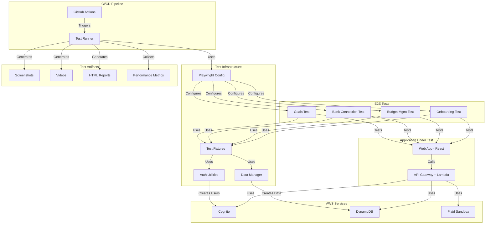

# Design Document: E2E Testing Infrastructure

## Overview

This design document outlines the architecture and implementation approach for a comprehensive End-to-End (E2E) testing infrastructure for BudgetBuddy. The system will use Playwright as the primary testing framework for web applications, with future support for React Native mobile testing using Detox or Appium.

The infrastructure will enable automated testing of four critical user journeys:

1. New User Onboarding Journey
2. Daily Budget Management Journey
3. Bank Account Connection Journey
4. Debt and Savings Goals Journey

The design emphasizes test isolation, cost efficiency, CI/CD integration, and comprehensive reporting to ensure high-quality releases while maintaining reasonable AWS costs.

## Architecture

### High-Level Architecture



### Component Responsibilities

**Playwright Configuration (`playwright.config.js`)**

- Defines browser targets (Chromium, Firefox, WebKit)
- Configures test timeouts and retries
- Sets up base URL and environment variables
- Configures screenshot and video capture
- Defines test directory structure

**Test Fixtures (`tests/e2e/fixtures/`)**

- Provides reusable test setup and teardown
- Creates authenticated test users
- Generates test data (budgets, transactions, accounts, goals)
- Tracks created resources for cleanup
- Provides helper methods for common operations

**Authentication Utilities (`tests/e2e/utils/auth.js`)**

- Creates Cognito test users
- Authenticates users and obtains tokens
- Stores authentication state for reuse
- Deletes test users after test completion

**Data Manager (`tests/e2e/utils/data-manager.js`)**

- Creates test data in DynamoDB
- Generates unique identifiers to prevent conflicts
- Tracks all created items for cleanup
- Deletes test data after test completion
- Provides factory methods for common entities

**Test Reporter**

- Generates HTML reports with test results
- Captures screenshots on failure
- Records videos for failed tests
- Collects browser console logs
- Tracks performance metrics

## Components and Interfaces

### Playwright Configuration

```javascript
// playwright.config.js
module.exports = {
  testDir: "./tests/e2e",
  timeout: 60000, // 60 seconds per test
  globalTimeout: 1800000, // 30 minutes for entire suite
  retries: process.env.CI ? 2 : 0,
  workers: process.env.CI ? 2 : 1,

  use: {
    baseURL: process.env.BASE_URL || "http://localhost:5173",
    screenshot: "only-on-failure",
    video: "retain-on-failure",
    trace: "retain-on-failure",
  },

  projects: [
    {
      name: "chromium",
      use: { browserName: "chromium" },
    },
    {
      name: "firefox",
      use: { browserName: "firefox" },
    },
    {
      name: "webkit",
      use: { browserName: "webkit" },
    },
  ],

  reporter: [
    ["html", { outputFolder: "test-results/html" }],
    ["json", { outputFile: "test-results/results.json" }],
    ["junit", { outputFile: "test-results/junit.xml" }],
  ],
};
```

### Test Fixture Interface

```javascript
// tests/e2e/fixtures/base-fixture.js

class BaseFixture {
  constructor() {
    this.createdResources = [];
    this.authTokens = null;
    this.testUser = null;
  }

  // Authentication
  async createAuthenticatedUser(role = "Primary") {
    // Creates Cognito user and authenticates
    // Returns { userId, email, tokens, familyId }
  }

  async authenticate(email, password) {
    // Authenticates existing user
    // Returns { accessToken, refreshToken, idToken }
  }

  // Data Creation
  async createBudget(familyId, month, categories) {
    // Creates budget in DynamoDB
    // Returns budgetId
  }

  async createTransaction(familyId, budgetId, categoryId, amount, description) {
    // Creates transaction in DynamoDB
    // Returns transactionId
  }

  async createBankAccount(familyId, plaidAccessToken) {
    // Creates bank account in DynamoDB
    // Returns accountId
  }

  async createGoal(familyId, type, name, targetAmount, currentAmount) {
    // Creates goal in DynamoDB
    // Returns goalId
  }

  // Cleanup
  async cleanup() {
    // Deletes all created resources
    // Deletes test user from Cognito
  }
}
```

### Authentication Utilities Interface

```javascript
// tests/e2e/utils/auth.js

async function createCognitoUser(email, password, attributes) {
  // Creates user in Cognito User Pool
  // Returns { userId, email }
}

async function authenticateUser(email, password) {
  // Authenticates user with Cognito
  // Returns { accessToken, refreshToken, idToken }
}

async function deleteCognitoUser(userId) {
  // Deletes user from Cognito User Pool
}

async function verifyEmail(email) {
  // Simulates email verification for test users
}
```

### Data Manager Interface

```javascript
// tests/e2e/utils/data-manager.js

class DataManager {
  constructor() {
    this.createdItems = [];
  }

  async createUser(userId, email, familyId) {
    // Creates user profile in DynamoDB
    // Returns user object
  }

  async createFamily(familyId, primaryUserId) {
    // Creates family in DynamoDB
    // Returns family object
  }

  async createBudget(familyId, month, categories) {
    // Creates budget in DynamoDB
    // Returns budget object
  }

  async createTransaction(familyId, budgetId, categoryId, amount) {
    // Creates transaction in DynamoDB
    // Returns transaction object
  }

  async createBankAccount(familyId, plaidAccessToken, accountData) {
    // Creates bank account in DynamoDB
    // Returns account object
  }

  async createGoal(familyId, type, name, targetAmount) {
    // Creates goal in DynamoDB
    // Returns goal object
  }

  async cleanup() {
    // Deletes all created items from DynamoDB
  }

  generateUniqueId(prefix) {
    // Generates unique identifier with prefix
    // Returns string like "test-user-abc123"
  }
}
```

### Page Object Model

```javascript
// tests/e2e/pages/LoginPage.js
class LoginPage {
  constructor(page) {
    this.page = page;
  }

  async navigate() {
    await this.page.goto("/login");
  }

  async login(email, password) {
    await this.page.fill('[data-testid="email-input"]', email);
    await this.page.fill('[data-testid="password-input"]', password);
    await this.page.click('[data-testid="login-button"]');
  }

  async waitForDashboard() {
    await this.page.waitForURL("/dashboard");
  }
}

// tests/e2e/pages/BudgetPage.js
class BudgetPage {
  constructor(page) {
    this.page = page;
  }

  async navigate() {
    await this.page.goto("/budget");
  }

  async addTransaction(categoryName, amount, description) {
    await this.page.click(`[data-testid="category-${categoryName}"]`);
    await this.page.fill('[data-testid="amount-input"]', amount.toString());
    await this.page.fill('[data-testid="description-input"]', description);
    await this.page.click('[data-testid="save-transaction"]');
  }

  async getCategoryTotal(categoryName) {
    const text = await this.page.textContent(
      `[data-testid="category-${categoryName}-total"]`,
    );
    return parseFloat(text.replace("$", ""));
  }

  async editBudgetAmount(categoryName, newAmount) {
    await this.page.click(`[data-testid="category-${categoryName}-edit"]`);
    await this.page.fill(
      '[data-testid="budget-amount-input"]',
      newAmount.toString(),
    );
    await this.page.click('[data-testid="save-budget"]');
  }
}
```

## Data Models

### Test User Model

```javascript
{
  userId: "test-user-abc123",
  email: "test-abc123@example.com",
  password: "TestPassword123!",
  familyId: "test-family-abc123",
  role: "Primary", // Primary, Spouse, Viewer
  cognitoUsername: "test-user-abc123",
  tokens: {
    accessToken: "eyJraWQiOiI...",
    refreshToken: "eyJjdHkiOiJ...",
    idToken: "eyJraWQiOiJ..."
  }
}
```

### Test Budget Model

```javascript
{
  budgetId: "test-budget-abc123",
  familyId: "test-family-abc123",
  month: "2024-02",
  currency: "USD",
  categories: [
    {
      categoryId: "cat-1",
      name: "Groceries",
      emoji: "🛒",
      planned: 500,
      spent: 0,
      type: "expense"
    }
  ],
  totalIncome: 5000,
  totalSavings: 1000,
  totalExpenses: 850
}
```

### Test Transaction Model

```javascript
{
  transactionId: "test-trans-abc123",
  familyId: "test-family-abc123",
  budgetId: "test-budget-abc123",
  categoryId: "cat-1",
  categoryName: "Groceries",
  amount: 75.50,
  type: "expense",
  description: "Weekly grocery shopping",
  date: "2024-02-15",
  budgetMonth: "2024-02",
  createdBy: "test-user-abc123"
}
```

### Test Bank Account Model

```javascript
{
  accountId: "test-account-abc123",
  familyId: "test-family-abc123",
  plaidAccessToken: "access-sandbox-abc123",
  plaidItemId: "item-sandbox-abc123",
  institutionName: "Chase",
  accountName: "Checking",
  accountType: "depository",
  accountSubtype: "checking",
  currentBalance: 5000.00,
  availableBalance: 4800.00,
  currency: "USD",
  lastSync: "2024-02-15T10:30:00Z"
}
```

### Test Goal Model

```javascript
{
  goalId: "test-goal-abc123",
  familyId: "test-family-abc123",
  type: "debt", // debt or savings
  name: "Pay off credit card",
  targetAmount: 5000.00,
  currentAmount: 1500.00,
  progress: 30, // percentage
  status: "active", // active or completed
  createdAt: "2024-02-01T00:00:00Z",
  targetDate: "2024-12-31"
}
```

### Performance Metrics Model

```javascript
{
  testName: "Daily Budget Management Journey",
  metrics: {
    pageLoadTime: 1250, // milliseconds
    apiResponseTimes: {
      getBudget: 180,
      createTransaction: 220,
      updateBudget: 195
    },
    timeToInteractive: 2100,
    transactionEntryTime: 25000, // milliseconds
    totalTestDuration: 45000
  },
  thresholds: {
    pageLoadTime: 2000,
    apiP95: 500,
    timeToInteractive: 3000,
    transactionEntry: 30000
  },
  passed: true
}
```

## Correctness Properties

A property is a characteristic or behavior that should hold true across all valid executions of a system—essentially, a formal statement about what the system should do. Properties serve as the bridge between human-readable specifications and machine-verifiable correctness guarantees.

### Property Reflection

After analyzing all acceptance criteria, I identified several areas where properties could be combined or where examples are more appropriate than properties:

**Configuration Properties**: Most configuration requirements (1.1-1.10, 9.1-9.10) are better tested as examples since they verify specific configuration values rather than universal behaviors.

**Test Journey Properties**: Requirements 4.1-4.10, 5.1-5.10, 6.1-6.10, 7.1-7.10 describe specific E2E test behaviors. These are better tested as examples since they verify specific test implementations.

**Universal Behaviors**: Requirements related to cleanup (2.4, 3.2, 3.3), uniqueness (3.4), error handling (2.7, 3.9), and reporting (10.1-10.6) represent universal properties that should hold across all executions.

**Performance and Cost**: Requirements 11.1-11.4, 11.7-11.8, 12.1-12.3, 12.5-12.7 represent universal properties about measurement and resource management.

### Property 1: Test User Cleanup Completeness

_For any_ E2E test that creates a Cognito test user, when the test completes (whether passing or failing), the test user should be deleted from Cognito and not appear in the user pool.

**Validates: Requirements 2.4**

### Property 2: Test Data Cleanup Completeness

_For any_ E2E test that creates test data in DynamoDB, when the test completes (whether passing or failing), all created test data should be deleted from DynamoDB and not appear in any queries.

**Validates: Requirements 3.2, 3.3**

### Property 3: Test Entity Uniqueness

_For any_ set of test entities created during E2E test execution, all generated identifiers (user IDs, family IDs, budget IDs, transaction IDs, account IDs, goal IDs) should be unique and not conflict with each other or with existing data.

**Validates: Requirements 3.4**

### Property 4: Authentication Token Storage

_For any_ test user that successfully authenticates, the authentication tokens (access token, refresh token, ID token) should be stored in the test fixture and be available for subsequent API calls within the same test.

**Validates: Requirements 2.3**

### Property 5: Cognito Credential Validity

_For any_ test user created by the test fixture, the generated AWS Cognito credentials should be valid and allow successful authentication with the Cognito User Pool.

**Validates: Requirements 2.2**

### Property 6: Authentication Error Clarity

_For any_ authentication attempt that fails (invalid credentials, expired tokens, missing user), the system should provide a clear error message that indicates the specific reason for the failure.

**Validates: Requirements 2.7**

### Property 7: Test Data Creation Success

_For any_ test that requires test data (budgets, transactions, accounts, goals), when the test fixture creates the data, it should successfully appear in DynamoDB and be retrievable by subsequent queries.

**Validates: Requirements 3.1**

### Property 8: Test Data Creation Failure Handling

_For any_ test data creation operation that fails (network error, validation error, permission error), the system should immediately fail the test with a descriptive error message indicating what failed and why.

**Validates: Requirements 3.9**

### Property 9: Test Data Tracking Completeness

_For any_ test data created during test execution, the data manager should track all created items (including their partition keys and sort keys) to ensure complete cleanup.

**Validates: Requirements 3.10**

### Property 10: HTML Report Generation

_For any_ E2E test run (whether all tests pass, some fail, or all fail), the test reporter should generate an HTML report containing test results, execution times, and pass/fail statistics.

**Validates: Requirements 10.1**

### Property 11: Failure Screenshot Capture

_For any_ E2E test that fails, the test reporter should capture and include a screenshot of the browser state at the time of failure in the test report.

**Validates: Requirements 10.2**

### Property 12: Failure Video Recording

_For any_ E2E test that fails, the test reporter should include a video recording of the entire test execution in the test report.

**Validates: Requirements 10.3**

### Property 13: Failure Console Log Capture

_For any_ E2E test that fails, the test reporter should capture and include browser console logs from the test execution in the test report.

**Validates: Requirements 10.4**

### Property 14: Failure Network Log Capture

_For any_ E2E test that fails, the test reporter should capture and include network request logs from the test execution in the test report.

**Validates: Requirements 10.5**

### Property 15: Test Execution Time Reporting

_For any_ E2E test that runs, the test reporter should measure and display the execution time for that test in the test report.

**Validates: Requirements 10.6**

### Property 16: Page Load Time Measurement

_For any_ page navigation during E2E test execution, the system should measure and record the page load time in milliseconds.

**Validates: Requirements 11.1**

### Property 17: API Response Time Measurement

_For any_ API call made during E2E test execution, the system should measure and record the response time in milliseconds.

**Validates: Requirements 11.2**

### Property 18: Time to Interactive Measurement

_For any_ key page loaded during E2E test execution, the system should measure and record the time to interactive in milliseconds.

**Validates: Requirements 11.3**

### Property 19: Performance Regression Detection

_For any_ E2E test run where performance metrics (page load time, API response time, time to interactive) exceed defined thresholds, the system should flag the test as a performance regression.

**Validates: Requirements 11.4**

### Property 20: Performance Degradation Failure

_For any_ E2E test run where performance degrades significantly (exceeds thresholds by more than 50%), the system should fail the test and report the performance issue.

**Validates: Requirements 11.8**

### Property 21: Performance Trend Tracking

_For any_ series of E2E test runs over time, the system should track performance metrics (page load time, API response time, time to interactive) and identify trends (improving, stable, degrading).

**Validates: Requirements 11.7**

### Property 22: Per-Test Cost Limit

_For any_ individual E2E test execution, the AWS costs (DynamoDB operations, Lambda invocations, Cognito operations) should not exceed $0.10.

**Validates: Requirements 12.1**

### Property 23: Daily Cost Limit

_For any_ day of E2E test execution, the total AWS costs across all test runs should not exceed $5.

**Validates: Requirements 12.2**

### Property 24: Monthly Cost Limit

_For any_ month of E2E test execution, the total AWS costs across all test runs should not exceed $100.

**Validates: Requirements 12.3**

### Property 25: Immediate Test Data Cleanup for Cost Efficiency

_For any_ E2E test that creates test data in DynamoDB, the cleanup should execute immediately after test completion (within 1 second) to minimize storage costs.

**Validates: Requirements 12.5**

### Property 26: Lambda Invocation Efficiency

_For any_ E2E test execution, the number of Lambda invocations should be minimized to only those necessary for the test scenario (no redundant or unnecessary calls).

**Validates: Requirements 12.6**

### Property 27: API Call Efficiency

_For any_ E2E test execution, the number of API calls should be minimized to only those necessary for the test scenario (no redundant or unnecessary calls).

**Validates: Requirements 12.7**

### Property 28: Cost Threshold Alert

_For any_ E2E test execution period (daily or monthly) where AWS costs exceed defined thresholds, the system should send an alert to the development team.

**Validates: Requirements 12.10**

## Error Handling

### Test Execution Errors

**Scenario**: Test fails to start due to missing configuration

- **Handling**: Fail immediately with clear error message indicating missing configuration
- **Recovery**: User must provide required configuration before retrying

**Scenario**: Browser fails to launch

- **Handling**: Retry up to 2 times, then fail with error message
- **Recovery**: Check browser installation and Playwright setup

**Scenario**: Test times out

- **Handling**: Fail test with timeout error, capture screenshot and video
- **Recovery**: Investigate slow operations, increase timeout if necessary

### Authentication Errors

**Scenario**: Cognito user creation fails

- **Handling**: Fail test immediately with Cognito error details
- **Recovery**: Check Cognito configuration and permissions

**Scenario**: Authentication fails with invalid credentials

- **Handling**: Fail test with clear error message indicating credential issue
- **Recovery**: Verify test user credentials are correct

**Scenario**: Token refresh fails

- **Handling**: Re-authenticate user, retry operation once
- **Recovery**: If retry fails, fail test with authentication error

### Data Creation Errors

**Scenario**: DynamoDB write fails

- **Handling**: Fail test immediately with DynamoDB error details
- **Recovery**: Check DynamoDB permissions and table configuration

**Scenario**: Test data conflicts with existing data

- **Handling**: Generate new unique identifier and retry once
- **Recovery**: If retry fails, fail test with conflict error

**Scenario**: Plaid sandbox connection fails

- **Handling**: Retry up to 2 times, then fail with Plaid error details
- **Recovery**: Check Plaid sandbox credentials and configuration

### Cleanup Errors

**Scenario**: Test data cleanup fails

- **Handling**: Log error but don't fail test, attempt cleanup in background
- **Recovery**: Manual cleanup may be required, alert development team

**Scenario**: Cognito user deletion fails

- **Handling**: Log error but don't fail test, attempt deletion in background
- **Recovery**: Manual cleanup may be required, alert development team

**Scenario**: Cleanup times out

- **Handling**: Log timeout, continue with remaining cleanup operations
- **Recovery**: Manual verification of cleanup completion

### CI/CD Errors

**Scenario**: E2E tests fail in CI but pass locally

- **Handling**: Capture full test artifacts (screenshots, videos, logs)
- **Recovery**: Investigate environment differences, timing issues, or flaky tests

**Scenario**: Test artifacts fail to upload

- **Handling**: Log error, continue with test execution
- **Recovery**: Artifacts may not be available for debugging

**Scenario**: Test report generation fails

- **Handling**: Log error, output raw test results to console
- **Recovery**: Manual report generation from raw results

### Performance Errors

**Scenario**: Performance metrics exceed thresholds

- **Handling**: Flag test as performance regression, include metrics in report
- **Recovery**: Investigate performance bottlenecks, optimize code

**Scenario**: Performance measurement fails

- **Handling**: Log error, continue test without performance data
- **Recovery**: Fix performance measurement instrumentation

### Cost Errors

**Scenario**: AWS costs exceed per-test limit

- **Handling**: Fail test with cost error, include cost breakdown
- **Recovery**: Optimize test to reduce AWS operations

**Scenario**: Daily or monthly cost limits exceeded

- **Handling**: Send alert to development team, block further test execution
- **Recovery**: Investigate cost spike, adjust limits or optimize tests

## Testing Strategy

### Dual Testing Approach

The E2E testing infrastructure itself requires both unit tests and property-based tests to ensure correctness:

**Unit Tests**: Verify specific examples, edge cases, and error conditions

- Test fixture API methods work correctly
- Authentication utilities create valid users
- Data manager generates unique IDs
- Configuration file has correct values
- Page objects interact with UI elements correctly

**Property Tests**: Verify universal properties across all inputs

- All test users are cleaned up after tests complete
- All test data is cleaned up after tests complete
- All generated IDs are unique
- All authentication tokens are valid
- All performance metrics are measured correctly

Together, these approaches provide comprehensive coverage: unit tests catch concrete bugs in specific scenarios, while property tests verify general correctness across all possible inputs.

### Property-Based Testing Configuration

**Library**: fast-check (JavaScript property-based testing library)
**Minimum Iterations**: 100 runs per property test
**Tag Format**: `// Feature: e2e-testing-infrastructure, Property {number}: {property_text}`

Each correctness property listed above must be implemented as a single property-based test that:

1. Generates random test inputs (user data, budget data, transaction data, etc.)
2. Executes the operation under test
3. Verifies the property holds for all generated inputs
4. Includes a comment tag referencing the design property

### Unit Testing Strategy

**Test Organization**:

- `tests/e2e/fixtures/base-fixture.test.js` - Test fixture unit tests
- `tests/e2e/utils/auth.test.js` - Authentication utilities unit tests
- `tests/e2e/utils/data-manager.test.js` - Data manager unit tests
- `tests/e2e/pages/*.test.js` - Page object unit tests
- `tests/e2e/config.test.js` - Configuration validation tests

**Coverage Target**: > 80% code coverage for all infrastructure code

**Test Execution**: Run unit tests before E2E tests in CI/CD pipeline

### E2E Test Execution Strategy

**Local Development**:

```bash
# Run all E2E tests
npx playwright test

# Run specific test file
npx playwright test tests/e2e/onboarding-journey.test.js

# Run in headed mode (visible browser)
npx playwright test --headed

# Run on specific browser
npx playwright test --project=chromium

# Debug mode
npx playwright test --debug
```

**CI/CD Pipeline**:

```bash
# Run all E2E tests in headless mode
npx playwright test --project=chromium --project=firefox --project=webkit

# Generate HTML report
npx playwright show-report
```

### Test Isolation Strategy

Each E2E test must be completely isolated:

1. Create unique test user with unique email
2. Create unique family ID
3. Create unique test data with unique IDs
4. Clean up all created resources after test
5. No shared state between tests
6. Tests can run in any order
7. Tests can run in parallel

### Performance Testing Strategy

**Metrics to Capture**:

- Page load time (navigation start to load complete)
- API response time (request sent to response received)
- Time to interactive (page load to user can interact)
- Transaction entry time (click add to transaction saved)
- Budget generation time (click generate to budget displayed)

**Thresholds**:

- Page load time: < 2 seconds
- API p95 response time: < 500ms
- Time to interactive: < 3 seconds
- Transaction entry: < 30 seconds
- Budget generation: < 10 seconds

**Implementation**:

```javascript
// Measure page load time
const startTime = Date.now();
await page.goto("/budget");
await page.waitForLoadState("load");
const pageLoadTime = Date.now() - startTime;
expect(pageLoadTime).toBeLessThan(2000);

// Measure API response time
const apiStartTime = Date.now();
const response = await page.request.get("/api/budget/current");
const apiResponseTime = Date.now() - apiStartTime;
expect(apiResponseTime).toBeLessThan(500);
```

### Cost Management Strategy

**Cost Tracking**:

- Track DynamoDB operations per test
- Track Lambda invocations per test
- Track Cognito operations per test
- Calculate estimated cost per test
- Aggregate costs daily and monthly

**Cost Optimization**:

- Use DynamoDB on-demand pricing (pay per request)
- Clean up test data immediately after test
- Minimize API calls (only necessary operations)
- Use Plaid sandbox (free)
- Run tests against dev environment only

**Cost Monitoring**:

```javascript
// Track operations in test
const operations = {
  dynamodbWrites: 0,
  dynamodbReads: 0,
  lambdaInvocations: 0,
  cognitoOperations: 0,
};

// Calculate estimated cost
const estimatedCost =
  operations.dynamodbWrites * 0.00000125 +
  operations.dynamodbReads * 0.00000025 +
  operations.lambdaInvocations * 0.0000002 +
  operations.cognitoOperations * 0.0055;

expect(estimatedCost).toBeLessThan(0.1);
```

### CI/CD Integration Strategy

**GitHub Actions Workflow**:

```yaml
name: E2E Tests

on:
  pull_request:
    branches: [develop, main]
  push:
    branches: [develop]

jobs:
  e2e-tests:
    runs-on: ubuntu-latest
    timeout-minutes: 30

    steps:
      - uses: actions/checkout@v3

      - name: Setup Node.js
        uses: actions/setup-node@v3
        with:
          node-version: "20"

      - name: Install dependencies
        run: npm ci

      - name: Install Playwright browsers
        run: npx playwright install --with-deps

      - name: Run E2E tests
        run: npx playwright test
        env:
          BASE_URL: ${{ secrets.DEV_BASE_URL }}
          AWS_REGION: us-east-1
          AWS_ACCESS_KEY_ID: ${{ secrets.AWS_ACCESS_KEY_ID }}
          AWS_SECRET_ACCESS_KEY: ${{ secrets.AWS_SECRET_ACCESS_KEY }}

      - name: Upload test artifacts
        if: failure()
        uses: actions/upload-artifact@v3
        with:
          name: playwright-report
          path: test-results/
          retention-days: 7

      - name: Upload HTML report
        if: always()
        uses: actions/upload-artifact@v3
        with:
          name: playwright-html-report
          path: playwright-report/
          retention-days: 7
```

**Branch Protection**:

- Require E2E tests to pass before merging
- Run E2E tests on all pull requests
- Block merge if E2E tests fail

### Test Maintenance Strategy

**Flaky Test Handling**:

- Retry failed tests up to 2 times
- Investigate tests that fail intermittently
- Fix timing issues with proper waits
- Use stable selectors (data-testid attributes)

**Test Updates**:

- Update tests when UI changes
- Update tests when API changes
- Update tests when requirements change
- Keep tests in sync with application code

**Test Documentation**:

- Document test purpose and user journey
- Document test setup and prerequisites
- Document expected behavior
- Document known issues and workarounds
