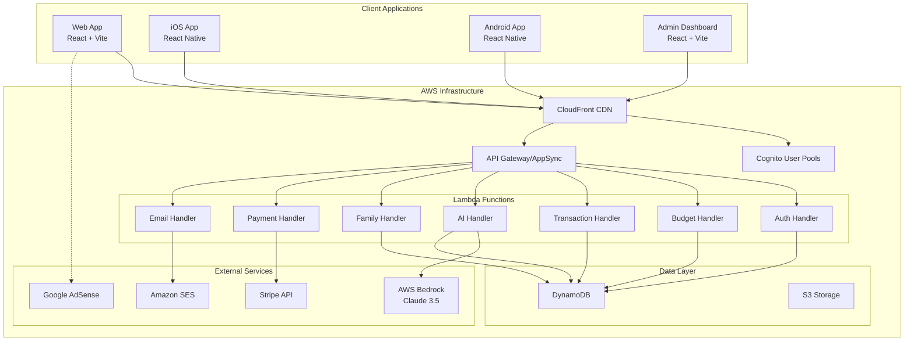

# BudgetBuddy Design Document

## Overview

BudgetBuddy is a comprehensive family budgeting application built on AWS serverless architecture with multi-platform support (web, iOS, Android). The system features AI-powered budget generation using AWS Bedrock, real-time data synchronization, family account sharing, and a freemium subscription model with integrated payments and advertising.

## Architecture

### High-Level Architecture



### Technology Stack

#### Frontend (Monorepo Structure)
- **Monorepo Management**: Yarn Workspaces with Turborepo
- **Mobile**: React Native with Expo 0.76+
- **Web**: React 18+ with Vite
- **Admin**: React 18+ with Vite + React Admin/MUI
- **Shared Components**: React Native Paper (mobile) + Tailwind CSS (web/admin)
- **Navigation**: React Navigation (mobile) + React Router (web)
- **State Management**: Zustand
- **Forms**: React Hook Form + Zod validation
- **API Client**: AWS Amplify API + SWR for caching
- **Charts**: Recharts (web) + Victory Native (mobile)

#### Backend (AWS Serverless)
- **API**: AWS AppSync (GraphQL) or API Gateway (REST)
- **Functions**: AWS Lambda (Node.js 20)
- **Database**: Amazon DynamoDB with GSIs
- **Authentication**: Amazon Cognito User Pools
- **AI**: AWS Bedrock (Claude 3.5 Sonnet)
- **Storage**: Amazon S3
- **CDN**: Amazon CloudFront
- **Email**: Amazon SES
- **Scheduling**: Amazon EventBridge
- **Monitoring**: Amazon CloudWatch
- **Payments**: Stripe integration
- **Ads**: Google AdSense (client-side)

#### Infrastructure
- **IaC**: AWS CDK (TypeScript)
- **CI/CD**: GitHub Actions
- **Hosting**: AWS Amplify Hosting (web/admin) + App Stores (mobile)

## Components and Interfaces

### Monorepo Structure

```
budget-buddy/
├── packages/
│   ├── mobile/           # React Native (iOS/Android)
│   ├── web/              # React Web App
│   ├── admin/            # React Admin Dashboard
│   ├── shared/           # Shared components & logic
│   └── api-client/       # API client wrapper
├── backend/              # AWS Lambda functions
├── infrastructure/       # AWS CDK
└── .github/workflows/    # CI/CD pipelines
```

### Core Components

#### 1. Authentication System
- **Cognito Integration**: User pools with custom attributes for family relationships
- **Multi-Factor Authentication**: Optional SMS/email verification
- **Social Login**: Future integration with Google/Apple
- **Session Management**: JWT tokens with refresh mechanism

#### 2. AI Budget Generator
- **Input Processing**: Analyzes onboarding questionnaire responses
- **Regional Data Integration**: Uses pre-seeded cost of living data for 50+ cities
- **Category Generation**: Creates income, savings, and expense categories based on location and lifestyle
- **Amount Calculation**: Generates realistic budget amounts using regional averages and user inputs
- **Customization Engine**: Allows users to modify AI-generated budgets before acceptance

#### 3. Budget Management Engine
- **Zero-Based Budgeting**: Ensures income minus expenses equals zero
- **Real-Time Calculations**: Updates remaining amounts as transactions are added
- **Category Hierarchy**: Supports groups (Income, Savings, Expenses) with nested categories
- **Regional Customization**: Different category sets for Canada (RRSP, TFSA, RESP) vs US (401k, IRA, HSA)

#### 4. Family Account System
- **Account Types**: Single-user and family accounts with conversion capability
- **Role Management**: Primary user, spouse, and viewer roles with different permissions
- **Invitation System**: Email-based invitations with secure token verification
- **Data Sharing**: Shared budget access with individual transaction attribution

#### 5. Transaction Management
- **Manual Entry**: Income and expense transactions with categorization
- **Real-Time Updates**: Automatic budget recalculation on transaction changes
- **Search and Filtering**: By category, date range, family member, and amount
- **History Tracking**: Complete audit trail with edit/delete capabilities

## Data Models

### DynamoDB Single Table Design

**Table Name**: `BudgetBuddy`

#### Access Patterns
1. Get user profile by userId
2. Get family members by familyId
3. Get budget by familyId and month
4. Get transactions by familyId and date range
5. Get categories by familyId and group
6. Get cost of living data by location
7. Get subscriptions by status
8. Get financial tips by publication date

#### Entity Schemas

```typescript
// User Entity
{
  PK: "USER#<userId>",
  SK: "PROFILE",
  GSI1PK: "FAMILY#<familyId>",
  GSI1SK: "USER#<userId>",
  
  entityType: "USER",
  userId: string,
  email: string,
  firstName: string,
  lastName: string,
  age: number,
  location: {
    country: string,
    province: string,
    city: string,
    postalCode: string
  },
  familyId?: string,
  role: "primary" | "spouse" | "viewer",
  subscriptionTier: "free" | "premium",
  accountType: "single" | "family",
  onboardingCompleted: boolean,
  createdAt: string,
  updatedAt: string
}

// Family Entity
{
  PK: "FAMILY#<familyId>",
  SK: "METADATA",
  
  entityType: "FAMILY",
  familyId: string,
  familyName: string,
  primaryUserId: string,
  memberIds: string[],
  familyStatus: "single" | "married" | "common-law",
  adults: number,
  children: Array<{ age: number }>,
  sharedBudgetId: string,
  createdAt: string
}

// Budget Entity
{
  PK: "FAMILY#<familyId>",
  SK: "BUDGET#<year-month>",
  GSI2PK: "BUDGET#<year-month>",
  GSI2SK: "FAMILY#<familyId>",
  
  entityType: "BUDGET",
  budgetId: string,
  familyId: string,
  month: string,
  totalIncome: number,
  totalSavings: number,
  totalExpenses: number,
  remainingBalance: number,
  groups: {
    income: BudgetGroup[],
    savings: BudgetGroup[],
    expenses: BudgetGroup[]
  },
  isAIGenerated: boolean,
  createdAt: string,
  updatedAt: string
}

// Category Entity
{
  PK: "FAMILY#<familyId>",
  SK: "CATEGORY#<groupName>#<categoryName>",
  GSI1PK: "FAMILY#<familyId>#GROUP#<groupName>",
  GSI1SK: "ORDER#<orderIndex>",
  
  entityType: "CATEGORY",
  categoryId: string,
  categoryName: string,
  parentGroup: string,
  groupType: "income" | "saving" | "expense",
  categoryOrder: number,
  icon: string,
  colorCode: string,
  plannedAmount: number,
  spentAmount: number,
  remainingAmount: number,
  isCustom: boolean,
  isActive: boolean,
  createdAt: string
}

// Transaction Entity
{
  PK: "FAMILY#<familyId>",
  SK: "TXN#<date>#<timestamp>#<txnId>",
  GSI2PK: "FAMILY#<familyId>#CATEGORY#<categoryId>",
  GSI2SK: "DATE#<date>",
  GSI3PK: "BUDGET#<year-month>",
  GSI3SK: "CATEGORY#<categoryId>",
  
  entityType: "TRANSACTION",
  transactionId: string,
  familyId: string,
  budgetMonth: string,
  amount: number,
  type: "income" | "expense",
  categoryId: string,
  categoryName: string,
  description: string,
  date: string,
  merchantName?: string,
  createdBy: string,
  createdByName: string,
  createdAt: string,
  updatedAt: string
}

// Cost of Living Data
{
  PK: "LOCATION#<country>",
  SK: "CITY#<city>#<province>",
  
  entityType: "COST_DATA",
  cityName: string,
  province: string,
  country: string,
  medianIncome: number,
  medianRent2Bed: number,
  avgGroceriesFamily4: number,
  avgUtilities: number,
  avgTransportation: number,
  avgChildcare: number,
  avgHealthcare: number,
  avgEntertainment: number,
  lastUpdated: string
}

// Subscription Entity
{
  PK: "USER#<userId>",
  SK: "SUBSCRIPTION",
  GSI2PK: "SUBSCRIPTION#<status>",
  GSI2SK: "DATE#<currentPeriodEnd>",
  
  entityType: "SUBSCRIPTION",
  userId: string,
  tier: "free" | "premium",
  status: "active" | "canceled" | "past_due",
  stripeSubscriptionId?: string,
  stripeCustomerId?: string,
  currentPeriodStart: string,
  currentPeriodEnd: string,
  cancelAtPeriodEnd: boolean,
  createdAt: string
}

// Financial Tips (Admin Content)
{
  PK: "CONTENT#TIP",
  SK: "TIP#<tipId>",
  GSI2PK: "TIP#<status>",
  GSI2SK: "DATE#<scheduledDate>",
  
  entityType: "FINANCIAL_TIP",
  tipId: string,
  title: string,
  content: string,
  category: "budgeting" | "saving" | "investing" | "debt" | "retirement",
  country: "CA" | "US" | "ALL",
  status: "draft" | "published" | "archived",
  scheduledDate: string,
  createdBy: string,
  createdAt: string
}
```

## Error Handling

### Client-Side Error Handling
- **Network Errors**: Retry mechanism with exponential backoff
- **Validation Errors**: Real-time form validation with user-friendly messages
- **Authentication Errors**: Automatic token refresh and re-authentication flow
- **Offline Support**: Local storage with sync when connectivity restored

### Server-Side Error Handling
- **Lambda Error Handling**: Structured error responses with appropriate HTTP status codes
- **DynamoDB Errors**: Retry logic for throttling and conditional check failures
- **AI Service Errors**: Fallback to default categories when Bedrock is unavailable
- **Payment Errors**: Comprehensive Stripe webhook handling with retry mechanisms

### Monitoring and Alerting
- **CloudWatch Alarms**: Lambda errors, DynamoDB throttling, API Gateway 5xx errors
- **Custom Metrics**: User registration rates, budget generation success rates, payment failures
- **Log Aggregation**: Structured logging with correlation IDs for request tracing

## Testing Strategy

### Unit Testing
- **Frontend**: Jest + React Testing Library for components and hooks
- **Backend**: Jest for Lambda function business logic
- **Shared Code**: Unit tests for utility functions and validation schemas

### Integration Testing
- **API Testing**: Automated tests for all Lambda functions with DynamoDB Local
- **Authentication Flow**: End-to-end testing of Cognito integration
- **Payment Integration**: Stripe webhook testing with mock events

### End-to-End Testing
- **Web Application**: Cypress for critical user journeys
- **Mobile Applications**: Detox for React Native testing
- **Cross-Platform**: Shared test scenarios across web and mobile

### Performance Testing
- **Load Testing**: Artillery.js for API endpoints under various loads
- **Database Performance**: DynamoDB query optimization and capacity planning
- **Mobile Performance**: React Native performance monitoring

## Security Considerations

### Data Protection
- **Encryption in Transit**: HTTPS/TLS for all client-server communication
- **Encryption at Rest**: DynamoDB encryption with AWS managed keys
- **PII Handling**: Minimal collection and secure storage of personal information

### Authentication and Authorization
- **JWT Tokens**: Short-lived access tokens with refresh token rotation
- **API Security**: All endpoints require valid authentication
- **Role-Based Access**: Family member permissions enforced at API level

### Compliance
- **GDPR Compliance**: Data export and deletion capabilities
- **PCI Compliance**: Stripe handles all payment card data
- **Regional Compliance**: Data residency considerations for Canadian users

## Deployment Strategy

### Environment Setup
- **Development**: Local development with DynamoDB Local and Cognito Local
- **Staging**: Full AWS environment for integration testing
- **Production**: Multi-region deployment for high availability

### CI/CD Pipeline
- **Code Quality**: ESLint, Prettier, TypeScript compilation
- **Testing**: Automated test suite execution on all pull requests
- **Security Scanning**: Snyk for dependency vulnerabilities
- **Deployment**: Automated deployment to staging on merge, manual promotion to production

### Monitoring and Observability
- **Application Monitoring**: CloudWatch dashboards for key metrics
- **Error Tracking**: Structured error logging with alerting
- **Performance Monitoring**: API response times and database query performance
- **Business Metrics**: User engagement, subscription conversion rates, feature usage

## Scalability Considerations

### Database Scaling
- **DynamoDB On-Demand**: Automatic scaling based on traffic patterns with cost monitoring
- **GSI Optimization**: Efficient query patterns to minimize read/write costs, careful GSI design to avoid hot partitions
- **Single Table Design**: Reduces costs by minimizing the number of tables and associated GSIs
- **Data Archiving**: Strategy for archiving old transactions and budgets to reduce storage costs
- **Query Optimization**: Batch operations and efficient access patterns to minimize RCU/WCU consumption

### API Scaling
- **Lambda Concurrency**: Careful concurrency management to avoid unnecessary reserved capacity costs
- **API Gateway Throttling**: Rate limiting to prevent abuse and control costs
- **Caching Strategy**: Aggressive CloudFront caching for static content and appropriate API response caching
- **Lambda Layer Optimization**: Shared layers to reduce deployment package sizes and improve cold start times
- **Memory Optimization**: Right-sized Lambda memory allocation to balance performance and cost

### Cost Optimization
- **Serverless Architecture**: Pay-per-use model with automatic scaling
- **AI Cost Management**: Pre-seeded cost of living data for 50+ cities to minimize Bedrock API calls during budget generation
- **DynamoDB Cost Control**: On-demand pricing with careful query optimization to avoid unnecessary reads
- **Lambda Optimization**: Efficient code with minimal cold starts and shared layers for common dependencies
- **Storage Optimization**: S3 lifecycle policies for exported reports and backups
- **CDN Efficiency**: CloudFront caching strategies to reduce origin requests
- **Monitoring Costs**: CloudWatch log retention policies and selective metric collection
- **Development Cost Control**: Use of AWS Free Tier resources during development and testing phases
## Cos
t Management Strategy

### MVP Cost Breakdown (1,000 active users/month)

**AWS Services**: $80-120/month
- **Lambda**: $10-15
  - ~500,000 requests/month (500 per user)
  - Average 512MB memory, 2s duration
  - Cost: ~$12/month
- **DynamoDB**: $15-25
  - ~2M read requests, 500K write requests
  - ~10GB storage
  - Cost: ~$20/month
- **API Gateway**: $5-10
  - ~500,000 API calls/month
  - Cost: ~$7/month
- **Cognito**: $0 (free tier covers 50,000 MAU)
- **S3 + CloudFront**: $10-15
  - ~100GB storage, 1TB transfer
  - Cost: ~$12/month
- **AWS Bedrock**: $20-30
  - ~100 AI budget generations/month (pre-seeded data reduces usage)
  - Cost: ~$25/month
- **SES**: $2-5
  - ~4,000 emails/month (premium tips, invites)
  - Cost: ~$3/month
- **CloudWatch**: $5-10
  - Logs, metrics, alarms
  - Cost: ~$7/month
- **EventBridge**: $1-2
  - Scheduled events for tips, reminders
  - Cost: ~$1/month

**Third-Party Services**: $30-50/month
- **Stripe**: 2.9% + $0.30 per transaction (revenue dependent)
- **Domain & SSL**: ~$15/year (~$1.25/month)
- **Expo EAS Build**: $29/month (unlimited builds)

**Total Monthly Cost**: $110-170/month for 1,000 active users
**Cost per user**: $0.11-0.17/month

### Cost Control Measures
- **Pre-seeded Data**: Reduce AI API calls by 90% using cached regional data
- **Efficient Queries**: Single table design with optimized access patterns
- **Smart Caching**: CloudFront and application-level caching to reduce backend calls
- **Resource Right-sizing**: Lambda memory and timeout optimization
- **Development Efficiency**: Local development environment to minimize AWS usage during development
- **Monitoring**: Real-time cost alerts and usage dashboards
- **Gradual Scaling**: Start with minimal resources and scale based on actual usage patterns