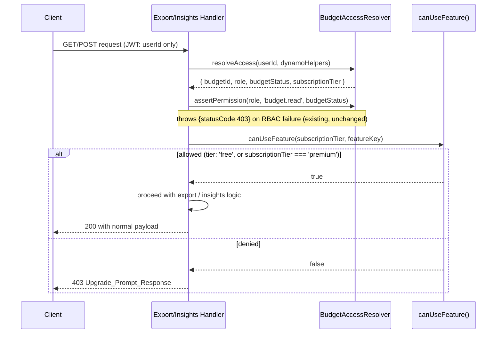

# Design Document

## Overview

This feature wires the already-implemented `canUseFeature(subscriptionTier, featureKey)` gate into
two Lambda handlers that currently have no entitlement enforcement (`export`, `insights`), removes a
dead entitlement import from a third handler that has no gateable action (`budgets`), and reclassifies
the two catalog entries these handlers reference (`budget.export`, `reports.advanced`) from
`tier: 'premium'` to `tier: 'free'` so the catalog matches the actual current product state (every
user is on the same $0/month tier; there is no billing integration and no code path that ever writes
`subscriptionTier: 'premium'`).

The result is structurally ready for Phase 2 billing: when a real premium tier ships, re-gating these
two features requires changing only two `tier` values in `entitlements.js`. No Lambda handler code
changes at that time, because the `canUseFeature()` call sites already exist and already read
`subscriptionTier` from the object `BudgetAccessResolver.resolveAccess` already returns.

This is a backend enforcement + documentation-correctness change with no new data model, no new API
surface, and no UI change. It touches three Lambda handlers, one shared layer module, two Lambda
`package.json`/`jest.config.js` scaffolding sets, and two documentation files.

## Architecture

No architectural change. This slots into the existing Lambda access pattern
(`backend/functions/<name>/index.js` → `BudgetAccessResolver.resolveAccess` → `assertPermission` →
business logic) by inserting one additional check — `canUseFeature(subscriptionTier, featureKey)` —
immediately after the existing `assertPermission` call and before any handler-specific logic runs.



The RBAC check (`assertPermission`) and the entitlement check (`canUseFeature`) are deliberately kept
as two separate, sequential checks rather than merged: RBAC answers "can this user act on this
budget," entitlement answers "does this user's plan include this feature." Requirements 1.5 and the
existing 403-shape-preservation behavior depend on these staying distinguishable (an
`Upgrade_Prompt_Response` vs. an RBAC-denial 403 vs. a 400 for a bad `type` param).

## Components and Interfaces

### `backend/layers/common/nodejs/entitlements.js` (modified)

No interface change — `canUseFeature(subscriptionTier, featureKey)` and `FEATURE_CATALOG` keep their
existing signatures. Only two `FEATURE_CATALOG` entry values and the module JSDoc change:

```javascript
'reports.advanced':   { tier: 'free', description: 'Advanced reports' },
'budget.export':      { tier: 'free', description: 'Export budget data' },
```

### `backend/functions/export/index.js` (modified)

Adds one import and one gating call. `subscriptionTier` is destructured from the existing
`resolveAccess` result (Requirement 1.3 — no extra DynamoDB read). The check sits once, upstream of
the `exportType` dispatch (`csv` / `json` / `pdf`), so it covers Requirement 1.4's "every export type"
without three separate checks — every branch of the `if/else if/else if` chain runs only after the
gate passes.

```javascript
const {
  getUserFromEvent,
  dynamoHelpers,
  BudgetAccessResolver,
} = require('/opt/nodejs/utils');
const { canUseFeature } = require('/opt/nodejs/entitlements');

// ...inside exports.handler, after the existing resolveAccess + assertPermission:
const { budgetId, role, budgetStatus, subscriptionTier } = await BudgetAccessResolver.resolveAccess(
  user.userId,
  dynamoHelpers,
);
BudgetAccessResolver.assertPermission(role, 'budget.read', budgetStatus);

if (!canUseFeature(subscriptionTier, 'budget.export')) {
  return {
    statusCode: 403,
    headers: getCorsHeaders(),
    body: JSON.stringify({
      error: 'Upgrade required',
      message: 'Exporting budget data requires a premium subscription.',
    }),
  };
}

// Parse query parameters
const queryParams = event.queryStringParameters || {};
const exportType = queryParams.type || 'csv';
// ...existing csv/json/pdf dispatch, and existing 400 for unsupported type, unchanged
```

The existing 400 response for an unsupported `exportType` (Requirement 1.5) is untouched — it's still
evaluated inside the dispatch chain, after the entitlement gate, exactly as it runs today after RBAC.
Both checks precede it in sequence; neither changes its behavior.

### `backend/functions/insights/index.js` (modified)

Adds one import once at the top. Each of the five handler functions gets the same two-line addition
immediately after its existing `assertPermission` call — destructure `subscriptionTier`, then gate:

```javascript
const {
  successResponse,
  errorResponse,
  parseRequestBody,
  getUserFromEvent,
  dynamoHelpers,
  logger,
  BudgetAccessResolver,
} = require("/opt/nodejs/utils");
const { canUseFeature } = require("/opt/nodejs/entitlements");

// Repeated identically in getWeeklyInsights, getMonthlyInsights, getSpendingTrends,
// getSpendingPatterns, and askAboutSpending:
const { budgetId, role, budgetStatus, subscriptionTier } = await BudgetAccessResolver.resolveAccess(user.userId, dynamoHelpers);
BudgetAccessResolver.assertPermission(role, 'budget.read', budgetStatus);
if (!canUseFeature(subscriptionTier, 'reports.advanced')) {
  return {
    statusCode: 403,
    headers: { 'Access-Control-Allow-Origin': '*', 'Content-Type': 'application/json' },
    body: JSON.stringify({
      error: 'Upgrade required',
      message: 'Advanced spending reports require a premium subscription.',
    }),
  };
}
```

Placing the check immediately after `assertPermission` and before any `dynamoHelpers.queryByPK`,
`dynamoHelpers.getItem`, or Bedrock call satisfies Requirement 2.3's "SHALL NOT execute any DynamoDB
query, Bedrock invocation, or computation beyond RBAC resolution" on the deny path — nothing below the
gate runs before it.

### `backend/functions/budgets/index.js` (modified — deletion only)

Three lines removed, no behavior change:

```javascript
// REMOVED:
// canUseFeature is imported for future entitlement checks (Phase 2)
// eslint-disable-next-line no-unused-vars
const { canUseFeature } = require('/opt/nodejs/entitlements');
```

Confirmed by direct read of the full file: every gated action in `budgets/index.js` is RBAC-only
(`member.invite`, `member.remove`, `budget.archive`, `budget.delete`, `budget.read` — all via
`assertPermission`), none maps to a `FEATURE_CATALOG` key. There is nothing left in this file for
`canUseFeature` to gate, so per Requirement 3.2 the import is deleted rather than wired to a
placeholder action.

### `backend/functions/budgets/__mocks__/entitlements.js` (deleted)

Once the import above is gone, `budgets/index.js` no longer references `/opt/nodejs/entitlements` at
all, so this manual mock has nothing to intercept. Requirement 4.5's disjunction ("either removed or
exercised") resolves to removed: `budgets`' `jest.config.js` `moduleNameMapper` entry for
`^/opt/nodejs/entitlements$` is also removed, since mapping a module path the code no longer requires
is dead configuration. (`budgets`' `moduleNameMapper` entry for `/opt/nodejs/utils` stays — that layer
is still used throughout the file.)

## Test Scaffolding Design (Requirement 4.4)

Both `export/` and `insights/` need the same per-function test isolation pattern that `budgets/`
already established. This section is normative for the tasks phase — it is not additional design
exploration, it's the exact file set to create, modeled directly on the three files already read from
`backend/functions/budgets/`.

### `backend/functions/export/` (currently: no local jest.config.js, no `__mocks__/`, no fast-check, placeholder `test` script)

**`package.json`** — replace the placeholder script, add dev dependencies:
```json
"scripts": {
  "test": "jest",
  "test:coverage": "jest --coverage"
},
"devDependencies": {
  "fast-check": "^3.15.0",
  "jest": "^29.7.0"
}
```
(Version pins match `budgets/package.json` exactly, per the steering rule on pinned exact versions.)

**`jest.config.js`** (new file, identical structure to `budgets/jest.config.js`):
```javascript
module.exports = {
  testEnvironment: 'node',
  testMatch: ['**/*.test.js', '**/*.pbt.test.js'],
  collectCoverageFrom: ['*.js', '!jest.config.js', '!*.test.js', '!*.pbt.test.js'],
  coverageThreshold: { global: { branches: 60, functions: 60, lines: 60, statements: 60 } },
  moduleNameMapper: {
    '^/opt/nodejs/utils$': '<rootDir>/__mocks__/utils.js',
    '^/opt/nodejs/entitlements$': '<rootDir>/__mocks__/entitlements.js',
  },
  verbose: true,
};
```

**`__mocks__/utils.js`** (new file) — mocks only what `export/index.js` actually imports from
`/opt/nodejs/utils`: `getUserFromEvent`, `dynamoHelpers` (specifically `queryByPK`, used by the
handler's local `getBudgets`/`getTransactions` helpers), and `BudgetAccessResolver`. Confirmed by
direct read of `export/index.js` — it does not import `successResponse`, `errorResponse`,
`parseRequestBody`, `generateId`, or `logger` from the layer (it builds raw response objects and uses
`console.log`/`console.error` directly), so the mock does not need to stub those:
```javascript
'use strict';

const getUserFromEvent = jest.fn(() => ({ userId: 'test-user-id' }));

const dynamoHelpers = {
  queryByPK: jest.fn().mockResolvedValue([]),
};

const BudgetAccessResolver = {
  resolveAccess: jest.fn().mockResolvedValue({
    budgetId: 'budget-test-123',
    role: 'owner',
    budgetType: 'family',
    budgetStatus: 'active',
    subscriptionTier: 'free',
  }),
  assertPermission: jest.fn(),
};

module.exports = { getUserFromEvent, dynamoHelpers, BudgetAccessResolver };
```

**`__mocks__/entitlements.js`** (new file) — identical shape to `budgets/__mocks__/entitlements.js`:
```javascript
'use strict';

const canUseFeature = jest.fn(() => true); // allow all features by default

module.exports = { canUseFeature };
```

### `backend/functions/insights/` (currently: has `package.json` with `jest` dep and `"test": "jest"`, but no local `jest.config.js`, no `__mocks__/`, no `fast-check`, and its existing `insights.test.js` uses an inline `jest.mock('/opt/nodejs/utils', () => ({...}), { virtual: true })`)

Confirmed by direct read: `insights/index.js` imports `successResponse`, `errorResponse`,
`parseRequestBody`, `getUserFromEvent`, `dynamoHelpers`, `logger`, and `BudgetAccessResolver` from
`/opt/nodejs/utils` — all seven are needed in the mock, matching what the existing inline
`insights.test.js` mock already stubs.

Introducing a `moduleNameMapper` entry for `^/opt/nodejs/utils$` while `insights.test.js` also calls
`jest.mock('/opt/nodejs/utils', factory, { virtual: true })` inline would leave two competing mocks
for the same module path in the same test run (Jest resolves `moduleNameMapper` first, then applies
the inline `jest.mock` factory on top of the mapped module — in practice the inline factory wins for
that file, but the two mechanisms diverge silently for every other test file that doesn't repeat the
inline mock). To keep exactly one mocking mechanism for this module, `insights.test.js`'s inline
`jest.mock('/opt/nodejs/utils', ...)` block is removed and replaced with a `require` of the same mock
object the new `__mocks__/utils.js` exports, so its existing assertions (`dynamoHelpers.queryByPK`
overrides, etc.) keep working unchanged — only the mock's *source* moves, not its shape or the
existing test bodies.

**`package.json`** — add `fast-check`, keep the existing `"test": "jest"`:
```json
"devDependencies": {
  "fast-check": "^3.15.0",
  "jest": "^29.0.0"
}
```

**`jest.config.js`** (new file):
```javascript
module.exports = {
  testEnvironment: 'node',
  testMatch: ['**/*.test.js', '**/*.pbt.test.js'],
  collectCoverageFrom: ['*.js', '!jest.config.js', '!*.test.js', '!*.pbt.test.js'],
  coverageThreshold: { global: { branches: 60, functions: 60, lines: 60, statements: 60 } },
  moduleNameMapper: {
    '^/opt/nodejs/utils$': '<rootDir>/__mocks__/utils.js',
    '^/opt/nodejs/entitlements$': '<rootDir>/__mocks__/entitlements.js',
  },
  verbose: true,
};
```

**`__mocks__/utils.js`** (new file) — same shape as `budgets/__mocks__/utils.js`, minus `generateId`
(not imported by `insights/index.js`):
```javascript
'use strict';

const successResponse = jest.fn((data, message) => ({
  statusCode: 200,
  headers: { 'Content-Type': 'application/json', 'Access-Control-Allow-Origin': '*' },
  body: JSON.stringify({ success: true, data, message }),
}));

const errorResponse = {
  badRequest: jest.fn((message) => ({
    statusCode: 400,
    headers: { 'Content-Type': 'application/json', 'Access-Control-Allow-Origin': '*' },
    body: JSON.stringify({ success: false, error: message }),
  })),
  notFound: jest.fn((message) => ({
    statusCode: 404,
    headers: { 'Content-Type': 'application/json', 'Access-Control-Allow-Origin': '*' },
    body: JSON.stringify({ success: false, error: message }),
  })),
  unauthorized: jest.fn((message) => ({
    statusCode: 401,
    headers: { 'Content-Type': 'application/json', 'Access-Control-Allow-Origin': '*' },
    body: JSON.stringify({ success: false, error: message }),
  })),
  internalError: jest.fn((message) => ({
    statusCode: 500,
    headers: { 'Content-Type': 'application/json', 'Access-Control-Allow-Origin': '*' },
    body: JSON.stringify({ success: false, error: message }),
  })),
};

const parseRequestBody = jest.fn((body) => (body ? JSON.parse(body) : {}));

const getUserFromEvent = jest.fn(() => ({ userId: 'test-user-123' }));

const dynamoHelpers = {
  getItem: jest.fn().mockResolvedValue(null),
  putItem: jest.fn(),
  queryByPK: jest.fn().mockResolvedValue([]),
};

const logger = {
  info: jest.fn(),
  warn: jest.fn(),
  error: jest.fn(),
};

const BudgetAccessResolver = {
  resolveAccess: jest.fn().mockResolvedValue({
    budgetId: 'budget_test_123',
    role: 'owner',
    budgetType: 'personal',
    budgetStatus: 'active',
    subscriptionTier: 'free',
  }),
  assertPermission: jest.fn(),
};

module.exports = {
  successResponse,
  errorResponse,
  parseRequestBody,
  getUserFromEvent,
  dynamoHelpers,
  logger,
  BudgetAccessResolver,
};
```

**`__mocks__/entitlements.js`** (new file) — identical to `budgets/__mocks__/entitlements.js`.

**`insights.test.js` (existing file, modified)** — remove the inline `jest.mock('/opt/nodejs/utils',
..., { virtual: true })` block at the top; replace with a plain `require` of the mocked module (now
served by `moduleNameMapper`):
```javascript
const { handler } = require("./index");
const { dynamoHelpers } = require("/opt/nodejs/utils"); // now resolves via moduleNameMapper
```
All existing `describe`/`it` bodies in this file are unchanged — they already call
`dynamoHelpers.queryByPK.mockResolvedValue(...)` etc., which continues to work identically because the
mock object's shape is preserved. This is a mechanism swap, not a test-behavior change.

## Data Models

No data model changes. `FEATURE_CATALOG` keeps its existing shape
(`Record<string, { tier: 'free' | 'premium', description: string }>`); only two `tier` values change
from `'premium'` to `'free'`. No DynamoDB schema, GSI, or item shape changes — `subscriptionTier`
continues to be read from the existing `USER#<userId>/PROFILE.subscriptionTier` attribute via
`BudgetAccessResolver.resolveAccess`, unchanged by this feature.

## Correctness Properties

*A property is a characteristic or behavior that should hold true across all valid executions of a
system-essentially, a formal statement about what the system should do. Properties serve as the
bridge between human-readable specifications and machine-verifiable correctness guarantees.*

`canUseFeature` is a pure function (`(subscriptionTier: string, featureKey: string) => boolean`) with
no I/O, no AWS dependency, and behavior that varies meaningfully across its input space — a direct fit
for property-based testing per Requirement 7. The Export_Handler and Insights_Handler integration
tests (Requirement 4) are deliberately *not* covered here: they depend on RBAC resolution, DynamoDB
mocks, and (for insights) Bedrock, and per Requirement 7.4 remain example-based.

### Property 1: Unknown feature keys always deny

*For any* `featureKey` string that is not a key present in `FEATURE_CATALOG`, and *for any*
`subscriptionTier` value, `canUseFeature(subscriptionTier, featureKey)` SHALL return `false`.

**Validates: Requirements 7.1**

### Property 2: Free-tier features are always allowed

*For any* `featureKey` whose `FEATURE_CATALOG` entry has `tier: 'free'`, and *for any*
`subscriptionTier` value (including values that are not `'free'` or `'premium'`),
`canUseFeature(subscriptionTier, featureKey)` SHALL return `true`.

**Validates: Requirements 7.2**

### Property 3: Premium-tier features are allowed if and only if the caller's tier is premium

*For any* `featureKey` whose catalog entry has `tier: 'premium'`, and *for any* `subscriptionTier`
value, `canUseFeature(subscriptionTier, featureKey)` SHALL return `true` if and only if
`subscriptionTier === 'premium'`.

**Validates: Requirements 7.3**

**Design note on test data**: after Requirement 5's reclassification, the live `FEATURE_CATALOG` has
zero `tier: 'premium'` entries. Property 3 is still written and still exercised — using a
locally-constructed fixture catalog inside the test file (e.g. `{ 'test.premium.feature': { tier:
'premium', description: '...' } }`), not the live `FEATURE_CATALOG` — because `canUseFeature` reads
whatever `FEATURE_CATALOG` object is in scope, so the test can construct its own module instance (via
`jest.isolateModules` or a re-required module with `jest.resetModules()` and a mocked catalog) or, more
directly, verify the premium-comparison branch by monkey-patching `FEATURE_CATALOG` before the
assertion and restoring it after. This is a regression guard: it proves `canUseFeature`'s premium
comparison logic (`return subscriptionTier === 'premium'`) is correct and stays correct, independent
of whether any catalog entry currently exercises that branch in production. Skipping this property
because the live catalog has no premium entries today would leave that comparison line with zero test
coverage, which is exactly the regression Requirement 7 exists to prevent.

**Property reflection**: Properties 1–3 are mutually exclusive by construction (a `featureKey` is
either absent from the catalog, present with `tier: 'free'`, or present with `tier: 'premium'` — no
input satisfies two properties' preconditions at once), so there is no redundancy to consolidate.

## Error Handling

- **Upgrade_Prompt_Response shape**: both new gates return `{ statusCode: 403, headers: {...},
  body: JSON.stringify({ error: 'Upgrade required', message: '<feature-specific message>' }) }`. The
  `error: 'Upgrade required'` field is chosen specifically to be distinguishable from the existing
  RBAC-denial 403 shape already produced by both handlers' `catch` blocks (`{ error: 'Forbidden',
  message: ... }` — visible in both `export/index.js` and `insights/index.js`'s existing `catch`
  handling of `error.statusCode`), satisfying the Glossary's Upgrade_Prompt_Response definition
  ("distinguishable from an RBAC-denial 403").
- **Ordering preserved**: the entitlement check runs after `assertPermission` (which throws and is
  caught by the handler's existing `catch` block, producing the RBAC-denial 403 shape) and before any
  business logic. If RBAC fails, the entitlement check never runs — the existing RBAC error path is
  completely unmodified.
- **Export's 400 path preserved**: an unsupported `type` query value still produces the existing 400
  response, unchanged, because the entitlement gate is now unconditional (checked before the
  `exportType` branch) rather than embedded inside any one branch — Requirement 1.5 requires this stay
  independent of the entitlement check, and placing the gate before the dispatch (rather than inside
  each `if`) is what makes both true simultaneously: the gate always runs, and the 400 branch for bad
  `type` still runs on its own independent condition afterward.
- **No new error types**: no new error classes or codes are introduced. The change reuses the
  existing inline-object 403 response style already present in both files (neither file currently
  uses a shared `errorResponse.forbidden()` helper for RBAC denials — both hand-rolled the response
  object directly in their `catch` blocks), for consistency with the surrounding code in each file
  rather than introducing a new response-building convention.

## Testing Strategy

**Dual approach**: property-based tests for `canUseFeature`'s pure logic (Correctness Properties
above), example-based integration tests for the two Lambda handlers (mocked at the layer boundary, per
existing project convention — no live AWS calls, consistent with `aws-integration-testing` steering
which scopes real AWS calls to a separate, deliberate test tier).

### Property-based tests

New file: `backend/layers/common/nodejs/entitlements.pbt.test.js`, following the existing
`*.pbt.test.js` convention (e.g. `backend/functions/transactions/budget-exclusion.pbt.test.js`) already
established in this repo — `fast-check`'s `fc.assert(fc.property(...))`, tagged per-property with a
comment, minimum 100 runs (this repo's existing pbt files use `numRuns: 50` in places, but Requirement
7 and the workflow's own PBT rules specify a 100-run minimum for newly authored properties, so these
three use `numRuns: 100` explicitly rather than relying on fast-check's runtime default).

```javascript
/**
 * Entitlements Property-Based Tests
 *
 * Feature: feature-entitlements-enforcement
 * Validates: Requirements 7.1, 7.2, 7.3
 */
const fc = require('fast-check');
const { canUseFeature, FEATURE_CATALOG } = require('./entitlements');

describe('canUseFeature property tests', () => {
  // Feature: feature-entitlements-enforcement, Property 1: Unknown feature keys always deny
  it('Property 1: unknown featureKey always returns false regardless of subscriptionTier', () => {
    const knownKeys = Object.keys(FEATURE_CATALOG);
    fc.assert(
      fc.property(
        fc.string().filter((k) => !knownKeys.includes(k)),
        fc.oneof(fc.constantFrom('free', 'premium'), fc.string()),
        (featureKey, subscriptionTier) => canUseFeature(subscriptionTier, featureKey) === false,
      ),
      { numRuns: 100 },
    );
  });

  // Feature: feature-entitlements-enforcement, Property 2: Free-tier features always allowed
  it('Property 2: free-tier featureKey always returns true regardless of subscriptionTier', () => {
    const freeKeys = Object.entries(FEATURE_CATALOG)
      .filter(([, v]) => v.tier === 'free')
      .map(([k]) => k);
    fc.assert(
      fc.property(
        fc.constantFrom(...freeKeys),
        fc.oneof(fc.constantFrom('free', 'premium'), fc.string()),
        (featureKey, subscriptionTier) => canUseFeature(subscriptionTier, featureKey) === true,
      ),
      { numRuns: 100 },
    );
  });

  // Feature: feature-entitlements-enforcement, Property 3: Premium-tier iff subscriptionTier === 'premium'
  it('Property 3: premium-tier featureKey allowed iff subscriptionTier is premium', () => {
    // Local fixture catalog — the live catalog has zero premium entries after Requirement 5,
    // so this proves the comparison logic itself, independent of current catalog contents.
    jest.isolateModules(() => {
      jest.doMock('./entitlements', () => {
        const actual = jest.requireActual('./entitlements');
        return {
          ...actual,
          FEATURE_CATALOG: {
            ...actual.FEATURE_CATALOG,
            'test.premium.feature': { tier: 'premium', description: 'fixture' },
          },
        };
      });
      const { canUseFeature: canUseFeatureWithFixture } = require('./entitlements');
      fc.assert(
        fc.property(
          fc.oneof(fc.constantFrom('free', 'premium'), fc.string()),
          (subscriptionTier) =>
            canUseFeatureWithFixture(subscriptionTier, 'test.premium.feature') ===
            (subscriptionTier === 'premium'),
        ),
        { numRuns: 100 },
      );
    });
  });
});
```

(The exact fixture-injection mechanism for Property 3 — `jest.isolateModules` + `jest.doMock` shown
above vs. a simpler local re-implementation call against a standalone copy of the comparison branch —
is an implementation detail to finalize during the corresponding task; the property statement and its
100-run minimum are the binding part of this design.)

### Example-based integration tests

**Export_Handler** (`backend/functions/export/export.test.js`, new file):

| Test | Mechanism | Validates |
|---|---|---|
| `type=csv` with default (free-tier) mock → 200 with CSV body | `__mocks__/utils.js` default (`subscriptionTier: 'free'`) | 4.1, 1.1, 1.4 |
| `type=json` with default mock → 200 with JSON body | same default mock | 4.1, 1.1, 1.4 |
| `type=pdf` with default mock → 200 (existing "PDF being prepared" response) | same default mock | 4.1, 1.1, 1.4 |
| `type=csv` with `canUseFeature` mocked to return `false` (via `require('/opt/nodejs/entitlements').canUseFeature.mockReturnValueOnce(false)`) → 403 Upgrade_Prompt_Response, and `dynamoHelpers.queryByPK` NOT called | `__mocks__/entitlements.js` override | 4.3, 1.2 |
| `type=invalidformat` with default mock → existing 400, independent of entitlement check | default mocks | 1.5 |

**Advanced_Reports_Handler** (existing `insights.test.js`, extended — one new `describe` block per
handler function, plus one shared deny-path block):

| Test | Mechanism | Validates |
|---|---|---|
| `GET /insights/weekly` with default (free-tier) mock → 200 | default mock | 4.2, 2.2 |
| `GET /insights/monthly` with default mock → 200 | default mock | 4.2, 2.2 |
| `GET /insights/trends` with default mock → 200 | default mock | 4.2, 2.2 |
| `GET /insights/patterns` with default mock → 200 | default mock | 4.2, 2.2 |
| `POST /insights/ask` with default mock → 200 | default mock | 4.2, 2.2 |
| One representative handler (`GET /insights/weekly`) with `canUseFeature` mocked to return `false` → 403 Upgrade_Prompt_Response, and `dynamoHelpers.queryByPK` NOT called | `__mocks__/entitlements.js` override | 4.3, 2.3 |

Only one Advanced_Reports_Handler function needs a dedicated deny-path test rather than all five,
because all five call the identical `canUseFeature(subscriptionTier, 'reports.advanced')` expression
with identical placement relative to `assertPermission` — the deny branch is the same code shape
repeated five times, not five distinct behaviors. Testing it once and relying on the five allow-path
tests (which exercise each function's distinct business logic) for the remaining coverage avoids
redundant tests without leaving any function's gate unverified in either direction across the suite as
a whole.

**Why the deny-path mechanism is mocking `canUseFeature`'s return value, not `resolveAccess`'s
`subscriptionTier`**: after Requirement 5's reclassification, both `budget.export` and
`reports.advanced` are `tier: 'free'` in the live catalog, and `canUseFeature`'s own logic (Property 2)
guarantees a `tier: 'free'` entry returns `true` for *every* `subscriptionTier` value, including
`'premium'` — so overriding `BudgetAccessResolver.resolveAccess` to return `subscriptionTier:
'premium'` would still produce an allow, not a deny, and could never reach the 403 branch. The only way
to exercise `if (!canUseFeature(...))` taking the `false` branch, given the current catalog state, is
to mock `canUseFeature` itself directly via each function's `__mocks__/entitlements.js` and a per-test
`.mockReturnValueOnce(false)` (or equivalent), which is exactly the mechanism `budgets/__mocks__/
entitlements.js` already establishes for the same purpose. This is also why Requirement 4.3's text
allows *either* mechanism ("mocking `resolveAccess`... or... mocking `canUseFeature`/
`FEATURE_CATALOG` directly") — mocking `resolveAccess` would only work if the catalog still had a real
premium entry, and Requirement 5 removes the only two that existed.

## Documentation Changes

### `docs/product-requirements.md`

1. Line 141 (`| \`budget.export\` | premium | Export budget data |`) → change `premium` to `free`, and
   apply the same correction to the `reports.advanced` row in the same table (not shown in the grep
   excerpt above but present in the same table per the file's Feature Gating section — confirmed to be
   read and corrected at implementation time; the requirements/design work here establishes the
   correction, exact line text confirmed against the live file during the task that edits it).
2. Line 142 — replace:
   > **Phase 1**: All features are free. The `canUseFeature()` pattern is wired but not enforced yet —
   > this allows Phase 2 to gate features without touching Lambda business logic.

   with text describing the shipped state (Requirement 6.2):
   > **Current state**: `canUseFeature()` is enforced in `export/index.js` (`budget.export`) and all
   > five spending-insights handlers in `insights/index.js` (`reports.advanced`). Both features are
   > currently classified `tier: 'free'` in `FEATURE_CATALOG`, because every user today is on the same
   > $0/month plan — there is no billing integration and no code path writes `subscriptionTier:
   > 'premium'`. Phase 2 re-gates these two features by changing only their `tier` field back to
   > `'premium'` in `entitlements.js`; no Lambda handler changes are needed at that time.
3. Line 156 — replace:
   > **Not yet implemented**: Subscription as a first-class DynamoDB entity. Currently
   > `subscriptionTier` comes from the Cognito JWT claim `custom:subscriptionTier`.

   with the corrected source (Requirement 6.1):
   > **Not yet implemented**: Subscription as a first-class DynamoDB entity. Currently
   > `subscriptionTier` is read from the `USER#<userId>/PROFILE` DynamoDB record (`profile.
   > subscriptionTier || 'free'`) via `BudgetAccessResolver.resolveAccess` — it is not a JWT claim; the
   > JWT carries only `userId`, per this project's auth model.
4. Line 319 (Known Issues list) — replace:
   > 2. **`canUseFeature()` not called in Lambda handlers** — the entitlement pattern is wired but
   >    Phase 1 intentionally leaves all features open. Phase 2 will add actual gating for
   >    `reports.advanced` and `budget.export`.

   with either removal of this list item or a note that it's resolved, consistent with Requirement
   6.3's instruction for the work-log equivalent — exact final line text (remove vs. mark done) decided
   at task time by matching the surrounding list's existing convention for resolved items (the file
   already shows a precedent one item above: `1. ~~**Family budget transparency not enforced at
   category level**~~ ✅ **Fixed (Session 148)**` — the same strikethrough-and-checkmark convention
   applies here).

### Work Log (steering rule `work-log`)

Under "Known Open Items > Security," remove:
```
- [ ] `canUseFeature()` not yet called in Lambda handlers - Phase 2: gate `reports.advanced`, `budget.export`
```
per Requirement 6.3, since this document's steering convention removes completed open items rather
than checking them off in place (no `- [x]` pattern is used elsewhere in this file's Known Open Items
sections — items are deleted once resolved, matching the existing "Deprecated / Removed" section's
role as the historical record instead).

### `CHANGELOG.md` / `DEVELOPMENT_LOG.md`

Updated per the project's Documentation Standards at implementation time, once the actual session
number and date are known — not fixed in this design.

## Summary of Files Touched

- `backend/layers/common/nodejs/entitlements.js` — 2 catalog values + JSDoc (modified)
- `backend/layers/common/nodejs/entitlements.pbt.test.js` — new
- `backend/functions/export/index.js` — modified
- `backend/functions/export/package.json` — modified
- `backend/functions/export/jest.config.js` — new
- `backend/functions/export/__mocks__/utils.js` — new
- `backend/functions/export/__mocks__/entitlements.js` — new
- `backend/functions/export/export.test.js` — new
- `backend/functions/insights/index.js` — modified
- `backend/functions/insights/package.json` — modified
- `backend/functions/insights/jest.config.js` — new
- `backend/functions/insights/__mocks__/utils.js` — new
- `backend/functions/insights/__mocks__/entitlements.js` — new
- `backend/functions/insights/insights.test.js` — modified (mock mechanism swap + new test cases)
- `backend/functions/budgets/index.js` — modified (3 lines removed)
- `backend/functions/budgets/__mocks__/entitlements.js` — deleted
- `backend/functions/budgets/jest.config.js` — modified (remove dead `moduleNameMapper` entry)
- `docs/product-requirements.md` — modified (4 corrections)
- work-log steering content — modified (1 open item removed)
- `CHANGELOG.md`, `DEVELOPMENT_LOG.md` — updated at implementation time
