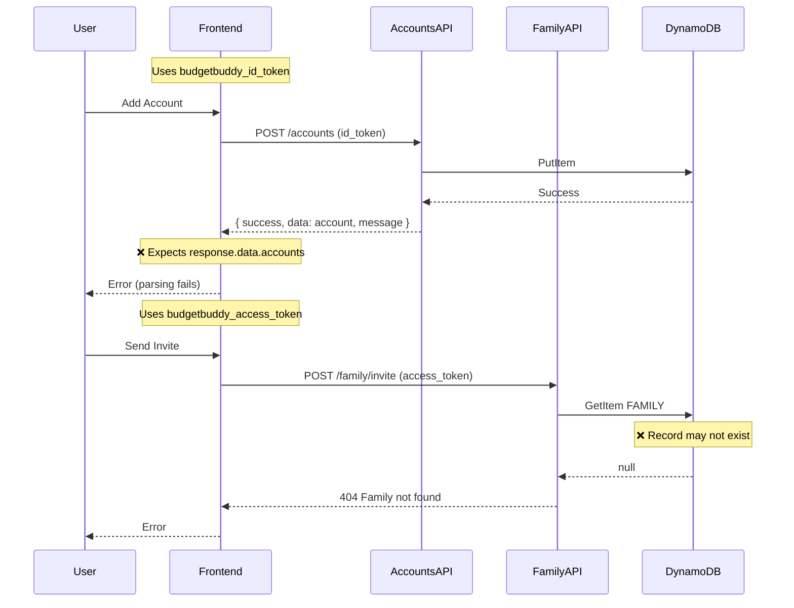
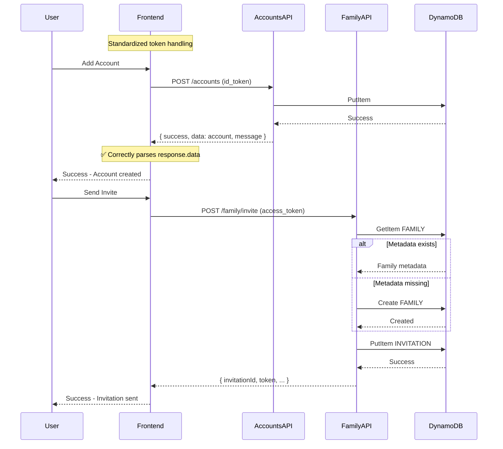

# Design Document: Fix Accounts & Family Features

## Overview

This design addresses critical integration bugs in the Manual Accounts and Family Invitations features. The root causes are:

1. **Token Mismatch**: FamilySettings component uses `budgetbuddy_access_token` but API Gateway Cognito authorizer requires `budgetbuddy_id_token`
2. **Response Format Mismatch**: Frontend expects `response.data.accounts` but backend returns `{ success, data: { accounts, count }, message }`
3. **Missing Family Metadata**: Family invite requires `FAMILY#<familyId>` METADATA record that may not exist for legacy users
4. **Inconsistent Error Handling**: Errors are not consistently surfaced to users

The fix strategy is to:

- Change FamilySettings to use `budgetbuddy_id_token` (same as other API calls)
- Fix frontend response parsing to match actual backend format
- Add family metadata auto-creation in the invite flow
- Improve error handling and user feedback

## AWS Architecture Assessment

### Token Strategy Decision

**Decision**: Use ID tokens for all API Gateway calls with Cognito User Pools Authorizer.

**Rationale**:

- AWS API Gateway Cognito User Pools Authorizer validates ID tokens by default
- ID tokens contain user identity claims (userId, familyId, familyRole) needed by Lambda functions
- Access tokens are designed for OAuth 2.0 scopes, which we're not using
- Consistent token usage reduces confusion and bugs

**Alternative Considered**: Configure API Gateway to accept access tokens with custom scopes.

- Rejected because: Adds complexity, requires scope configuration, and ID tokens already contain needed claims.

### Family Metadata Auto-Creation Strategy

**Decision**: Implement idempotent family metadata creation in the invite flow.

**Rationale**:

- Legacy users may not have FAMILY#<familyId> METADATA records
- Auto-creation provides graceful degradation
- Idempotent operations are safe to retry

**Implementation**:

```javascript
// Check if family metadata exists
const familyResult = await dynamodb.send(new GetCommand({...}));

// Auto-create if missing (idempotent)
if (!familyResult.Item) {
  await dynamodb.send(new PutCommand({
    ...familyMetadata,
    ConditionExpression: 'attribute_not_exists(PK)' // Idempotent
  }));
}
```

### Error Response Standardization

**Decision**: Standardize all Lambda responses to use `{ success, data, message }` format.

**Current State**:

- Accounts Lambda: `{ success: true, data: {...}, message: "..." }`
- Family Lambda: `{ error: "..." }` for errors, raw data for success

**Target State**:

- All Lambdas: `{ success: boolean, data: any, message: string }`

**Migration Strategy**:

1. Update Family Lambda to use standardized response format
2. Frontend already handles both formats (graceful degradation)
3. No breaking changes for existing clients

## Architecture

### Current Architecture (With Issues)



### Fixed Architecture



## Components and Interfaces

### 1. Frontend API Services

#### accountsApi.ts (Fix Response Parsing)

**Current Issue**: Expects `response.data.accounts` but backend returns `{ success, data: { accounts, count }, message }`

**Fix**: The frontend is already correctly structured to parse `response.data.accounts`. The issue is that the backend returns the account directly in `data` for single account operations, not wrapped in an `accounts` array.

```typescript
// Current (incorrect for single account)
async getAccount(accountId: string): Promise<Account> {
  const response = await accountsApiCall<ApiResponse<Account>>(`/accounts/${accountId}`);
  return response.data; // ✅ This is correct - backend returns account directly
}

// Current (needs verification for list)
async getAccounts(): Promise<Account[]> {
  const response = await accountsApiCall<ApiResponse<{ accounts: Account[] }>>(endpoint);
  return response.data.accounts; // ✅ Backend returns { accounts: [...], count }
}

// Current (needs fix for create)
async createAccount(input: CreateAccountInput): Promise<Account> {
  const response = await accountsApiCall<ApiResponse<Account>>('/accounts', { ... });
  return response.data; // ✅ Backend returns account directly in data
}
```

**Actual Issue Found**: The backend `successResponse` wraps data in `{ success, data, message }`. The frontend correctly expects this. The real issue is likely:

1. Token not being sent correctly
2. Network/CORS issues
3. Backend validation failures not being surfaced

#### FamilySettings.tsx (Token Fix)

**Current Issue**: Uses `budgetbuddy_access_token` but API Gateway Cognito authorizer requires ID token.

**Fix**: Change to use `budgetbuddy_id_token` (same as other API calls).

```typescript
// Current (incorrect - causes 401)
const token = localStorage.getItem("budgetbuddy_access_token");

// Fixed (correct - API Gateway Cognito authorizer requires ID token)
const token = localStorage.getItem("budgetbuddy_id_token");
```

### 2. Backend Family Lambda (Fix Metadata Handling)

#### handleInvite Function Enhancement

**Current Issue**: Returns 404 if `FAMILY#<familyId>` METADATA doesn't exist.

**Fix**: Auto-create family metadata if missing.

```javascript
async function handleInvite(event, userId, familyId, familyRole) {
  // ... validation ...

  // Get or create family metadata
  let familyResult = await dynamodb.send(
    new GetCommand({
      TableName: TABLE_NAME,
      Key: {
        PK: `FAMILY#${familyId}`,
        SK: "METADATA",
      },
    }),
  );

  // Auto-create family metadata if missing
  if (!familyResult.Item) {
    const now = new Date().toISOString();
    const familyMetadata = {
      PK: `FAMILY#${familyId}`,
      SK: "METADATA",
      familyId,
      primaryUserId: userId,
      createdAt: now,
      memberCount: 1,
      subscriptionTier: "free",
    };

    await dynamodb.send(
      new PutCommand({
        TableName: TABLE_NAME,
        Item: familyMetadata,
      }),
    );

    // Also create MEMBER record for primary user
    await dynamodb.send(
      new PutCommand({
        TableName: TABLE_NAME,
        Item: {
          PK: `FAMILY#${familyId}`,
          SK: `MEMBER#${userId}`,
          userId,
          role: "primary",
          joinedAt: now,
          addedBy: userId,
        },
      }),
    );

    familyResult = { Item: familyMetadata };
  }

  // Continue with invitation logic...
}
```

### 3. Error Handling Improvements

#### Frontend Error Display

```typescript
// Enhanced error handling in accountsApi.ts
async function accountsApiCall<T>(
  endpoint: string,
  options: RequestInit = {},
): Promise<T> {
  const token = getToken();
  if (!token) {
    throw new AccountsApiError("Please log in to continue", 401);
  }

  try {
    const response = await fetch(url, { ...options, headers });

    if (!response.ok) {
      let errorMessage = `Request failed (${response.status})`;
      try {
        const errorData = await response.json();
        errorMessage = errorData.message || errorData.error || errorMessage;
      } catch {
        // Use default error message
      }
      throw new AccountsApiError(errorMessage, response.status);
    }

    const data = await response.json();

    // Handle API-level errors
    if (data.success === false) {
      throw new AccountsApiError(data.message || "Operation failed", 400);
    }

    return data;
  } catch (error) {
    if (error instanceof AccountsApiError) {
      throw error;
    }
    // Network error
    throw new AccountsApiError(
      "Network error. Please check your connection.",
      0,
    );
  }
}
```

## Data Models

### Family Metadata Record

```typescript
interface FamilyMetadata {
  PK: string; // FAMILY#<familyId>
  SK: string; // METADATA
  familyId: string;
  primaryUserId: string;
  createdAt: string; // ISO 8601
  memberCount: number; // 1-2 for editors
  subscriptionTier: "free" | "premium";
}
```

### Family Member Record

```typescript
interface FamilyMember {
  PK: string; // FAMILY#<familyId>
  SK: string; // MEMBER#<userId>
  userId: string;
  role: "primary" | "spouse" | "viewer";
  joinedAt: string; // ISO 8601
  addedBy: string; // userId who added this member
}
```

### Invitation Record

```typescript
interface Invitation {
  PK: string; // INVITATION#<invitationId>
  SK: string; // METADATA
  GSI4PK: string; // INVITATION#<email>
  GSI4SK: string; // CREATED#<timestamp>
  invitationId: string;
  familyId: string;
  invitedBy: string;
  invitedEmail: string;
  role: "spouse" | "viewer";
  token: string; // Hashed token
  status: "pending" | "accepted" | "expired" | "revoked";
  createdAt: string;
  expiresAt: string;
}
```

### Account Record

```typescript
interface Account {
  PK: string; // FAMILY#<familyId>
  SK: string; // ACCOUNT#<accountId>
  GSI1PK: string; // FAMILY#<familyId>#ACCOUNTS
  GSI1SK: string; // <accountType>#<accountId>
  entityType: "ACCOUNT";
  accountId: string;
  familyId: string;
  accountType: "banking" | "cash" | "credit_card" | "investment" | "loan";
  accountSubtype: string;
  nickname: string;
  institutionName: string | null;
  currentBalance: number;
  currency: string;
  isManual: boolean;
  isTracked: boolean;
  createdAt: string;
  updatedAt: string;
}
```

## Correctness Properties

_A property is a characteristic or behavior that should hold true across all valid executions of a system—essentially, a formal statement about what the system should do. Properties serve as the bridge between human-readable specifications and machine-verifiable correctness guarantees._

Based on the prework analysis, the following properties have been identified and consolidated to eliminate redundancy:

### Property 1: Token Retrieval Correctness

_For any_ API service (accounts or family), the service SHALL retrieve the correct token key from localStorage based on its documented token type.

**Validates: Requirements 1.1, 1.2**

### Property 2: Missing Token Handling

_For any_ API call where the required token is missing from localStorage, the system SHALL throw an authentication error with a user-friendly message.

**Validates: Requirements 1.3, 1.5**

### Property 3: Account Creation Round-Trip

_For any_ valid account input (with required fields: nickname, accountType, accountSubtype, currentBalance), creating the account and then listing accounts SHALL return an accounts array containing the created account with matching properties.

**Validates: Requirements 2.2, 2.3, 2.6**

### Property 4: Account Validation Rejects Invalid Input

_For any_ account input missing required fields (nickname, accountType, accountSubtype), the system SHALL reject the creation with a validation error message.

**Validates: Requirements 2.5, 2.7**

### Property 5: Family Metadata Auto-Creation

_For any_ family operation (invite, get members) where the `FAMILY#<familyId>` METADATA record does not exist, the system SHALL create the metadata record before proceeding with the operation.

**Validates: Requirements 3.1, 3.2, 5.3**

### Property 6: Invitation Creation and Storage

_For any_ valid invitation request (valid email, valid role), the system SHALL store the invitation with status "pending" and return the invitation details including the token.

**Validates: Requirements 3.3, 3.4**

### Property 7: Duplicate Invitation Prevention

_For any_ email address with an existing pending invitation to the same family, attempting to send another invitation SHALL fail with a conflict error.

**Validates: Requirements 3.5**

### Property 8: Family Member Limit Enforcement

_For any_ family with 2 members having edit permissions (primary + spouse), attempting to add another editor SHALL fail with a "family full" error.

**Validates: Requirements 3.6**

### Property 9: Invitation Acceptance Flow

_For any_ valid, non-expired invitation token, accepting the invitation SHALL: add the user to the family, update invitation status to "accepted", and increment the family member count by exactly 1.

**Validates: Requirements 4.1, 4.2, 4.3, 4.4**

### Property 10: Invalid Token Rejection

_For any_ invalid or expired invitation token, attempting to accept SHALL fail with a clear error message indicating the token is invalid or expired.

**Validates: Requirements 4.5**

### Property 11: Member Count Invariant

_For any_ family, the memberCount in the METADATA record SHALL equal the actual count of MEMBER records for that family.

**Validates: Requirements 5.4, 5.5**

### Property 12: Error Message Safety

_For any_ API error response, the error message displayed to users SHALL NOT contain stack traces, internal paths, or sensitive system information.

**Validates: Requirements 6.1, 6.2**

### Property 13: Response Format Consistency

_For any_ backend API response, the response SHALL follow the format `{ success: boolean, data: any, message: string }` and the frontend SHALL correctly parse this format without errors.

**Validates: Requirements 7.1, 7.2, 7.3**

## Error Handling

### Frontend Error Handling Strategy

```typescript
// Error types and handling
enum ErrorType {
  AUTHENTICATION = "authentication",
  VALIDATION = "validation",
  NETWORK = "network",
  SERVER = "server",
  NOT_FOUND = "not_found",
  CONFLICT = "conflict",
}

interface AppError {
  type: ErrorType;
  message: string;
  field?: string; // For validation errors
  retryable: boolean;
}

function categorizeError(statusCode: number, message: string): AppError {
  switch (statusCode) {
    case 0:
      return {
        type: ErrorType.NETWORK,
        message: "Network error. Please check your connection.",
        retryable: true,
      };
    case 401:
      return {
        type: ErrorType.AUTHENTICATION,
        message: "Please log in to continue.",
        retryable: false,
      };
    case 403:
      return {
        type: ErrorType.AUTHENTICATION,
        message: "You do not have permission for this action.",
        retryable: false,
      };
    case 404:
      return {
        type: ErrorType.NOT_FOUND,
        message: message || "Resource not found.",
        retryable: false,
      };
    case 409:
      return {
        type: ErrorType.CONFLICT,
        message: message || "This action conflicts with existing data.",
        retryable: false,
      };
    case 400:
      return {
        type: ErrorType.VALIDATION,
        message: message || "Invalid input.",
        retryable: false,
      };
    default:
      return {
        type: ErrorType.SERVER,
        message: "Something went wrong. Please try again.",
        retryable: true,
      };
  }
}
```

### Backend Error Handling Strategy

```javascript
// Standardized error responses
const errorResponses = {
  // Authentication errors
  unauthorized: (message = "Authentication required") => ({
    statusCode: 401,
    body: { success: false, message, error: { code: "UNAUTHORIZED" } },
  }),

  // Validation errors
  badRequest: (message, field = null) => ({
    statusCode: 400,
    body: {
      success: false,
      message,
      error: { code: "VALIDATION_ERROR", field },
    },
  }),

  // Not found errors
  notFound: (resource = "Resource") => ({
    statusCode: 404,
    body: {
      success: false,
      message: `${resource} not found`,
      error: { code: "NOT_FOUND" },
    },
  }),

  // Conflict errors
  conflict: (message) => ({
    statusCode: 409,
    body: { success: false, message, error: { code: "CONFLICT" } },
  }),

  // Server errors (sanitized)
  serverError: (requestId) => ({
    statusCode: 500,
    body: {
      success: false,
      message: "An unexpected error occurred. Please try again.",
      error: { code: "INTERNAL_ERROR", requestId },
    },
  }),
};
```

### Error Scenarios and Responses

| Scenario               | HTTP Status | User Message                                             |
| ---------------------- | ----------- | -------------------------------------------------------- |
| Missing auth token     | 401         | "Please log in to continue."                             |
| Invalid auth token     | 401         | "Your session has expired. Please log in again."         |
| Missing required field | 400         | "Account nickname is required."                          |
| Family not found       | 404         | "Family not found." (then auto-create)                   |
| Duplicate invitation   | 409         | "An invitation has already been sent to this email."     |
| Family full            | 409         | "Your family already has the maximum number of editors." |
| Expired invitation     | 400         | "This invitation has expired. Please request a new one." |
| Network error          | N/A         | "Network error. Please check your connection."           |
| Server error           | 500         | "Something went wrong. Please try again."                |

## Testing Strategy

### Unit Tests

Unit tests focus on individual functions and components in isolation:

1. **Token Retrieval Tests**
   - Test `getToken()` returns correct token from localStorage
   - Test missing token handling

2. **Response Parsing Tests**
   - Test parsing of success responses
   - Test parsing of error responses
   - Test handling of malformed responses

3. **Validation Tests**
   - Test account input validation
   - Test invitation input validation

4. **Error Categorization Tests**
   - Test error type mapping from status codes
   - Test error message sanitization

### Property-Based Tests

Property-based tests verify universal properties across many generated inputs using fast-check:

1. **Property 3: Account Creation Round-Trip**
   - Generate random valid account inputs
   - Verify created account matches input
   - Minimum 100 iterations

2. **Property 4: Account Validation**
   - Generate inputs with missing required fields
   - Verify all are rejected with validation errors
   - Minimum 100 iterations

3. **Property 7: Duplicate Invitation Prevention**
   - Generate random email addresses
   - Send invitation, then attempt duplicate
   - Verify second attempt fails
   - Minimum 100 iterations

4. **Property 11: Member Count Invariant**
   - Generate random family operations (add/remove members)
   - Verify memberCount always equals actual member count
   - Minimum 100 iterations

5. **Property 12: Error Message Safety**
   - Generate various error scenarios
   - Verify no stack traces or internal paths in messages
   - Minimum 100 iterations

### Integration Tests

Integration tests verify end-to-end flows:

1. **Account Creation Flow**
   - Create account via API
   - Verify account appears in list
   - Verify account details match

2. **Family Invitation Flow**
   - Send invitation
   - Accept invitation
   - Verify family membership

3. **Error Handling Flow**
   - Trigger various error conditions
   - Verify appropriate error messages displayed

### Test Configuration

```javascript
// Property-based test configuration
const PBT_CONFIG = {
  numRuns: 100, // Minimum iterations per property
  seed: Date.now(), // For reproducibility
  verbose: true,
};

// Test tagging format
// Feature: fix-accounts-family-features, Property N: <property_text>
```
