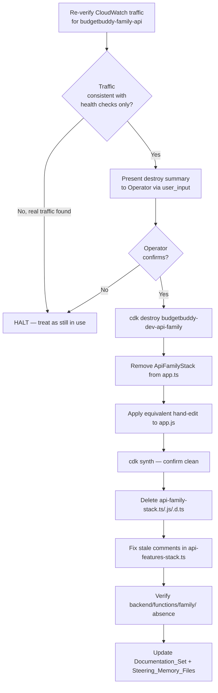
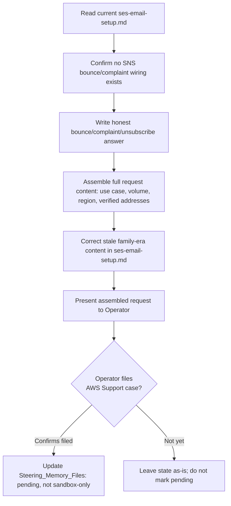

# Design Document

## Overview

This design covers two independent operational changes:

- **Item 1**: Retire the deprecated `api-family-stack` — verify zero traffic, get explicit
  Operator confirmation, destroy the CloudFormation stack, remove it from the CDK app
  entrypoint (both `app.ts` and the checked-in `app.js`), delete its source files, fix the
  one stale comment it leaves behind in `api-features-stack.ts`, and reconcile every doc/steering
  reference to its deployment status.
- **Item 2**: Prepare and hand off an AWS SES production-access request, including resolving
  a real gap in the current SES setup around bounce/complaint/unsubscribe handling — neither
  of which is currently built, not just undocumented — before AWS can be given an honest answer.

Both items are infra/ops changes, not application logic changes. There is no new pure-function
code being introduced (no parser, serializer, or business-rule transformation). Property-based
testing does not apply here — see Testing Strategy.

## Research Findings

### app.js sync mechanism (resolves Open Question 3)

`git log -- infrastructure/bin/app.js` shows commits (e.g. `c937e71`, "feat: add email
subscription to SNS alert topic...") that touch `app.js` and `app.ts` together, in the same
commit, with the file not excluded by `.gitignore`. This means `app.js` is a checked-in,
hand-synchronized compiled artifact — there is no build hook, pre-commit hook, or CI step
confirmed to regenerate it automatically before every commit. `.husky/pre-commit` and
`.husky/pre-push` were not found to invoke `tsc` on `infrastructure/bin`.

**Decision**: Edit `app.js` by hand, line for line, to mirror the removals made in `app.ts`.
Do not rely on `tsc` to regenerate it as part of this change, since no automatic regeneration
step is confirmed to run pre-commit. If a later, separate change introduces a verified build
step that regenerates and diffs `app.js` automatically, that step can replace this manual
requirement — that is out of scope here.

### SES bounce/complaint/unsubscribe gap (resolves Open Question 2)

Read `docs/ses-email-setup.md` directly. It documents the sandbox restriction and a
verify-recipient workaround. Its "Request Production Access" section step 3 instructs the
reader to fill in "**Bounce handling**: Describe your bounce handling process" but the
document never defines what that process actually is.

Searched `infrastructure/lib/*.ts` for `configurationSet`, `notificationTopic`, `ses.`,
`SESv2`, `CfnConfigurationSet` — **no matches**. Searched `notification-stack.ts` in full — it
wires DynamoDB Streams, EventBridge schedules, and CloudWatch alarms for push notifications
and budget alerts; it has no SES-related resources at all. There is no SNS topic anywhere in
the CDK code subscribed to SES bounce or complaint notifications, and no SES configuration set.

Searched the actual email-sending code:
- `backend/functions/email/index.js` uses `@aws-sdk/client-ses` `SendEmailCommand` directly
  against `FROM_EMAIL` (default `noreply@budgetbuddy.com`, overridden to
  `info@hitechparadigm.com` per `CHANGELOG.md`). No bounce/complaint handling logic.
- `backend/functions/daily-reminders/index.js` uses the SES v2 `AWS.SES` client for a monthly
  kickoff email. No bounce/complaint handling logic.

**Conclusion — this is a real, unbuilt gap, not a documentation-only gap.** There is no
"already configured, just undocumented" answer available. Design decision for Requirement 7:

1. The SES production-access request will **not** claim an automated bounce/complaint
   pipeline that does not exist, because that would misrepresent the account to AWS Support
   and risks a future compliance problem if a real bounce spike occurs with no automation
   behind it.
2. The written summary (see "SES Production-Access Request Content" below) states the actual,
   honest current process: manual monitoring of SES sending statistics via
   `node scripts/setup-ses-email.js list` and the SES console's built-in reputation dashboard,
   with a commitment to suppress/remove any address that produces a hard bounce or complaint
   before resending. This is a legitimate answer for a low-volume transactional sender at this
   stage — AWS does not require full SNS-based automation to grant production access, only a
   credible process description — but it must describe what is actually true today.
3. Building automated SNS bounce/complaint handling is flagged as a **follow-up task**
   (tracked in Known Open Items / work-log, not built as part of this spec), because
   Requirement 7 only requires *preparing* the request, and Requirement 8 keeps the Operator
   in control of what gets submitted. If the Operator wants full SNS automation built before
   submitting, that is a scope decision for them to make at review time, not something this
   design fabricates evidence for.
4. `docs/ses-email-setup.md` itself is stale independent of this gap — it still says "Family
   invitations," references `backend/functions/email` under a `debug-family-invitation.js`
   script and `budgetbuddy-email-family` Lambda log group name, all predating the
   budget-model migration. This is corrected as part of Requirement 6/9's documentation
   reconciliation (see "Documentation Changes" below), not left stale underneath new content.

## Architecture

No new components are introduced. This is a subtractive change (destroy one stack, remove its
wiring, delete its files) plus a documentation-consistency pass, plus an external AWS Support
interaction that is prepared but not automated.





## Components and Interfaces

This spec touches no application runtime components. The "interfaces" here are: the CDK
app entrypoint (`app.ts`/`app.js`), the CDK stack source files, code comments in
`api-features-stack.ts`, and a set of documentation/steering files. There are no new
functions, classes, or APIs.

## Data Models

Not applicable. No DynamoDB schema, API contract, or data shape changes. The `api-family-stack`
never wrote budget data under a live code path (all routes return 410), so its destruction has
no data migration concern.

## Exact Diff Plan — `infrastructure/bin/app.ts`

Remove these lines (confirmed present via direct read above):

```diff
- import { ApiFamilyStack } from '../lib/api-family-stack';
```

```diff
- /**
-  * API Family Stack - Family collaboration features (DEPRECATED)
-  * Returns 410 Gone for all requests. Kept deployed during transition period.
-  * Will be removed once all clients have migrated to /budgets/* endpoints.
-  * @deprecated Use ApiBudgetsStack instead.
-  */
- const apiFamilyStack = new ApiFamilyStack(app, `${stackPrefix}-api-family`, {
-   env,
-   description: 'BudgetBuddy Family API stack for family collaboration and member management',
-   table: databaseStack.table,
-   userPool: authStack.userPool,
- });
-
```

```diff
- apiFamilyStack.addDependency(databaseStack);
- apiFamilyStack.addDependency(authStack);
```

```diff
- monitoringStack.addDependency(apiFamilyStack);
```

All other `monitoringStack.addDependency(...)` lines (`databaseStack`, `authStack`, `apiStack`,
`apiFeaturesStack`, `apiFeaturesExtendedStack`, `apiBudgetsStack`, `notificationStack`) are
preserved exactly as-is, satisfying Requirement 3 Criterion 3.

## Exact Diff Plan — `infrastructure/bin/app.js`

`app.js` is the compiled, checked-in sibling. Apply the equivalent removals by hand (per the
Research Findings decision above), preserving the file's existing compiled style
(`require(...)` instead of `import`, no type annotations):

```diff
- const api_family_stack_1 = require("../lib/api-family-stack");
```

```diff
- /**
-  * API Family Stack - Family collaboration features
-  * Standalone stack to avoid circular dependencies and CloudFormation resource limits
-  * Contains: Family management, member management, invitations, email notifications
-  * Creates its own CommonLayer and SharedLayer to avoid CloudFormation export dependency issues
-  */
- const apiFamilyStack = new api_family_stack_1.ApiFamilyStack(app, `${stackPrefix}-api-family`, {
-     env,
-     description: 'BudgetBuddy Family API stack for family collaboration and member management',
-     table: databaseStack.table,
-     userPool: authStack.userPool,
- });
-
```

```diff
- apiFamilyStack.addDependency(databaseStack);
- apiFamilyStack.addDependency(authStack);
```

```diff
- monitoringStack.addDependency(apiFamilyStack);
```

Note: the current checked-in `app.js` predates the `ApiBudgetsStack` addition present in
`app.ts` (it has no `api_budgets_stack_1` require, no `apiBudgetsStack` instantiation, and no
`notificationFunction` wiring into `apiStack`) — `app.js` is already drifted from `app.ts`
independent of this spec's change. This design's edit only removes the family-stack lines from
`app.js` as it exists today; it does **not** attempt to backfill the unrelated
`api-budgets`/`notificationFunction` drift, since that is outside Requirement 3's scope (which
is specifically about removing `ApiFamilyStack`). This drift is flagged as a new item for
`work-log.md`'s Known Open Items (see Documentation Changes below) so it isn't silently lost.

Also remove the trailing `//# sourceMappingURL=...` base64 comment at the end of the file as
part of this edit (it encodes the pre-edit source and will be stale/misleading after a manual
edit); do not attempt to regenerate a correct source map by hand.

## Destroy Sequence and Operator Confirmation Procedure

Exact CLI sequence, executed strictly in this order:

1. **Re-verify traffic** (Requirement 1) — run, and read the output of:
   ```
   aws logs tail /aws/lambda/<api-family-lambda-name> --since 24h --profile hitechparadigm
   aws cloudwatch get-metric-statistics --namespace AWS/ApiGateway --metric-name Count \
     --dimensions Name=ApiName,Value=budgetbuddy-family-api --start-time <24h-ago> \
     --end-time <now> --period 3600 --statistics Sum --profile hitechparadigm
   ```
   This is a **new, distinct execution** at task time — not a re-read of this design document's
   research. If either command shows a sustained pattern of non-automated-scan traffic, halt
   per Requirement 1 Criterion 2 and do not proceed to step 2.

2. **Present the destroy summary and obtain confirmation** (Requirement 2) — this is the
   concrete mechanism satisfying "explicit Operator confirmation": use the `user_input` tool to
   present a summary containing (a) the CloudFormation stack name
   `budgetbuddy-dev-api-family`, (b) the resources it will delete (API Gateway
   `budgetbuddy-family-api`, its Lambda functions, its Lambda Layers, any stack-scoped IAM
   roles/log groups), (c) the traffic-verification result from step 1, and (d) an explicit
   yes/no question asking the Operator to confirm destruction. **Do not proceed past this point
   without an explicit affirmative answer captured in that tool call.** A narrated assumption
   of consent (e.g. "the Operator likely wants this destroyed since it's in the spec") does not
   satisfy Requirement 2 — the confirmation must be a real, in-the-moment response to a
   real question, asked after step 1's fresh data is in hand, not a decision made at
   spec-writing time.

3. **Destroy the stack** (only after step 2's affirmative confirmation):
   ```
   cdk destroy budgetbuddy-dev-api-family --profile hitechparadigm
   ```
   Run from `infrastructure/`. This is a single targeted destroy, not part of any batched or
   scripted multi-stack sequence, satisfying Requirement 2 Criterion 2.

4. **Remove from app entrypoint** — apply the `app.ts` and `app.js` diffs above.

5. **Synth check** (Requirement 3 Criterion 5):
   ```
   cd infrastructure && npx cdk synth
   ```
   Must complete with no errors and no reference to `ApiFamilyStack`, `api-family-stack`, or
   `budgetbuddy-dev-api-family` in the synthesized output.

6. **Delete source files** (Requirement 4 Criterion 1) — delete all three:
   - `infrastructure/lib/api-family-stack.ts`
   - `infrastructure/lib/api-family-stack.js`
   - `infrastructure/lib/api-family-stack.d.ts`

   Confirm `infrastructure/.gitignore` (or a build-output exclusion) covers `lib/*.js` and
   `lib/*.d.ts` compiled siblings going forward, so a future `tsc` build does not
   re-introduce and re-commit these compiled files (Requirement 4 Criterion 2). If no such
   exclusion currently exists for `infrastructure/lib/*.js`/`*.d.ts`, add one.

7. **Fix stale comments in `api-features-stack.ts`** (Requirement 4 Criterion 3) — both
   confirmed by direct read:

   ```diff
   -    // Note: Family Lambda moved to ApiFamilyStack (standalone stack) to avoid circular dependency
   +    // Note: Family Lambda removed — ApiFamilyStack was destroyed (see ARCHITECTURE_DECISIONS.md ADR-001)
   ```

   ```diff
   -    // Note: Family routes moved to ApiFamilyStack (standalone stack) to avoid circular dependency
   +    // Note: Family routes removed — ApiFamilyStack was destroyed; use /budgets/* via ApiBudgetsStack
   ```

8. **Verify `backend/functions/family/`** (Requirement 5) — run a direct filesystem check
   (`list_directory` or `Test-Path`) at execution time. Confirmed absent at design time via
   `file_search`, but Requirement 5 Criterion 1 requires re-verification at execution time, not
   reuse of this design-time check. If it is found to exist at that point (state changed since
   this design was written), delete it; if absent, record "no action needed" — do not create
   a placeholder.

## File Disposition Summary

| File | Action |
|---|---|
| `infrastructure/lib/api-family-stack.ts` | Delete |
| `infrastructure/lib/api-family-stack.js` | Delete |
| `infrastructure/lib/api-family-stack.d.ts` | Delete |
| `infrastructure/bin/app.ts` | Hand-edit (remove import, instantiation, 2 deps, monitoring dep) |
| `infrastructure/bin/app.js` | Hand-edit (mirror the same 4 removals, drop stale source map comment) |
| `infrastructure/lib/api-features-stack.ts` | Hand-edit (2 stale comments corrected) |
| `backend/functions/family/` | Delete only if found present at execution time (verified absent at design time) |

## Documentation Changes

Each entry below quotes the exact current text (confirmed by direct read) and the exact
replacement.

### `ARCHITECTURE_DECISIONS.md`

Current (ADR-001, "What Was Removed" list):
```
- `api-family-stack` — still deployed but deprecated; will be destroyed after migration period
```
Replace with:
```
- `api-family-stack` — destroyed; removed from the CDK app entrypoint and deleted from the repository
```

Current (ADR-001, "Consequences"):
```
- ⚠️ `api-family-stack` still deployed (returns 410) — will be destroyed once confirmed no traffic
```
Replace with:
```
- ✅ `api-family-stack` destroyed after confirming zero traffic — no longer part of the deployed infrastructure
```

Current (ADR-002, "Stack Layout" fenced block):
```
database → auth → auth-onboarding → api → api-features
→ api-features-extended → api-budgets → hosting → notification → monitoring
api-family (DEPRECATED — returns 410)
```
Replace with:
```
database → auth → auth-onboarding → api → api-features
→ api-features-extended → api-budgets → hosting → notification → monitoring
```
(the `api-family` line is removed entirely — it no longer exists in any form)

### `docs/aws-stack-architecture.md`

Current (Deployed Stacks table, last row):
```
| `budgetbuddy-dev-api-family` | **Deprecated** | Returns 410 Gone — replaced by api-budgets |
```
Remove this row entirely (the stack no longer exists — it is not merely deprecated).

Current ("Deprecated" section):
```
### `budgetbuddy-dev-api-family`
- Returns **410 Gone** for all requests
- Kept deployed during client migration period
- Will be destroyed once all clients use `/budgets/*`
- Do not add new features or fix bugs in this stack
```
Replace with (preserving historical context per Requirement 6 Criterion 4 — why it existed and
what replaced it — while correcting the current-status field):
```
### `budgetbuddy-dev-api-family` (destroyed)
- Historically served `/family/*` routes; all routes returned **410 Gone** after the
  budget-model migration
- Destroyed on <date of execution> after confirming zero real traffic
- Replaced entirely by `budgetbuddy-dev-api-budgets` — use `/budgets/*`
```

### `docs/product-requirements.md`

Current (Deprecated/Removed table, last row):
```
| `api-family-stack` | `api-budgets-stack` (family stack still deployed, returns 410) |
```
Replace with:
```
| `api-family-stack` | `api-budgets-stack` (family stack destroyed) |
```

Current (Known Gaps, item 6):
```
6. **SES still in sandbox mode** — can only send to verified addresses. Verified: `dmytro.malyk@gmail.com`, `dima.pmp@gmail.com`, `info@hitechparadigm.com`, `t1@taxprocanada.ca`, `dmalyk@taxprocanada.ca`. Request SES production access to send to any address.
```
Per Requirement 9: if the SES support case has been filed by the time this doc is updated,
replace with:
```
6. **SES production access requested, pending AWS approval** — sending remains restricted to
   verified addresses (see `docs/ses-email-setup.md`) until AWS approves the request. Verified:
   `dmytro.malyk@gmail.com`, `dima.pmp@gmail.com`, `info@hitechparadigm.com`,
   `t1@taxprocanada.ca`, `dmalyk@taxprocanada.ca`.
```
If the case has not yet been filed at documentation-update time, leave the current sandbox
wording in place (Requirement 9 Criterion 1 requires stating the sandbox restriction while
pending; Criterion 2 only triggers the "requested" wording once the case is actually filed —
do not update this line ahead of the real event).

### `docs/ses-email-setup.md`

This file needs correction on two independent axes: (a) it is stale from the family-era model,
and (b) it needs the bounce/complaint/unsubscribe answer added per Requirement 7.

Stale content confirmed by direct read, with fixes:

```diff
-Family invitations are not being sent because AWS SES is in **sandbox mode** with no verified email addresses.
+Budget invitations are not being sent because AWS SES is in **sandbox mode** with no verified email addresses.
```

```diff
-3. Try sending the family invitation again
+3. Try sending the budget invitation again
```

```diff
-2. **Revoke stuck invitations** via the Family Settings UI
+2. **Revoke stuck invitations** via the Budget Members page (`/budget/members`)
```

```diff
-   ```bash
-   aws logs tail /aws/lambda/budgetbuddy-email-family --follow --profile hitechparadigm
-   ```
+   ```bash
+   aws logs tail /aws/lambda/budgetbuddy-email --follow --profile hitechparadigm
+   ```
```
(confirm the exact deployed function name via `aws lambda list-functions` before finalizing
this line at execution time — `backend/functions/email/index.js` is the current source, but the
exact CDK-assigned `functionName` should be checked rather than assumed)

```diff
-   ```bash
-   node scripts/debug-family-invitation.js <your-user-id>
-   ```
+   ```bash
+   node scripts/debug-invitation.js <your-user-id>
+   ```
```
(confirm at execution time whether `scripts/debug-family-invitation.js` still exists under that
name or was already renamed/removed in a prior session — if the script itself no longer exists,
remove this instruction rather than pointing at a dead script)

New content to add under "Long-Term Solution (Production)", replacing the current step 3 bullet
`**Bounce handling**: Describe your bounce handling process` with the actual, honest process
(see "SES Production-Access Request Content" below for the full text), plus a new subsection:

```markdown
### Bounce, Complaint, and Unsubscribe Handling (current state)

BudgetBuddy does not yet have automated SNS-based bounce/complaint processing. The current
process is manual:

- Sending reputation (bounce rate, complaint rate) is checked via the SES console dashboard
  and `node scripts/setup-ses-email.js list`.
- Any address that hard-bounces or complains is not re-sent to until manually investigated.
- All current outbound email (budget invitations, notifications, password resets) is
  transactional, sent only to users who created an account or were explicitly invited by an
  existing member — there is no bulk/marketing sending and therefore no separate unsubscribe
  link is currently implemented.

**Follow-up (not part of this change):** build an SNS topic subscribed to SES bounce and
complaint notifications, wired to suppress future sends to affected addresses automatically.
Tracked as an open item in `work-log.md`.
```

### Steering — `.kiro/steering/memory/work-log.md`

Current (Known Open Items → Infrastructure):
```
### Infrastructure
- [ ] `api-family-stack` still deployed (returns 410) - destroy after confirming no traffic
- [ ] SES still in sandbox - production access not yet requested
```
Replace with (assuming both actions in this spec have been executed by the time this file is
updated; if SES case has not yet been filed, keep that line as "not yet requested" — do not
mark pending prematurely):
```
### Infrastructure
- [x] `api-family-stack` destroyed and removed from CDK app entrypoint (infra-cleanup spec)
- [ ] SES production access requested, pending AWS approval (submitted <date>) — sending still
      restricted to verified addresses until approved
- [ ] SES bounce/complaint handling is manual only — no SNS automation. Build if/when volume
      or AWS review warrants it.
- [ ] `infrastructure/bin/app.js` was already drifted from `app.ts` before this cleanup
      (missing `api-budgets`/`notificationFunction` wiring present in `.ts`) — noticed during
      infra-cleanup's app.js edit, not fixed here since out of this spec's scope; needs its own
      correction pass.
```

Also add a dated entry to the "What's Live and Working" or a new session section noting the
`api-family-stack` destruction and SES request submission, per this repo's per-commit
documentation standard (`DEVELOPMENT_LOG.md` / `work-log.md` session entries).

### Steering — `.kiro/steering/memory/gotchas.md`

Current:
```
### api-family-stack still deployed (returns 410)
- Do NOT destroy without confirming zero traffic
```
Remove this subsection entirely — the caution it documents is now moot (the stack is gone), and
Requirement 6 Criterion 2 explicitly calls for removing this note, not just editing its wording.

### Steering — `.kiro/steering/memory/architecture.md`

Current:
```
`api-family` stack is DEPRECATED — returns 410.
```
Remove this line entirely from the "Stack Deploy Order" section (the stack no longer exists in
any form, so "deprecated" is no longer accurate).

Current (Infrastructure Security section):
```
- SES sandbox — verified senders only
```
Replace with (only once the case is actually filed, per Requirement 9 Criterion 2 — otherwise
leave unchanged):
```
- SES production access requested, pending AWS approval — verified senders only until approved
```

Current ("SES Status" section):
```
## SES Status
- Sandbox mode — verified: `dmytro.malyk@gmail.com`, `dima.pmp@gmail.com`, `info@hitechparadigm.com`, `t1@hitechparadigm.com`, `t1@taxprocanada.ca`, `dmalyk@taxprocanada.ca`, `noreply@budgetbuddy.com`
- FROM_EMAIL = `info@hitechparadigm.com`
```
Replace with (once filed):
```
## SES Status
- Production access requested <date>, pending AWS approval. Until approved, sending remains
  restricted to verified addresses: `dmytro.malyk@gmail.com`, `dima.pmp@gmail.com`,
  `info@hitechparadigm.com`, `t1@hitechparadigm.com`, `t1@taxprocanada.ca`,
  `dmalyk@taxprocanada.ca`, `noreply@budgetbuddy.com`
- FROM_EMAIL = `info@hitechparadigm.com`
- Bounce/complaint handling: manual (SES console + `setup-ses-email.js list`); no SNS
  automation yet — see `docs/ses-email-setup.md`
```

Current (Removed/Deprecated section):
```
## Removed / Deprecated
- `FamilyIdResolver`, `FAMILY#` keys, `custom:familyId`, `/family/*` API, `FamilySettings.tsx`, `api-family-stack`
```
This line is already correct as written — `api-family-stack` is listed as removed/deprecated,
consistent with its destroyed state. No change needed here (confirmed by direct read; leaving
it alone rather than inventing a change).

### Steering — `.kiro/steering/memory/product.md`

Searched directly for `api-family` and `SES` — **no matches found**. `product.md` does not
reference either topic, so Requirement 6/9's reconciliation requirement does not apply to this
file. No change needed.

### Consistency check (Requirement 6 Criterion 3)

After all edits above, grep the repository for the exact strings `still deployed`,
`kept deployed`, and `budgetbuddy-family-api` (excluding this spec's own requirements.md/
design.md, which are historical records of the cleanup, not live documentation) to confirm
zero remaining contradictory claims.

## SES Production-Access Request Content

This is the concrete artifact Requirement 7 asks this design to produce — the actual text the
Operator will use to fill out the AWS Support case (Requirement 8 keeps submission itself
manual and Operator-owned):

```
Region: us-east-1

Mail Type: Transactional

Website URL: https://app.budgetbuddy.com

Use case description:
BudgetBuddy is a personal/family budgeting web application. We send transactional email only,
triggered by direct user action or account events:
  - Budget collaboration invitations (a user invites a partner/household member/viewer to a
    shared budget)
  - In-app notification digests (budget alerts, bill reminders) for users who have opted into
    email notifications
  - Password reset emails
We do not send marketing or bulk/promotional email.

Additional contacts: (Operator's own AWS account contact — not fabricated here)

Expected sending volume:
Current active user base is pre-launch/early access. Estimated volume: under 100 emails/day
initially, scaling with user growth. Requesting a starting quota consistent with AWS's standard
production-access default rather than a specific high-volume exception.

Compliance/process answers:
  - Bounce handling: We monitor SES sending statistics (bounce rate, complaint rate) via the
    SES console reputation dashboard and an internal script (setup-ses-email.js). Any address
    that produces a hard bounce is not sent to again until manually investigated and confirmed
    valid. We do not currently have automated SNS-based bounce suppression; given our current
    low sending volume, we monitor manually and plan to add automated SNS bounce/complaint
    handling as sending volume grows.
  - Complaint handling: Complaints are monitored the same way as bounces via the SES console.
    Any address that files a complaint is immediately suppressed from all future sends.
  - Unsubscribe mechanism: All current email is transactional (invitations the user directly
    requested, account security emails, and opt-in notification digests). Users can disable
    notification emails from their account settings at any time. We do not send bulk/marketing
    email that would require a List-Unsubscribe header, but will add one if we introduce any
    non-transactional sending in the future.

Currently verified identities (for reference, from docs/ses-email-setup.md):
  dmytro.malyk@gmail.com, dima.pmp@gmail.com, info@hitechparadigm.com,
  t1@hitechparadigm.com, t1@taxprocanada.ca, dmalyk@taxprocanada.ca, noreply@budgetbuddy.com

FROM_EMAIL in production: info@hitechparadigm.com
```

This content is presented to the Operator for review and manual submission via the AWS Support
Center per Requirement 8 — it is not submitted by any automated process.

## Correctness Properties

This feature is infrastructure cleanup and documentation reconciliation — removing a CDK stack
from an app entrypoint, deleting source files, editing markdown, and preparing a support-case
text. None of this has a pure-function input/output behavior with a meaningful "for all inputs"
statement to test. Per the PBT applicability guidance, this falls squarely into the "Infrastructure
as Code" and "configuration/documentation validation" exclusion categories.

### Property 1: Consistent deployment-status claims across documentation and steering files

For all files in the Documentation_Set and Steering_Memory_Files after this feature's changes
are applied, no file may state or imply that `budgetbuddy-dev-api-family` is "still deployed"
(or equivalent phrasing such as "kept deployed during client migration period") while another
file in that same set states it has been destroyed.

**Validates: Requirements 6.3**

**Property-based testing does not apply to this feature.** This is the one meaningful structural
invariant this spec has, but it is not amenable to generative property-based testing: the
Documentation_Set and Steering_Memory_Files are a fixed, finite, named list of files (enumerated
in the Glossary above), not an unbounded or randomly-generatable input space. There is no
generator that produces "a documentation file" to run 100 iterations against — the property is
checked once, structurally, against the specific finite set of files this spec modifies. The
appropriate verification is a grep/text-search check confirming no file in that fixed set
contains "still deployed" or "kept deployed during client migration period" language about
`budgetbuddy-dev-api-family`, paired with a check that at least one file states the destroyed
status. Correctness is otherwise verified structurally, as described below.

## Error Handling

- **Traffic re-verification finds real traffic (Requirement 1 Criterion 2)**: halt immediately,
  do not proceed to the confirmation step or the destroy command. Report the finding to the
  Operator as a blocker, not a soft warning.
- **Operator declines confirmation (Requirement 2)**: stop the destruction workflow entirely.
  Leave `api-family-stack` deployed and unchanged in the CDK app. Do not partially apply the
  `app.ts`/`app.js` edits if destruction did not happen — the entrypoint changes and the actual
  stack destruction must stay in sync (Requirement 3 Criterion 1 gates the entrypoint removal
  on the stack "having been destroyed per Requirement 2").
- **`cdk destroy` fails partway (e.g. a resource fails to delete)**: do not proceed to remove
  the stack from `app.ts`/`app.js` until `cdk destroy` (or `aws cloudformation describe-stacks`)
  confirms the stack is fully gone (`DELETE_COMPLETE` or stack-not-found). Removing the app
  entrypoint reference to a stack that still partially exists in CloudFormation would orphan it
  from CDK's management.
- **`cdk synth` fails after the entrypoint edit**: fix the edit before proceeding to file
  deletion — do not delete `api-family-stack.ts`/`.js`/`.d.ts` while any remaining reference to
  `ApiFamilyStack` exists, since that would break the build for anyone who has not pulled the
  entrypoint change yet.
- **`backend/functions/family/` unexpectedly exists at execution time**: per Requirement 5
  Criterion 2, delete it as part of this same change rather than treating it as a separate
  follow-up, since its only consumer will already be destroyed.
- **SES support case Operator has not yet filed at the time docs are updated**: do not write
  "pending" language into `product-requirements.md`/steering per Requirement 9 Criterion 2 — that
  criterion is conditioned on the case being filed. Leave existing sandbox wording in place
  until the Operator confirms filing.

## Testing Strategy

This is infrastructure and documentation work with no pure business logic under test, so this
uses structural/CLI verification and example-based checks rather than property-based tests.

1. **`cdk synth` success** — after the `app.ts` edit (and matching `app.js` edit), run
   `npx cdk synth` from `infrastructure/` and confirm it completes with exit code 0 and no
   `ApiFamilyStack`/`api-family` references in the synthesized template set.
2. **`cdk diff` shows only removal** — before destroying, run
   `cdk diff budgetbuddy-dev-api-family` to confirm the diff represents only a stack removal
   (no unexpected drift being destroyed alongside it). After the entrypoint edit, run
   `cdk diff` for the *remaining* stacks (e.g. `budgetbuddy-dev-monitoring`) to confirm the only
   change is the `apiFamilyStack` dependency edge being dropped — not an unrelated resource
   change.
3. **CloudWatch re-check before destroy** — the traffic re-verification in the Destroy Sequence
   step 1 is itself a test gate: destruction does not proceed unless this check passes.
4. **Grep for stale references after doc updates** — after all documentation edits, grep the
   repo (excluding this spec's own requirements.md/design.md/tasks.md) for `api-family`,
   `still deployed`, `kept deployed`, and `budgetbuddy-family-api` to confirm no contradictory
   claim remains anywhere in `docs/`, `ARCHITECTURE_DECISIONS.md`, or `.kiro/steering/`.
5. **Filesystem existence checks** — direct `list_directory`/`Test-Path` checks (not assumed
   from this design's research) for `backend/functions/family/` and for
   `infrastructure/lib/api-family-stack.{ts,js,d.ts}` before and after deletion, satisfying
   Requirement 5 Criterion 1 and confirming Requirement 4 Criterion 1's deletion actually took
   effect.
6. **No unit/property tests are added** for this spec — there is no new pure function, parser,
   or transformation introduced. The existing CDK stacks' own test suites (if any exist under
   `infrastructure/test/`) should be run once (`npm test` in `infrastructure/`) after the
   `app.ts` edit to confirm no existing snapshot test asserts the presence of `ApiFamilyStack`;
   if one does, it must be updated to match the new stack list as part of this same change.
