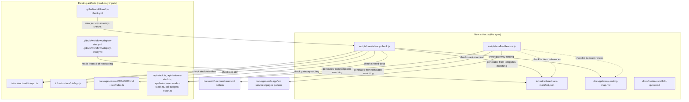

# Design Document

## Overview

This spec adds four read-only consistency checks, two small reference documents, and one
documented scaffold procedure to the existing repository conventions. It does **not** change the
number of API Gateways, the DynamoDB single-table design, or CDK stack boundaries (Requirement 6).
Every artifact here is a plain Node.js script (matching `scripts/check-cicd-status.js` and
`scripts/safe-commit-push.js`), a Markdown or JSON file, or a `pr-check.yml` job addition. No new
runtime dependencies are introduced — all four checks use only Node's built-in `fs`, `path`, and
`process` modules, which is how every existing script in `scripts/` is written.

The four failure modes from the requirements map directly to four independent check functions in
one script:

| Requirement | Failure mode that already happened | Check |
|---|---|---|
| 1 | `packages/api-client/README.md` described modules that didn't exist, before deletion | Shared package README vs. actual exports |
| 2 | `infrastructure/bin/app.js` drifted from `app.ts` (missing `api-budgets`/`notificationFunction`) | `app.ts` vs. `app.js` stack instantiation lists |
| 3 | `deploy-dev.yml` health check hardcoded a stack list that broke when `api-family-stack` was destroyed | `app.ts` stack list vs. `stack-manifest.json` |
| 4 | No tooling for deciding which of the 4 API Gateways a new route belongs on (steering-note only) | CDK API stack route prefixes vs. `docs/gateway-routing-map.md` |

All four checks are read-only: they parse existing files with regex/string matching and report
mismatches to stdout with a non-zero exit code on failure. None of them execute CDK, call AWS, or
write to any file other than the optional manifest files this spec introduces (which are then
committed normally, like any other doc).

## Architecture



No new AWS resources, no new packages, no new services. `consistency-check.js` runs locally
(`node scripts/consistency-check.js`) and in CI as a new `pr-check.yml` job, the same additive
pattern used when `mobile-tests` was added.

## Components and Interfaces

### 1. `scripts/consistency-check.js`

A single CLI script with four independent check functions, following the existing script
conventions (`#!/usr/bin/env node` shebang, plain `require`, `console.log`/`console.error` with
emoji-prefixed status lines, `process.exit(1)` on failure — matching `check-cicd-status.js`).

```javascript
#!/usr/bin/env node
/**
 * Consistency Check - Modular Architecture Guardrails
 *
 * Runs one or all of four read-only checks that keep documentation and
 * generated files in sync with the source of truth they describe.
 * Never modifies CDK stacks, API Gateway resources, or DynamoDB.
 *
 * Usage:
 *   node scripts/consistency-check.js                  # run all checks
 *   node scripts/consistency-check.js --check=shared-docs
 *   node scripts/consistency-check.js --check=app-drift
 *   node scripts/consistency-check.js --check=stack-manifest
 *   node scripts/consistency-check.js --check=gateway-routing
 *
 * Exit codes: 0 = all requested checks passed, 1 = at least one mismatch found
 */

const fs = require('fs');
const path = require('path');

const ROOT = path.join(__dirname, '..');

function checkSharedDocs() { /* Requirement 1 — see below */ }
function checkAppDrift() { /* Requirement 2 — see below */ }
function checkStackManifest() { /* Requirement 3 — see below */ }
function checkGatewayRouting() { /* Requirement 4 — see below */ }

const CHECKS = {
  'shared-docs': checkSharedDocs,
  'app-drift': checkAppDrift,
  'stack-manifest': checkStackManifest,
  'gateway-routing': checkGatewayRouting,
};

function main() {
  const arg = process.argv.find((a) => a.startsWith('--check='));
  const selected = arg ? [arg.split('=')[1]] : Object.keys(CHECKS);

  let failed = false;
  for (const name of selected) {
    const fn = CHECKS[name];
    if (!fn) {
      console.error(`❌ Unknown check: ${name}`);
      process.exit(1);
    }
    console.log(`\n🔍 Running check: ${name}`);
    const ok = fn();
    if (!ok) failed = true;
  }

  process.exit(failed ? 1 : 0);
}

main();
```

Each check function returns a boolean and prints its own mismatches — this mirrors
`check-cicd-status.js`'s style of printing structured results before deciding the exit code,
and keeps each check independently testable and independently callable via `--check=`.

#### Requirement 1 — `checkSharedDocs()`

- Reads `packages/shared/README.md`, extracts module names via a regex over its "What's in this
  package" bullet sections (each bullet documents a directory or specific export, e.g.
  `Types (`src/types/`)`, `**Currency**: ...`). Given the README's current freeform prose style,
  the check targets the concrete, mechanically-checkable claim the requirement is actually about:
  the top-level export surface declared in `packages/shared/src/index.ts` (`export * from './X'`
  statements).
- Reads `packages/shared/src/index.ts`, extracts every path from `export * from '<path>'` lines.
- For each exported path, verifies the corresponding source file/directory exists (sanity check on
  the extraction itself) and that the README's "What's in this package" section mentions the
  containing directory (`types`, `validation`, `utils`, `data`, `services`, `components`).
- Reports two categories of mismatch, matching Requirement 1 AC 2/3 exactly:
  - **documentation mismatch**: a directory named in the README with no corresponding
    `export * from` statement in `index.ts`.
  - **undocumented export**: an `export * from` path in `index.ts` whose directory is not
    mentioned anywhere in the README.
- This same function shape (regex-extract-from-README vs. regex-extract-from-source,
  set-difference, report both directions) is written once and is reusable if a second
  Shared_Package appears later; today `packages/shared` is the only one.

```javascript
function checkSharedDocs() {
  const readmePath = path.join(ROOT, 'packages/shared/README.md');
  const indexPath = path.join(ROOT, 'packages/shared/src/index.ts');
  const readme = fs.readFileSync(readmePath, 'utf-8');
  const index = fs.readFileSync(indexPath, 'utf-8');

  // Extract directories referenced from index.ts's barrel exports
  const exportDirs = new Set();
  for (const m of index.matchAll(/export \* from '\.\/([^']+)'/g)) {
    exportDirs.add(m[1].split('/')[0]); // top-level dir under src/
  }

  // Extract directories the README claims to document
  const documentedDirs = new Set();
  for (const m of readme.matchAll(/`src\/([^/]+)\/`/g)) {
    documentedDirs.add(m[1]);
  }

  const undocumented = [...exportDirs].filter((d) => !documentedDirs.has(d));
  const stale = [...documentedDirs].filter((d) => !exportDirs.has(d) && !fs.existsSync(
    path.join(ROOT, 'packages/shared/src', d)
  ));

  if (undocumented.length) {
    console.error(`❌ Undocumented exports in packages/shared: ${undocumented.join(', ')}`);
  }
  if (stale.length) {
    console.error(`❌ README documents non-existent modules: ${stale.join(', ')}`);
  }
  if (!undocumented.length && !stale.length) {
    console.log('✅ packages/shared README matches actual exports');
  }
  return !undocumented.length && !stale.length;
}
```

#### Requirement 2 — `checkAppDrift()`

- Reads `infrastructure/bin/app.ts`, extracts every `new <ClassName>(app, \`${stackPrefix}-<slug>\`` construction via regex, capturing `<slug>`.
- Reads `infrastructure/bin/app.js`, extracts the same via its compiled form (`new x_1.ClassName(app, \`${stackPrefix}-<slug>\``).
- Compares the two slug sets; reports slugs present in one file and absent in the other, per AC 3.

```javascript
function extractStackSlugs(source) {
  const slugs = new Set();
  for (const m of source.matchAll(/\$\{stackPrefix\}-([a-z-]+)`/g)) {
    slugs.add(m[1]);
  }
  return slugs;
}

function checkAppDrift() {
  const ts = fs.readFileSync(path.join(ROOT, 'infrastructure/bin/app.ts'), 'utf-8');
  const js = fs.readFileSync(path.join(ROOT, 'infrastructure/bin/app.js'), 'utf-8');

  const tsSlugs = extractStackSlugs(ts);
  const jsSlugs = extractStackSlugs(js);

  const onlyInTs = [...tsSlugs].filter((s) => !jsSlugs.has(s));
  const onlyInJs = [...jsSlugs].filter((s) => !tsSlugs.has(s));

  if (onlyInTs.length || onlyInJs.length) {
    console.error('❌ app.ts and app.js stack lists differ:');
    if (onlyInTs.length) console.error(`   Only in app.ts: ${onlyInTs.join(', ')}`);
    if (onlyInJs.length) console.error(`   Only in app.js: ${onlyInJs.join(', ')}`);
    return false;
  }
  console.log('✅ app.ts and app.js instantiate the same stacks');
  return true;
}
```

Both `app.ts` and `app.js` already use the identical `${stackPrefix}-<slug>` template literal
pattern (confirmed by reading both files), so one regex works for both — no separate TS/JS parsers
needed.

#### Requirement 3 — `checkStackManifest()`

- Reuses `extractStackSlugs()` against `app.ts` to get the live stack slug set.
- Reads `infrastructure/stack-manifest.json` (format below), takes its `stacks[].slug` list.
- Reports slugs in one but not the other (AC 3).

```javascript
function checkStackManifest() {
  const ts = fs.readFileSync(path.join(ROOT, 'infrastructure/bin/app.ts'), 'utf-8');
  const tsSlugs = extractStackSlugs(ts);

  const manifest = JSON.parse(
    fs.readFileSync(path.join(ROOT, 'infrastructure/stack-manifest.json'), 'utf-8')
  );
  const manifestSlugs = new Set(manifest.stacks.map((s) => s.slug));

  const onlyInApp = [...tsSlugs].filter((s) => !manifestSlugs.has(s));
  const onlyInManifest = [...manifestSlugs].filter((s) => !tsSlugs.has(s));

  if (onlyInApp.length || onlyInManifest.length) {
    console.error('❌ stack-manifest.json is out of sync with app.ts:');
    if (onlyInApp.length) console.error(`   In app.ts, missing from manifest: ${onlyInApp.join(', ')}`);
    if (onlyInManifest.length) console.error(`   In manifest, missing from app.ts: ${onlyInManifest.join(', ')}`);
    return false;
  }
  console.log('✅ stack-manifest.json matches app.ts');
  return true;
}
```

#### Requirement 4 — `checkGatewayRouting()`

- For each of the four CDK API stack files (`api-stack.ts`, `api-features-stack.ts`,
  `api-features-extended-stack.ts`, `api-budgets-stack.ts`), extracts every top-level route prefix
  via `this.api.root.addResource('<prefix>')` (confirmed as the consistent pattern across all four
  files by reading them — e.g. `budget`, `transactions`, `insights`, `receipt`, `budgets`, etc.).
- Reads `docs/gateway-routing-map.md`, extracts every route prefix listed in its mapping tables
  (format below uses `` `prefix` `` inline-code cells, matched with a simple regex).
- Reports any CDK-defined prefix with no Gateway_Routing_Map entry as "undocumented" (AC 4).
  Extra entries in the map with no matching CDK route are not flagged as errors — the map is
  allowed to describe planned/reserved domains ahead of implementation, only actual undocumented
  routes are a CI failure per AC 6 ("report that route path prefix as undocumented").

```javascript
const API_STACK_FILES = {
  'api-stack.ts': 'apiBaseUrl',
  'api-features-stack.ts': 'featuresApiUrl',
  'api-features-extended-stack.ts': 'extendedFeaturesApiUrl',
  'api-budgets-stack.ts': 'budgetsApiUrl',
};

function extractRoutePrefixes(source) {
  const prefixes = new Set();
  for (const m of source.matchAll(/this\.api\.root\.addResource\('([a-z0-9-]+)'\)/g)) {
    prefixes.add(m[1]);
  }
  return prefixes;
}

function checkGatewayRouting() {
  const mapDoc = fs.readFileSync(path.join(ROOT, 'docs/gateway-routing-map.md'), 'utf-8');
  const documented = new Set([...mapDoc.matchAll(/`([a-z0-9-]+)`/g)].map((m) => m[1]));

  const undocumented = [];
  for (const [file, gatewayKey] of Object.entries(API_STACK_FILES)) {
    const source = fs.readFileSync(path.join(ROOT, 'infrastructure/lib', file), 'utf-8');
    const prefixes = extractRoutePrefixes(source);
    for (const prefix of prefixes) {
      if (!documented.has(prefix)) {
        undocumented.push(`${prefix} (${file} -> ${gatewayKey})`);
      }
    }
  }

  if (undocumented.length) {
    console.error(`❌ Undocumented route prefixes: ${undocumented.join(', ')}`);
    console.error('   Add each to docs/gateway-routing-map.md under its owning gateway.');
    return false;
  }
  console.log('✅ All CDK route prefixes are documented in gateway-routing-map.md');
  return true;
}
```

### 2. `infrastructure/stack-manifest.json` (Requirement 3)

JSON, not Markdown, because it is consumed programmatically by both the consistency check and the
`deploy-dev.yml`/`deploy-prod.yml` health-check step (via `jq`, which `deploy-dev.yml` already
uses for `cdk-outputs.json`). Location is `infrastructure/` — alongside `bin/app.ts`, which is the
file it mirrors, not `docs/` (this is a build/deploy artifact, not narrative documentation).

```json
{
  "description": "Source of truth for the currently deployed CDK stack set. Consistency-checked against infrastructure/bin/app.ts. Update this file in the same commit as any stack addition/removal in app.ts.",
  "stacks": [
    { "slug": "database", "class": "DatabaseStack", "file": "database-stack.ts" },
    { "slug": "auth", "class": "AuthStack", "file": "auth-stack.ts" },
    { "slug": "auth-onboarding", "class": "AuthOnboardingStack", "file": "auth-onboarding-stack.ts" },
    { "slug": "notification", "class": "NotificationStack", "file": "notification-stack.ts" },
    { "slug": "api", "class": "ApiStack", "file": "api-stack.ts" },
    { "slug": "api-features", "class": "ApiFeaturesStack", "file": "api-features-stack.ts" },
    { "slug": "api-features-extended", "class": "ApiFeaturesExtendedStack", "file": "api-features-extended-stack.ts" },
    { "slug": "api-budgets", "class": "ApiBudgetsStack", "file": "api-budgets-stack.ts" },
    { "slug": "hosting", "class": "HostingStack", "file": "hosting-stack.ts" },
    { "slug": "monitoring", "class": "MonitoringStack", "file": "monitoring-stack.ts" }
  ]
}
```

Slugs and classes are taken directly from reading `infrastructure/bin/app.ts` (10 stacks, matching
the Work Log's "All 11 CDK stacks deployed" note — the 11th, `api-family-stack`, is destroyed per
the infra-cleanup spec and correctly absent from `app.ts`, so the manifest has 10 entries).

### 3. `docs/gateway-routing-map.md` (Requirement 4)

Location: `docs/`, indexed in `docs/README.md` under a new "Architecture & Infrastructure" bullet
(that section already exists and holds `aws-stack-architecture.md`), per the Documentation
Placement steering rule. Format: one table per gateway, each row a route prefix in inline code (so
the regex in `checkGatewayRouting()` can extract it) plus the owning Lambda and a one-line
criterion for future domains.

```markdown
# API Gateway Routing Map

Maps every route prefix defined in the four CDK API stacks to its API Gateway. When adding a new
feature's routes, find the criteria row that matches your feature and wire the route into that
stack. This document is consistency-checked against the CDK stacks by
`scripts/consistency-check.js --check=gateway-routing`; any new top-level route prefix added to a
stack must get a row here in the same PR.

## Main API — `apiBaseUrl` (`api-stack.ts`)
Core account lifecycle domains: auth, the user's own budget/transactions, payments, AI.

| Prefix | Lambda | Notes |
|---|---|---|
| `auth` | authHandler | Public + protected auth routes |
| `users` | authHandler | Profile |
| `budget` | budgetHandler | Budget CRUD |
| `transactions` | transactionHandler | |
| `export` | exportHandler | |
| `restore` | restoreHandler | |
| `payments` | paymentHandler | Stripe |
| `webhooks` | paymentHandler | Stripe webhook |
| `bills` | billsHandler | |
| `goals` | goalsHandler | |
| `accounts` | accountsHandler | |
| `email` | emailHandler | Health only here; sending lives on features API |
| `ai` | aiHandler | |
| `notifications` | notificationFunction | Device registration |

## Budgets API — `budgetsApiUrl` (`api-budgets-stack.ts`)
Multi-user budget collaboration: membership, invitations, roles.

| Prefix | Lambda | Notes |
|---|---|---|
| `budgets` | budgetsHandler | Collaboration, members, invitations |
| `email` | emailHandler | Invitation emails |

## Features API — `featuresApiUrl` (`api-features-stack.ts`)
Bank integrations and lower-frequency financial features that don't need the AI-heavy extended
stack.

| Prefix | Lambda | Notes |
|---|---|---|
| `investments` | investmentsHandler | |
| `plaid` | plaidHandler | |
| `reconcile` | reconciliationHandler | |
| `admin` | adminHandler | |
| `comparison` | comparisonHandler | |
| `tips` | tipsHandler | |
| `learn` | learnHandler | |
| `subscriptions` | subscriptionsHandler | |
| `debts` | debtPayoffHandler | |
| `credit-score` | creditScoreHandler | |
| `email` | emailHandler | Health only |

## Extended Features API — `extendedFeaturesApiUrl` (`api-features-extended-stack.ts`)
AI-powered and derived-data features (Bedrock, receipts, pattern detection, planning).

| Prefix | Lambda | Notes |
|---|---|---|
| `insights` | insightsHandler | |
| `receipt` | receiptHandler | |
| `patterns` | patternDetectionHandler | |
| `budget-planning` | budgetPlanningHandler | |
| `transaction-planning` | transactionPlanningHandler | |
| `rules` | rulesHandler | |
| `net-worth` | netWorthHandler | |

## Choosing a gateway for a new feature domain

1. Does it touch AI/Bedrock, receipts, or derived analytics (patterns, planning, insights)? →
   Extended Features API.
2. Does it touch multi-user budget membership or invitations? → Budgets API.
3. Does it touch bank data (Plaid), or is it a lower-frequency financial feature (comparison,
   tips, learn, subscriptions, debt, credit score, admin)? → Features API.
4. Everything else — core account lifecycle (auth, budget, transactions, payments, notifications,
   AI chat) → Main API.

If none of the criteria clearly apply, add a row to whichever table already hosts the most
similar existing domain and note the reasoning in the PR description.
```

This document turns the existing steering-note comment (`config/environment.ts`'s inline comments)
into the authoritative, CI-checked list; the steering file's four-URL summary in `tech.md` stays
as the short version, this doc is the detailed one.

### 4. Deploy workflow changes (Requirement 3, AC 4)

`deploy-dev.yml`'s `health-checks` job currently hardcodes the stack array inline:

```bash
stacks=(
  "budgetbuddy-${{ env.ENVIRONMENT }}-database"
  "budgetbuddy-${{ env.ENVIRONMENT }}-auth"
  ...
)
```

This is replaced with a `jq` read of the new manifest (the workflow already uses `jq` for
`cdk-outputs.json`, so no new tool is introduced):

```yaml
      - name: Check CloudFormation stacks
        run: |
          echo "Checking CloudFormation stacks..."
          mapfile -t slugs < <(jq -r '.stacks[].slug' infrastructure/stack-manifest.json)
          stacks=()
          for slug in "${slugs[@]}"; do
            stacks+=("budgetbuddy-${{ env.ENVIRONMENT }}-${slug}")
          done

          for stack in "${stacks[@]}"; do
            status=$(aws cloudformation describe-stacks --stack-name "$stack" --query 'Stacks[0].StackStatus' --output text 2>/dev/null || echo "NOT_FOUND")
            if [[ "$status" == "CREATE_COMPLETE" || "$status" == "UPDATE_COMPLETE" || "$status" == "UPDATE_ROLLBACK_COMPLETE" ]]; then
              echo "✅ Stack $stack: $status"
            else
              echo "❌ Stack $stack: $status"
              exit 1
            fi
          done
```

Only the `stacks=(...)` literal array is replaced; the loop body, checkout step, and AWS
credentials step are unchanged. `deploy-prod.yml` is checked for the same pattern and updated
identically if present (not yet read in this design pass — verified during implementation, since
the requirement only names both files generically as "workflow-file(s) with a stack-list-dependent
step").

### 5. Module_Scaffold (Requirement 5)

Delivered as a documented procedure (`docs/module-scaffold-guide.md`) plus a generator script
(`scripts/scaffold-feature.js`) that writes the starter files. The script is a straightforward
template-writer — no templating engine dependency, just template literals, matching how every
other file in this codebase is plain JS/TS without a build step for scripts.

**Backend template** (mirrors `backend/functions/transaction-planning/`'s real
index.js/service-inline pattern, and `goals/`'s package.json shape):

```
backend/functions/<name>/
  index.js       # handler + routing, following the exports.handler pattern
                 # (getUserFromEvent -> BudgetAccessResolver.resolveAccess -> assertPermission)
  service.js     # business logic (created empty with a TODO if the feature is simple
                 # enough that index.js inlines it, matching transaction-planning's actual style)
  repository.js  # DynamoDB access, or omitted if dynamoHelpers calls are inlined
  <name>.test.js # jest stub importing the handler
  package.json   # matches goals/package.json shape: name, main, scripts.test = "jest",
                 # devDependencies.jest
```

`index.js` is generated with the real boilerplate already common to every existing Lambda (CORS
OPTIONS handling, health route, `getUserFromEvent`, `BudgetAccessResolver.resolveAccess`,
`BudgetAccessResolver.assertPermission`, try/catch with the same three error branches seen in
`transaction-planning/index.js`) rather than an empty stub, so a Contributor edits real working
code instead of filling in an abstract template.

**Frontend template** (mirrors `packages/web-app/src/services/plannedTransactionsApi.ts` +
a page under `packages/web-app/src/pages/`):

```
packages/web-app/src/services/<name>Api.ts   # config.<gatewayKey> import, authHeaders(), CRUD fns
packages/web-app/src/pages/<Name>Page.tsx    # minimal page stub with a TODO for the UI
```

**Generated checklist** (printed to stdout and written as a `TODO-<name>.md` in the new backend
function directory, deleted by the Contributor once addressed — satisfies AC 3/4 without adding
a permanent artifact):

```markdown
# Feature Module Checklist: <name>

- [ ] Choose the target API Gateway using docs/gateway-routing-map.md and add a row for your
      new route prefix(es) there.
- [ ] Wire the Lambda into the chosen CDK stack (one of api-stack.ts, api-features-stack.ts,
      api-features-extended-stack.ts, api-budgets-stack.ts) following the setup<Name>Routes()
      pattern used by existing routes in that file.
- [ ] If this feature requires a brand-new CDK stack (not just a new Lambda in an existing
      stack), add it to infrastructure/bin/app.ts AND to infrastructure/stack-manifest.json in
      the same commit.
- [ ] Fill in service.js / repository.js business logic and the frontend page UI.
- [ ] Run `node scripts/consistency-check.js` before committing.
```

`scripts/scaffold-feature.js` usage:

```bash
node scripts/scaffold-feature.js <name>
# writes:
#   backend/functions/<name>/{index.js,<name>.test.js,package.json,TODO-<name>.md}
#   packages/web-app/src/services/<name>Api.ts
#   packages/web-app/src/pages/<Name>Page.tsx (Name = PascalCase of <name>)
```

It refuses to overwrite existing files (checks `fs.existsSync` per target path and aborts with a
clear error listing which paths already exist) — this is the only safety behavior needed since the
script only ever creates new files, never modifies or deletes (AC 6: "SHALL NOT create, remove, or
rename any CDK stack, API Gateway, or DynamoDB table" — the script also never touches
`app.ts`/CDK files at all, only prints the checklist reminding the human to do so manually).

`docs/module-scaffold-guide.md` documents the invocation, the full list of generated files, and
links to `docs/gateway-routing-map.md` and `infrastructure/stack-manifest.json` — referenced from
`docs/README.md`'s existing "Development Process" section (AC 5).

### 6. CI wiring in `pr-check.yml` (Requirement 1 AC 4, Requirement 2 AC 4, Requirement 3 AC 5, Requirement 4 AC 5)

Following the exact additive pattern used for the recently-added `mobile-tests` job — a new
sibling job, not a restructure of `code-quality` or any existing job:

```yaml
  consistency-checks:
    name: Consistency Checks
    runs-on: ubuntu-latest

    steps:
      - name: Checkout code
        uses: actions/checkout@v4

      - name: Setup Node.js
        uses: actions/setup-node@v4
        with:
          node-version: ${{ env.NODE_VERSION }}

      - name: Run consistency checks
        run: node scripts/consistency-check.js
```

And added to the `pr-summary` job's `needs` array and summary table, alongside the existing
`mobile-tests` row, matching the exact pattern already used there:

```yaml
  pr-summary:
    needs:
      [
        code-quality,
        infrastructure-validation,
        unit-tests,
        security-scan,
        lambda-function-tests,
        mobile-tests,
        consistency-checks,
        build-validation,
      ]
```

```yaml
          echo "| Consistency Checks | ${{ needs.consistency-checks.result == 'success' && '✅ Passed' || '❌ Failed' }} |" >> $GITHUB_STEP_SUMMARY
```

Requirements 1/2/4 ask that the check run "when the CI_Pipeline runs on a pull request that
modifies" specific files (shared package files, `app.ts`/`app.js`, or the four CDK API stack
files). Rather than four separate path-filtered jobs (which would need four `paths:` blocks and
diverge from the simple, single-script design), the single `consistency-checks` job always runs
all four checks on every PR — each check is a few filesystem reads and regex matches (well under
the 30-second budget in Requirement 1 AC 6), so unconditional execution is simpler and cheaper than
path-based conditionals while still satisfying every AC (the check runs *at least* whenever the
named files change, and also on unrelated PRs, which is a superset, not a violation).

## Data Models

No application data model changes (no DynamoDB schema, no new entity types). The three new
artifacts are configuration/documentation, not runtime data:

**`infrastructure/stack-manifest.json`** — schema:
```typescript
{
  description: string;
  stacks: Array<{ slug: string; class: string; file: string }>;
}
```

**Gateway_Routing_Map row** (conceptual, expressed as Markdown table rows, not a machine schema):
```typescript
{ prefix: string; lambda: string; notes?: string }
```

**Consistency check result** (in-memory only, not persisted):
```typescript
{ checkName: string; passed: boolean; mismatches: string[] }
```

## Correctness Properties

*A property is a characteristic or behavior that should hold true across all valid executions of
a system-essentially, a formal statement about what the system should do. Properties serve as the
bridge between human-readable specifications and machine-verifiable correctness guarantees.*

Almost nothing in this spec is a fit for property-based testing. Property-based testing requires a
meaningful universal quantification ("for all inputs X, property P(X) holds") over an input space
large or varied enough for randomized generation to add value. Most of this spec has no such
space: every component except one is a PBT anti-pattern called out in the workflow guidance, not a
pure function over generated data.

- The four consistency checks are deterministic string/regex extraction over a fixed, small set of
  real repository files (`app.ts`, `app.js`, four CDK stack files, one README, one manifest, one
  routing map) — there is no meaningful "for all inputs" space to generate; the inputs *are* the
  specific files being checked, not arbitrary structured data.
- `stack-manifest.json` and `gateway-routing-map.md` are static reference documents, not code with
  input/output behavior.
- `scaffold-feature.js` is a side-effect-only file writer (generates fixed template content to
  disk) with no return value to state universal properties about.
- The `pr-check.yml`/`deploy-dev.yml` changes are CI/CD configuration, explicitly listed as
  IaC-adjacent and out of scope for PBT.

One genuine, non-artificial property does exist, though, and it is not about the *content* of any
check's mismatch report (which, as above, is not a "for all inputs" space worth generating) — it
is about the *execution behavior* of the four check functions themselves, which the Components and
Interfaces section establishes are plain synchronous functions that only call `fs.readFileSync`,
`JSON.parse`, `Array.prototype.matchAll`, and `Set` operations, with no randomness, no mutation of
their inputs, and no writes. That is a real, checkable invariant of the implementation, not a
requirements-derived business rule, so it is stated as a single property rather than left
unstated just because the requirements themselves don't call for PBT.

### Property 1: Consistency checks are deterministic and side-effect-free

For any of the four `consistency-check.js` check functions (`checkSharedDocs`, `checkAppDrift`,
`checkStackManifest`, `checkGatewayRouting`) and any fixed set of input files it reads, invoking
that function twice in succession without any change to the input files between calls SHALL
produce the same boolean return value both times, the same ordered list of reported mismatches
both times, and SHALL leave every file on disk — including the function's own input files and any
unrelated file such as the other three checks' inputs — byte-identical to its state before the
first call.

**Validates: Requirements 1.1, 1.2, 1.3, 2.1, 2.2, 2.3, 3.2, 3.3, 4.3, 4.4** (the read-only,
comparison-based behavior common to all four check functions as specified in these acceptance
criteria)

Everything else in this spec remains outside PBT's scope for the reasons enumerated above, and no
further Property N statements are declared for those parts — inventing additional properties over
the mismatch-reporting content itself would test nothing real, since that content is a direct,
non-varying function of whatever fixed repository files exist at a point in time, not a space
worth randomized generation. Correctness for those parts is instead verified with the alternative
strategies the workflow guidance directs to for non-PBT-applicable features, detailed in the
Testing Strategy section below: **unit tests** (deterministic fixtures against
`consistency-check.js`'s four functions — feed each function a known-good pair of files and a
known-bad pair, assert pass/fail) and a **manual smoke test** (run
`node scripts/consistency-check.js` against the actual current repository state and confirm it
reports the "no mismatches" success paths, since the repository is presently consistent).

## Error Handling

- **Missing input file** (e.g. `docs/gateway-routing-map.md` not yet created, or a CDK stack file
  renamed): each check function's `fs.readFileSync` throws; `main()` does not catch this
  intentionally — an uncaught exception with Node's default stack trace is preferable to a silent
  false-pass, and immediately signals "a file this check depends on is missing/renamed," which is
  itself a form of drift worth surfacing loudly in CI logs.
- **Malformed `stack-manifest.json`**: `JSON.parse` throws with a clear syntax error location;
  same reasoning as above — fail loudly rather than swallow.
- **Zero mismatches found**: each check prints a `✅` line and returns `true`; `main()` exits 0 only
  if every requested check returned `true`.
- **Scaffold target already exists**: `scaffold-feature.js` checks all target paths with
  `fs.existsSync` *before* writing any file, and if any already exists, aborts with a list of the
  conflicting paths and writes nothing (all-or-nothing, no partial scaffold left on disk).
- **Unknown `--check=` value**: `main()` prints the unknown name and the list of valid check names,
  exits 1.
- **CI job failure**: surfaces exactly like every other `pr-check.yml` job — a failed
  `consistency-checks` job turns the `pr-summary` row red, blocking merge if it's a required check
  (branch protection configuration itself is unchanged by this spec — out of scope).

## Testing Strategy

**Unit tests** (`scripts/consistency-check.test.js`, run via the same root Jest config used by
`tests/security/*.test.js` and other root-level test files — no new test runner):

- `checkSharedDocs()`: fixture with a README documenting a stale directory + `index.ts` missing an
  export for a real directory → asserts both mismatch categories are reported; fixture with
  matching README/exports → asserts pass.
- `checkAppDrift()` / `extractStackSlugs()`: fixture strings with a slug present only in one file
  → asserts it's reported in the correct "only in X" bucket; matching fixture → asserts pass.
- `checkStackManifest()`: fixture manifest missing a stack present in `app.ts`'s extracted slugs →
  asserts reported; matching fixture → asserts pass.
- `checkGatewayRouting()`: fixture CDK stack source with a route prefix absent from the routing map
  doc → asserts reported as undocumented; fixture where the map has an extra unused entry → asserts
  this does *not* fail (per the AC 6 "undocumented route" framing, only CDK→doc gaps are errors).

**Integration test** (manual, not automated in CI beyond running the real script against the real
repo): running `node scripts/consistency-check.js` with no arguments against the actual current
state of `packages/shared`, `infrastructure/bin/{app.ts,app.js}`, the new `stack-manifest.json`,
and the new `gateway-routing-map.md` must exit 0, proving the manifest and map were authored
correctly against the real files (not just against unit fixtures).

**Scaffold verification** (manual smoke test, one execution): run
`node scripts/scaffold-feature.js sample-feature` in a scratch branch, confirm the generated
backend directory's `index.js` has valid syntax (`node -c`, matching the existing
`pr-check.yml` "Validate Lambda function syntax" step), confirm the generated frontend files
compile under `tsc --noEmit`, then discard the branch. This is a one-time setup/config check per
the SMOKE classification — not repeated iteration, since the generator's output is a fixed
template, not input-varying logic.

**Property test** (Property 1, `scripts/consistency-check.test.js`): for each of the four check
functions, call it twice against the same fixed fixture-file pair and assert the two calls return
identical booleans and identical mismatch-list contents, and assert `stack-manifest.json` /
`gateway-routing-map.md` / the fixture source files are byte-identical before and after both
calls. Tag: **Feature: modular-architecture, Property 1: Consistency checks are deterministic and
side-effect-free**. This is the only property test in this spec; run with a small fixed set of
representative fixture pairs (matching, mismatched-in-each-direction) rather than 100+ generated
inputs, since the property is about execution behavior (determinism/no side effects) rather than
about mismatch-content correctness across a generated input space — the workflow guidance's
minimum-iteration guidance applies to properties whose input space benefits from randomization,
which this one does not.

No other property-based tests are included, consistent with the Correctness Properties section's
reasoning above.
