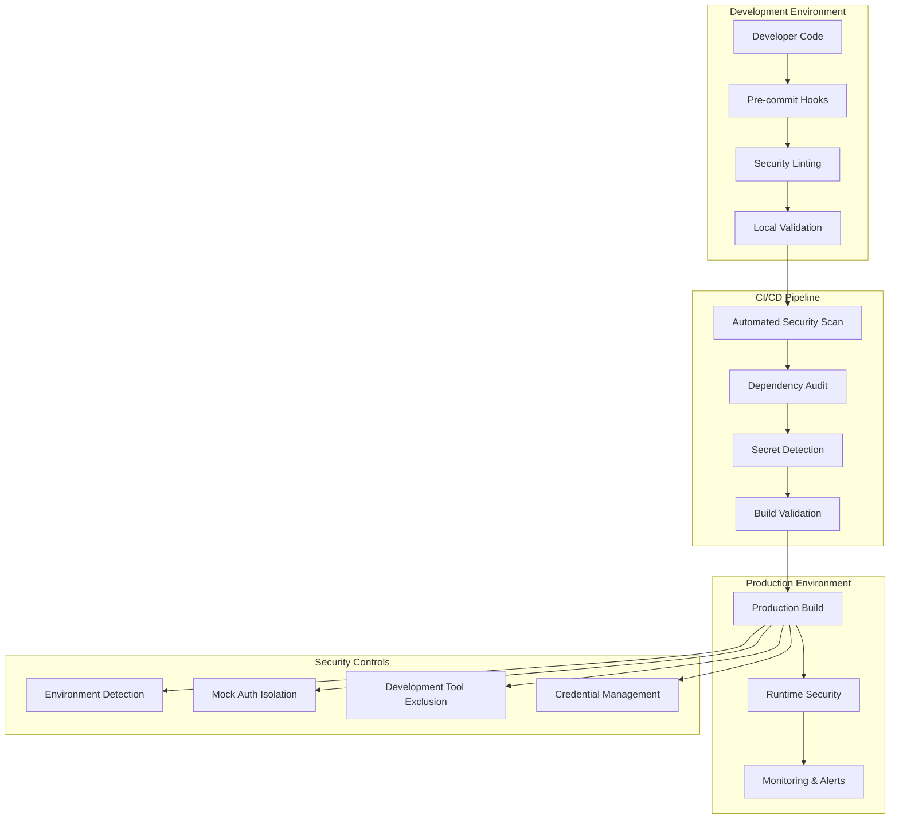

# Security Fixes Design Document

## Overview

This design document outlines the comprehensive security improvements for the BudgetBuddy application. The solution addresses identified vulnerabilities including dependency security, mock authentication safety, development tool isolation, credential protection, and automated security validation.

The design follows a defense-in-depth approach with multiple layers of security controls, automated validation, and clear separation between development and production environments.

## Architecture

### Security Layer Architecture



### Component Interaction

The security system operates through several interconnected components:

1. **Build-time Security**: Validates code during compilation and bundling
2. **Runtime Security**: Enforces security policies during application execution
3. **Environment Detection**: Automatically adapts security controls based on deployment environment
4. **Monitoring Layer**: Continuously validates security posture and detects threats

## Components and Interfaces

### 1. Security Configuration Manager

**Purpose**: Centralized security configuration and environment detection

**Interface**:

```typescript
interface SecurityConfig {
  isProduction(): boolean;
  isDevelopment(): boolean;
  getAllowedMockAuth(): boolean;
  getSecurityLevel(): "strict" | "development" | "testing";
  validateEnvironment(): SecurityValidationResult;
}
```

**Responsibilities**:

- Detect current environment (production, development, testing)
- Provide security configuration based on environment
- Validate environment consistency
- Enforce security policies per environment

### 2. Mock Authentication Guard

**Purpose**: Safely isolate mock authentication from production environments

**Interface**:

```typescript
interface MockAuthGuard {
  canInitializeMockAuth(): boolean;
  validateMockAuthSafety(): ValidationResult;
  disableMockAuthInProduction(): void;
  logSecurityViolation(violation: SecurityViolation): void;
}
```

**Responsibilities**:

- Prevent mock authentication initialization in production
- Log security violations when mock auth is attempted inappropriately
- Provide clear error messages for developers
- Ensure complete isolation of mock authentication code

### 3. Development Tool Controller

**Purpose**: Control visibility and functionality of development tools

**Interface**:

```typescript
interface DevToolController {
  shouldShowDevTools(): boolean;
  getDevToolsConfig(): DevToolsConfig;
  sanitizeForProduction(): void;
  validateDevToolSafety(): ValidationResult;
}
```

**Responsibilities**:

- Hide development tools in production builds
- Provide safe development tool configuration
- Ensure no development code reaches production
- Maintain clear separation between environments

### 4. Dependency Security Manager

**Purpose**: Manage and validate third-party dependency security

**Interface**:

```typescript
interface DependencySecurityManager {
  auditDependencies(): AuditResult;
  fixVulnerabilities(): FixResult;
  generateSecurityReport(): SecurityReport;
  validateDependencyIntegrity(): ValidationResult;
}
```

**Responsibilities**:

- Run automated dependency audits
- Apply security fixes when available
- Generate security reports for compliance
- Validate dependency integrity and authenticity

### 5. Credential Protection Service

**Purpose**: Ensure proper handling of credentials and secrets

**Interface**:

```typescript
interface CredentialProtectionService {
  scanForExposedCredentials(): ScanResult;
  validateCredentialUsage(): ValidationResult;
  sanitizeCredentialsInFiles(): SanitizationResult;
  generateSecurePlaceholders(): PlaceholderSet;
}
```

**Responsibilities**:

- Scan codebase for exposed credentials
- Replace hardcoded credentials with secure alternatives
- Generate secure placeholder values for documentation
- Validate proper credential management practices

## Data Models

### Security Validation Result

```typescript
interface SecurityValidationResult {
  isValid: boolean;
  violations: SecurityViolation[];
  warnings: SecurityWarning[];
  recommendations: SecurityRecommendation[];
  timestamp: Date;
}

interface SecurityViolation {
  type:
    | "EXPOSED_CREDENTIAL"
    | "MOCK_AUTH_IN_PROD"
    | "DEV_TOOL_IN_PROD"
    | "DEPENDENCY_VULN";
  severity: "CRITICAL" | "HIGH" | "MEDIUM" | "LOW";
  description: string;
  location: FileLocation;
  remediation: string;
}
```

### Environment Configuration

```typescript
interface EnvironmentConfig {
  name: "production" | "staging" | "development" | "testing";
  securityLevel: SecurityLevel;
  allowMockAuth: boolean;
  allowDevTools: boolean;
  requireSecureCredentials: boolean;
  enableSecurityLogging: boolean;
}

interface SecurityLevel {
  enforceHTTPS: boolean;
  requireTokenValidation: boolean;
  enableAuditLogging: boolean;
  blockInsecureOperations: boolean;
}
```

### Dependency Audit Result

```typescript
interface DependencyAuditResult {
  vulnerabilities: Vulnerability[];
  fixesAvailable: Fix[];
  securityScore: number;
  lastAuditDate: Date;
  recommendations: string[];
}

interface Vulnerability {
  package: string;
  version: string;
  severity: "CRITICAL" | "HIGH" | "MODERATE" | "LOW";
  description: string;
  cve?: string;
  fixAvailable: boolean;
  recommendedVersion?: string;
}
```

## Correctness Properties

_A property is a characteristic or behavior that should hold true across all valid executions of a system—essentially, a formal statement about what the system should do. Properties serve as the bridge between human-readable specifications and machine-verifiable correctness guarantees._

### Property 1: Dependency Vulnerability Detection

_For any_ set of dependencies with known vulnerabilities, the security scanner should identify all moderate and high severity vulnerabilities without false negatives
**Validates: Requirements 1.1**

### Property 2: Automatic Vulnerability Fixing

_For any_ vulnerability with an available automatic fix, the system should successfully apply the fix and verify the vulnerability is resolved
**Validates: Requirements 1.2**

### Property 3: Production Mock Auth Exclusion

_For any_ production build, the build output should contain no mock authentication code or development-only authentication tokens
**Validates: Requirements 2.1, 2.4**

### Property 4: Mock Auth Production Blocking

_For any_ attempt to initialize mock authentication in production mode, the system should block the attempt and log a security warning
**Validates: Requirements 2.3**

### Property 5: Development Tool Production Isolation

_For any_ production deployment, development helper components and debugging utilities should be completely excluded from the build and runtime
**Validates: Requirements 3.1, 3.3**

### Property 6: Security Scan Automation

_For any_ code commit or pull request, the CI/CD pipeline should automatically execute comprehensive security scans before allowing progression
**Validates: Requirements 4.1, 4.4**

### Property 7: Secret Detection Comprehensive Coverage

_For any_ file containing exposed secrets, credentials, or sensitive data, the secret detection system should identify and flag all instances regardless of file type
**Validates: Requirements 5.3, 8.1**

### Property 8: Credential Replacement Safety

_For any_ realistic-looking credential in documentation or test files, the system should replace it with clearly fake placeholder values that cannot be mistaken for real credentials
**Validates: Requirements 5.4, 8.2**

### Property 9: Security Event Logging

_For any_ security-relevant event or violation, the system should generate appropriate log entries and alerts for audit and monitoring purposes
**Validates: Requirements 6.1, 6.2**

### Property 10: Pre-commit Security Validation

_For any_ code submission attempt containing security violations, the pre-commit hooks should prevent the submission and provide specific remediation guidance
**Validates: Requirements 9.1, 9.2**

## Error Handling

### Security Violation Response

The system implements a graduated response to security violations:

1. **Critical Violations**: Immediately halt operations and require manual intervention
2. **High Severity**: Block the operation and require explicit override with justification
3. **Medium Severity**: Allow operation with warnings and mandatory logging
4. **Low Severity**: Log for audit purposes but allow operation to continue

### Error Recovery Mechanisms

- **Dependency Vulnerabilities**: Automatic rollback to last known secure version
- **Build Failures**: Clear error messages with step-by-step remediation instructions
- **Runtime Security Violations**: Graceful degradation with security logging
- **Authentication Failures**: Secure fallback to standard authentication methods

### Monitoring and Alerting

- Real-time security event monitoring with configurable alert thresholds
- Integration with external security monitoring systems
- Automated incident response for critical security violations
- Regular security posture reporting and compliance validation

## Testing Strategy

### Dual Testing Approach

The security system requires both unit testing and property-based testing to ensure comprehensive coverage:

**Unit Tests**:

- Specific security violation scenarios and edge cases
- Integration points between security components
- Error conditions and recovery mechanisms
- Configuration validation and environment detection

**Property-Based Tests**:

- Universal security properties across all inputs and configurations
- Comprehensive input coverage through randomization
- Security invariants that must hold under all conditions
- Cross-platform security behavior validation

### Property-Based Testing Configuration

- **Testing Framework**: Jest with fast-check for property-based testing
- **Minimum Iterations**: 100 iterations per property test
- **Test Tagging**: Each property test references its design document property
- **Tag Format**: **Feature: security-fixes, Property {number}: {property_text}**

### Security Test Categories

1. **Vulnerability Detection Tests**: Verify scanner accuracy and coverage
2. **Build Security Tests**: Validate production build isolation and safety
3. **Runtime Security Tests**: Ensure proper security enforcement during execution
4. **Configuration Tests**: Validate security configuration across environments
5. **Integration Tests**: Test security system interaction with application components

### Test Data Management

- **Synthetic Vulnerabilities**: Create controlled test scenarios with known vulnerabilities
- **Mock Credentials**: Use clearly identified fake credentials for testing
- **Environment Simulation**: Test across all supported deployment environments
- **Security Event Simulation**: Generate controlled security events for testing responses
