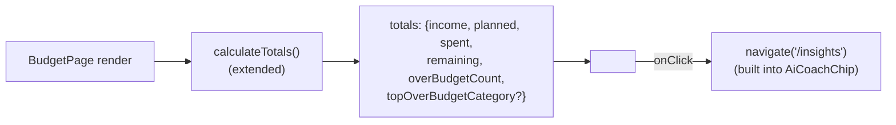

# Design Document

## Overview

This spec makes two unrelated, self-contained corrections to `packages/web-app` and the repo root:

1. **Wire `AiCoachChip` into `BudgetPage.tsx`.** `AiCoachChip` (`packages/web-app/src/components/AiCoachChip.tsx`) is fully built but has zero JSX consumers. `BudgetPage.tsx` already computes four of the six `BudgetSummary` fields inside its existing `calculateTotals()` function. This design extends that single function to also compute `overBudgetCount` and `topOverBudgetCategory` in the same pass, then renders `<AiCoachChip />` as a fixed-position sibling at the bottom of the page's existing JSX tree — the same pattern already used by `TutorialOverlay` and `MarkRecurringModal`.
2. **Delete `packages/api-client`.** The package is dead code: zero consumers in `web-app` or `mobile`, and its own lockfile entry is marked `"extraneous": true`. This design removes the package directory and every live reference to it (the root `tsconfig.json` path mapping, the root `package-lock.json` workspace entry, and the `docs/README.md` link).

Requirement 3 (documentation about `AiCoachChip`'s integration) is a no-op once Requirement 2 ships — confirmed below in Components and Interfaces — so no doc edits are needed for it. Requirement 5 (docs referencing the deleted package) requires one edit to `docs/README.md`, confirmed below.

## Architecture

No architectural change. This is a targeted edit inside one existing component (`BudgetPage.tsx`) plus deletion of one unused workspace package. No new services, no new data flow, no backend or infrastructure changes.



## Components and Interfaces

### `calculateTotals()` — extended in place (`BudgetPage.tsx`, currently line 716)

**Decision: extend the existing function to return two additional fields in the same reduce pass, rather than adding a second function that walks `nonIncomeGroups` again.**

Rationale: `calculateTotals()` already builds `nonIncomeGroups` and iterates every category's `plannedAmount`/`spentAmount` once via nested `.reduce()` calls to get `planned` and `spent`. Over-budget detection needs exactly the same per-category `spentAmount - plannedAmount` difference. Computing it in a second pass (a hypothetical `calculateOverBudgetInfo()`) would re-iterate the same `nonIncomeGroups.flatMap(g => g.categories)` a second time for no benefit — there's no reuse, caching, or separation-of-concerns argument for a second walk, since both computations consume the identical input and produce independent output fields. A combined single-pass computation is strictly cheaper and keeps one source of truth for "what counts as a category" (i.e., non-income categories only, matching `planned`/`spent`'s existing scope).

Current return shape:
```typescript
{ income: number; planned: number; spent: number; remaining: number }
```

New return shape:
```typescript
{
  income: number;
  planned: number;
  spent: number;
  remaining: number;
  overBudgetCount: number;
  topOverBudgetCategory?: string;
}
```

Both early-return branches (`!budget` and `!Array.isArray(budget.groups)`) are updated to include `overBudgetCount: 0` and to omit `topOverBudgetCategory` (matching Requirement 1.4's "omit when zero" rule, applied consistently even in the error/empty branches).

**Third fallback site — the call site itself.** Separate from `calculateTotals()`'s own two internal early-return branches above, `BudgetPage.tsx` also has a fallback object literal at the point where `calculateTotals()` is called, used when there is no `budget` at all:

```diff
  const totals = budget
    ? calculateTotals()
-   : { income: 0, planned: 0, spent: 0, remaining: 0 };
+   : { income: 0, planned: 0, spent: 0, remaining: 0, overBudgetCount: 0, topOverBudgetCategory: undefined };
```

This site must be updated for the same reason as the two internal branches — it produces a `BudgetSummary`-shaped value for the same `totals` variable — but it is a distinct edit location, since it lives outside `calculateTotals()` entirely. Once `calculateTotals()`'s return type is extended to include `overBudgetCount: number` and `topOverBudgetCategory?: string`, this ternary's two branches must agree on shape; leaving this fallback object at its old, narrower shape fails to type-check. All three fallback sites (the two early returns inside `calculateTotals()` and this external call-site literal) must be kept in sync with the extended return type.

Implementation approach — a single reduce over the flattened non-income categories, tracking count and running max in one loop:

```typescript
const nonIncomeCategories = nonIncomeGroups.flatMap((group) => group.categories);

let overBudgetCount = 0;
let topOverBudgetCategory: string | undefined;
let topOverBudgetAmount = -Infinity;

for (const cat of nonIncomeCategories) {
  const diff = cat.spentAmount - cat.plannedAmount;
  if (diff > 0) {
    overBudgetCount += 1;
    if (diff > topOverBudgetAmount) {
      topOverBudgetAmount = diff;
      topOverBudgetCategory = cat.name;
    }
  }
}

return {
  income,
  planned,
  spent,
  remaining,
  overBudgetCount,
  topOverBudgetCategory,
};
```

Placed after the existing `spent` computation and before the existing `remaining` computation (or immediately after `remaining`, either ordering is equivalent since there's no data dependency) — no change to `income`, `planned`, `spent`, or `remaining` logic.

**Tie-breaking decision**: when two or more categories share the exact largest positive `spentAmount - plannedAmount` difference, `topOverBudgetCategory` names whichever qualifying category is encountered **first** in iteration order (`nonIncomeGroups` order, then `categories` order within each group — the same order `calculateTotals()` already walks for `planned`/`spent`). This is a strict `diff > topOverBudgetAmount` comparison (not `>=`), so a later category with an equal (not greater) difference never overwrites an earlier one. This decision is arbitrary but must be deterministic and is now specified rather than left to whatever a naive `Math.max`/`.sort()` implementation would do implicitly.

### Extraction for testability

The loop above is pure (no React, no `this`, no closures over component state beyond its two parameters) and is extracted as a standalone exported function so it can be property-tested in isolation, then called from inside `calculateTotals()`:

**New file: `packages/web-app/src/utils/overBudgetInfo.ts`**

```typescript
export interface CategoryLike {
  name: string;
  plannedAmount: number;
  spentAmount: number;
}

export interface OverBudgetInfo {
  overBudgetCount: number;
  topOverBudgetCategory?: string;
}

export function calculateOverBudgetInfo(categories: CategoryLike[]): OverBudgetInfo {
  let overBudgetCount = 0;
  let topOverBudgetCategory: string | undefined;
  let topOverBudgetAmount = -Infinity;

  for (const cat of categories) {
    const diff = cat.spentAmount - cat.plannedAmount;
    if (diff > 0) {
      overBudgetCount += 1;
      if (diff > topOverBudgetAmount) {
        topOverBudgetAmount = diff;
        topOverBudgetCategory = cat.name;
      }
    }
  }

  return { overBudgetCount, topOverBudgetCategory };
}
```

`calculateTotals()` in `BudgetPage.tsx` imports this and calls `calculateOverBudgetInfo(nonIncomeCategories)`, spreading the result into its own return object. This satisfies Requirement 1 without duplicating logic inline in the component, and gives Requirement 1's acceptance criteria a direct, mockless unit under test.

### JSX insertion (`BudgetPage.tsx`)

**Import to add** (grouped with other component imports, e.g. after the `EmptyState` import at line 43):
```typescript
import { AiCoachChip } from "../components/AiCoachChip";
```

**Insertion point**: as the last child inside the outermost returned `<div className="h-full bg-background flex">` (opens line 1861, closes line 3721), placed immediately before that closing `</div>` — i.e., directly after the existing `<MarkRecurringModal ... />` sibling and before `</div>` on line 3721. This matches the established pattern in this file: `TutorialOverlay` and `MarkRecurringModal` are both fixed/overlay-positioned components rendered as plain siblings at the end of the tree, not nested inside any particular layout column, because their own CSS (`fixed` positioning, in `AiCoachChip`'s case `fixed bottom-6 left-1/2 -translate-x-1/2`) already takes them out of normal layout flow. No wrapper or layout slot is needed.

```tsx
      <MarkRecurringModal
        isOpen={showRecurringModal}
        onClose={() => {
          setShowRecurringModal(false);
          setSelectedTransactionForRecurring(null);
        }}
        transaction={selectedTransactionForRecurring}
        onSuccess={() => {
          // Optionally reload data or show success message
        }}
        currency={currency}
      />

      <AiCoachChip
        summary={{
          income: totals.income,
          planned: totals.planned,
          spent: totals.spent,
          remaining: totals.remaining,
          overBudgetCount: totals.overBudgetCount,
          topOverBudgetCategory: totals.topOverBudgetCategory,
          currency,
        }}
        hasBudget={budget !== null}
      />
    </div>
  );
};
```

`currency` is the component-level constant already in scope (`const currency = "USD";` at line 104), already used elsewhere in this same render (e.g. passed to `MarkRecurringModal` two lines above, and to `formatCurrency` calls throughout). No new state, prop, or fetch is introduced — `totals` is already computed from `budget`, which is already fetched by this page's existing data loading (satisfying Requirement 2.4's "no additional network request").

`hasBudget: budget !== null` satisfies Requirement 2.1/2.2 directly: `AiCoachChip` already returns `null` internally when `hasBudget` is falsy (see its existing `if (!hasBudget) return null;` guard), so no conditional wrapper (`{budget && <AiCoachChip .../>}`) is needed in `BudgetPage.tsx` — the component self-manages the empty-budget case. Passing it unconditionally, always with the live `budget !== null` value, is simpler and cannot drift from the component's own guard.

Requirement 2.3 ("navigate to `/insights`") requires no new code in `BudgetPage.tsx` — `AiCoachChip`'s existing `onClick={() => navigate('/insights')}` handler already does this; `BudgetPage.tsx` only needs to render the component for that existing behavior to take effect.

### Requirement 3 — no doc changes needed (confirmed no-op)

Requirement 3.2 states that where `Documentation_Set` files already describe `AiCoachChip` as integrated on `BudgetPage.tsx`, that description is to be **retained unchanged** once Requirement 2 ships, because implementing Requirement 2 makes the existing description accurate rather than obsolete. This design's Requirement 2 implementation mounts `AiCoachChip` on `BudgetPage.tsx` exactly as those docs already describe. No file under `Documentation_Set` (`docs/product-requirements.md`, `.kiro/specs/web-app-polish/design.md`, `.kiro/steering/structure.md`, `.kiro/steering/architecture.md`) requires editing for Requirement 3 — it is satisfied entirely as a side effect of Requirement 2's code change, not by any documentation task in this spec.

### Requirement 4 — `packages/api-client` removal

Confirmed current contents of `packages/api-client/` (via direct directory listing):
```
packages/api-client/
  dist/            (build output — deleted with the rest)
  node_modules/    (package-local deps — deleted with the rest)
  package-lock.json
  package.json
  README.md
  src/
    client.ts
    index.ts
    transactions.ts
  tsconfig.json
```

**Files/directories to delete:**
- `packages/api-client/` (entire directory, all contents above)

**Files to edit, and confirmed current content requiring change:**

1. **`tsconfig.json`** (repo root) — currently:
   ```json
   "paths": {
     "@budget-buddy/shared/*": ["./packages/shared/src/*"],
     "@budget-buddy/api-client/*": ["./packages/api-client/src/*"]
   }
   ```
   Remove the `@budget-buddy/api-client/*` line, leaving only the `@budget-buddy/shared/*` mapping.

2. **`package-lock.json`** (repo root) — confirmed via direct read to contain, under the top-level `"packages"` map:
   ```json
   "packages/api-client": {
     "name": "@budget-buddy/api-client",
     "version": "1.0.0",
     "extraneous": true,
     "dependencies": { "aws-amplify": "^6.0.0", "swr": "^2.2.0" },
     "devDependencies": { "@types/node": "^20.0.0", "jest": "^29.0.0", "typescript": "^5.1.0" }
   }
   ```
   This entry is removed by running `npm install` from the repo root after deleting the `packages/api-client` directory (npm regenerates the lockfile's workspace list from what's actually on disk under `packages/*`; there is no explicit `"workspaces"` array in root `package.json` to edit — confirmed by direct search, none exists). If `npm install` does not fully prune it in one pass, the entry is removed manually as a fallback.

**Confirmed no other live references exist.** A repo-wide search for `api-client`/`@budget-buddy/api-client` outside `packages/api-client` itself returned exactly:
- `tsconfig.json` and `package-lock.json` (above — code references, handled by Requirement 4).
- `docs/README.md` (a link — handled by Requirement 5, below).
- `CHANGELOG.md`, `DEVELOPMENT_LOG.md`, `.kiro/steering/memory/work-log.md` — all three mention `packages/api-client/README.md` only in **past-tense narrative form**, recording that a prior session (163/164) corrected that README's content. These are dated historical log entries describing work already done, not a live pointer to the package's current existence or usage — deleting the package doesn't make these sentences false, since they describe a documentation fix that did happen. Per Requirement 4.3's scope ("references... at the start of this spec's implementation" that need "update or remove" so that no reference "remains"), these are historical record entries, not the kind of forward-pointing reference (import, link, dependency) the requirement targets, and editing dated log history is out of scope for this spec and not requested by any acceptance criterion. Left unchanged.
- `.kiro/specs/repo-docs-specs-consolidation/{design.md,tasks.md}` — same reasoning: a prior spec's own completed design/task records describing work already performed on that README before this spec deletes the package. Historical, not live. Left unchanged.
- `.kiro/specs/web-app-followups/requirements.md` — this spec's own requirements document, which necessarily discusses the package it's asking to delete. Not a code or doc reference requiring cleanup; it's the specification itself.

No `packages/mobile` file references `@budget-buddy/api-client` (confirmed in the requirements' own investigation findings, and consistent with the repo-wide search above finding zero hits under `packages/mobile`).

### Requirement 5 — `docs/README.md` correction

Confirmed current content of `docs/README.md` (direct read), under "Outside `/docs`":
```markdown
- **[packages/api-client/README.md](../packages/api-client/README.md)** - HTTP client library overview
```

This line is deleted. No other line in `docs/README.md` references `packages/api-client`. A repo-wide search confirmed no other file under `docs/` references `packages/api-client` (the only `docs/` hit was this one line in `docs/README.md` itself), so Requirement 5.2's conditional ("if any file under docs/ references it") applies to exactly this one line and no others.

## Data Models

No new persisted data model. `BudgetSummary` (already defined in `AiCoachChip.tsx`) and the new `CategoryLike`/`OverBudgetInfo` types (in the new `overBudgetInfo.ts` utility) are the only type additions, both purely in-memory, derived-on-render values with no storage, API, or serialization involved.

```typescript
// Already exists in AiCoachChip.tsx — unchanged by this spec
interface BudgetSummary {
  income: number;
  planned: number;
  spent: number;
  remaining: number;
  overBudgetCount: number;
  topOverBudgetCategory?: string;
  currency?: string;
}

// New — packages/web-app/src/utils/overBudgetInfo.ts
interface CategoryLike {
  name: string;
  plannedAmount: number;
  spentAmount: number;
}

interface OverBudgetInfo {
  overBudgetCount: number;
  topOverBudgetCategory?: string;
}
```

`CategoryLike` is intentionally a minimal structural subset of the real `BudgetCategory` type (which has many more fields — `id`, `icon`, `transactions`, etc.) so the pure function only depends on the three fields it actually reads, and any object shape satisfying that structural type (including test fixtures) can be passed without constructing a full `BudgetCategory`.

## Correctness Properties

*A property is a characteristic or behavior that should hold true across all valid executions of a system — essentially, a formal statement about what the system should do. Properties serve as the bridge between human-readable specifications and machine-verifiable correctness guarantees.*

This spec has two parts. The `AiCoachChip` JSX wiring (Requirement 2) and the `packages/api-client` deletion (Requirements 3, 4, 5) are UI mounting and file-deletion/doc-cleanup work respectively — neither has a meaningful "for all inputs" statement (there's no varying input to a directory deletion or a JSX mount point), so both are covered by example-based/integration checks only, per the workflow's PBT applicability guidance. `calculateOverBudgetInfo()` (Requirement 1), however, is a newly-extracted pure function over an arbitrary list of categories with numeric fields — a strong PBT candidate, since its behavior varies meaningfully with input (category count, which categories are over/under budget, tie amounts) and 100+ randomized iterations exercise tie-breaking and boundary cases far better than a handful of examples.

### Property 1: Over-budget count matches positive-difference count

For any list of categories, each with a `plannedAmount` and `spentAmount`, the `overBudgetCount` returned by `calculateOverBudgetInfo` SHALL equal the number of categories in that list where `spentAmount` strictly exceeds `plannedAmount`.

**Validates: Requirements 1.2**

### Property 2: Top category presence matches over-budget count

For any list of categories, `calculateOverBudgetInfo`'s returned `topOverBudgetCategory` SHALL be `undefined` if and only if the returned `overBudgetCount` is `0`.

**Validates: Requirements 1.3, 1.4**

### Property 3: Top category is the first-encountered largest overage

For any list of categories containing at least one category where `spentAmount` exceeds `plannedAmount`, the `topOverBudgetCategory` returned by `calculateOverBudgetInfo` SHALL name a category whose `spentAmount - plannedAmount` difference is greater than or equal to every other category's difference in the list, and SHALL be the name of the first such category encountered in input order when multiple categories share that maximum difference.

**Validates: Requirements 1.3**

### Rationale for the Chosen Properties

Initial candidate properties for `calculateOverBudgetInfo()`:
- Candidate 1: `overBudgetCount` equals the number of categories where `spentAmount > plannedAmount`.
- Candidate 2: `topOverBudgetCategory` is `undefined` if and only if `overBudgetCount` is `0`.
- Candidate 3: when defined, `topOverBudgetCategory` names a category whose `spentAmount - plannedAmount` is the maximum such difference among all categories with a positive difference.
- Candidate 4: when defined, `topOverBudgetCategory` names the **first** category (in input order) achieving that maximum, in the presence of ties.
- Candidate 5: categories with `spentAmount <= plannedAmount` never influence `overBudgetCount` or `topOverBudgetCategory`.

Candidate 5 is subsumed by Candidate 1 (if a category with `spentAmount <= plannedAmount` incorrectly influenced the count, Candidate 1 would already fail) and by Candidate 3 (an under/at-budget category could never be the reported max, since Candidate 3 restricts the candidate set to positive-difference categories only) — dropped as redundant. Candidate 4 is a refinement of Candidate 3 specific to the tie-breaking rule and is kept separate since Candidate 3 alone (using a non-strict "is one of the maximizers" check) would not catch a tie-breaking regression; Candidate 4 specifically pins down *which* maximizer is reported. Candidate 2 is kept as-is since Candidate 1 and Candidate 3 don't independently guarantee the presence/absence correspondence between the count and the name (a mutant implementation could satisfy Candidate 1 and Candidate 3's "if defined" clause while still leaving `topOverBudgetCategory` set when `overBudgetCount` is 0, or vice versa).

Final set: Candidate 1, Candidate 2, Candidate 3+Candidate 4 (combined into one property, since Candidate 4 only makes sense as a refinement checked jointly with Candidate 3 — testing "is a maximizer" and "is the first maximizer" as two separate property runs over the same generated input is redundant; one property asserting the stronger, more specific claim (first-encountered maximizer) subsumes the weaker one).

## Error Handling

- `calculateOverBudgetInfo([])` (empty category list, e.g. an income-only budget with no expense/savings categories) returns `{ overBudgetCount: 0, topOverBudgetCategory: undefined }` — the loop body never executes, `topOverBudgetCategory` stays at its initial `undefined`. Covered by Property 2 at the `n = 0` boundary and by a dedicated unit test.
- `calculateTotals()`'s existing two early-return branches (`!budget`, `!Array.isArray(budget.groups)`) are extended to include `overBudgetCount: 0` with `topOverBudgetCategory` omitted, so `AiCoachChip` never receives a malformed summary even when `budget` data is missing or malformed — it receives the same all-zero shape it already receives today for `income`/`planned`/`spent`/`remaining`.
- No new error paths are introduced by the JSX wiring — `AiCoachChip` already handles `hasBudget === false` by rendering `null`, and `derivePrompt()` (inside `AiCoachChip.tsx`, unchanged by this spec) already has its own fallback (`'Ask AI Coach'`) for a summary with no alert conditions.
- Deleting `packages/api-client` is a build-time concern, not a runtime one: if any reference were missed, `tsc` (`npm run typecheck` in `web-app`, and the root-level TypeScript project) would fail to resolve the `@budget-buddy/api-client` path mapping or module, surfacing the omission immediately in CI rather than silently at runtime. This is why Requirement 4.3's repo-wide reference sweep is performed before deletion in this design (see Components and Interfaces, Requirement 4) rather than relying solely on the build to catch it.

## Testing Strategy

**Property tests** (`packages/web-app/src/utils/overBudgetInfo.pbt.test.ts`, following the existing `.pbt.test.ts` naming convention used by `error-handling.pbt.test.ts` in the same directory):
- Use `fast-check` (already a `devDependency` in `packages/web-app/package.json`) — do not hand-roll a generator/shrinker.
- Each of the three properties above is implemented as exactly one `fc.assert(fc.property(...))` test, configured for a minimum of 100 runs (`{ numRuns: 100 }`).
- Generator: an array of `CategoryLike` objects with a unique-enough `name` per test run (e.g. index-suffixed names, so "first encountered" in Property 3 is unambiguous to assert against) and `plannedAmount`/`spentAmount` drawn from `fc.float` or `fc.integer` covering negative, zero, and positive values (budgets can have categories with `plannedAmount: 0`, and `spentAmount` is never validated to be non-negative elsewhere in the codebase, so the generator should not artificially exclude those values).
- Each test is tagged with a comment referencing its design property:
  - `// Feature: web-app-followups, Property 1: overBudgetCount equals count of categories where spentAmount > plannedAmount`
  - `// Feature: web-app-followups, Property 2: topOverBudgetCategory is undefined iff overBudgetCount is 0`
  - `// Feature: web-app-followups, Property 3: topOverBudgetCategory is the first-encountered category with the maximum positive difference`

**Unit tests** (`packages/web-app/src/utils/overBudgetInfo.test.ts`):
- Empty array → `{ overBudgetCount: 0, topOverBudgetCategory: undefined }`.
- All categories at or under budget → `overBudgetCount: 0`, `topOverBudgetCategory: undefined`.
- Exactly one category over budget → that category's name reported.
- Two categories tied for the largest overage → the first one in the input array is reported (pins down the tie-break decision with a concrete example, complementing Property 3's randomized coverage).

**Component-level test** (`packages/web-app/src/pages/BudgetPage.test.tsx`, extending existing coverage of this page if present, or added if not — confirmed by checking the directory for an existing test file before writing):
- `BudgetPage` renders an `AiCoachChip` (or its visible button, queried by `aria-label="Open AI Coach"`) when a budget is loaded for the current month (Requirement 2.1).
- `BudgetPage` does not render a visible `AiCoachChip` button when no budget exists for the current month (Requirement 2.2) — asserted by querying for the `aria-label` and expecting it absent, consistent with `AiCoachChip`'s own `return null` guard.
- Clicking the rendered chip navigates to `/insights` (Requirement 2.3) — this exercises `AiCoachChip`'s existing, already-tested navigation handler in the context of being mounted from `BudgetPage`, not a reimplementation of that logic.

**Build/typecheck verification** (Requirement 4, Requirement 5):
- After deleting `packages/api-client` and editing `tsconfig.json`, running `npm run typecheck` (or the root-level equivalent) across the repo is the primary check that no reference was missed — a dangling import or path mapping fails the TypeScript compile.
- A repo-wide text search for `api-client` after the change is the check for Requirement 4.4 (lockfile) and Requirement 5 (docs), confirming only the accepted historical-narrative mentions (identified above in Components and Interfaces) remain.
